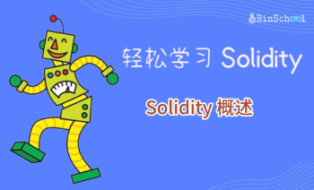
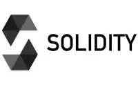
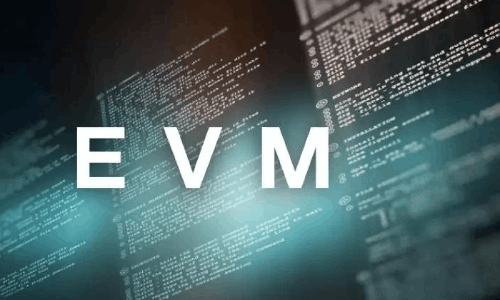

# Solidity基础教程:&nbsp;&nbsp;&nbsp;&nbsp;101.概述 

本章讲解与 **`Solidity`** 相关的基本概念，以及为什么要学习 **`Solidity`**，如何学习 **`Solidity`**。

**视频**：[Bilibili](https://www.bilibili.com/video/BV1c14y1R7L3)  |  [Youtube](https://youtu.be/WwU_05Wl1bo)

**官网**：[BinSchoolOrg](https://binschool.org)

**代码**：[github.com/hitadao](https://github.com/hitadao)

**推特**：[@Hita_DAO](https://x.com/hita_dao)    **Discord**：[Hita_DAO](https://discord.gg/dzWY3QYGrx)

-----
   **`Solidity`** 是一种面向对象的静态编程语言，用于在以太坊区块链上编写智能合约。

**`Solidity`** 深受 C++、Python 和 JavaScript 等编程语言的影响，语法与它们非常相似，但是 **`Solidity`** 针对以太坊虚拟机进行了专门的设计。

我们可以使用 **`Solidity`** 在以太坊区块链上创建 代币、NFT、投票、DeFi 以及 GameFi 等各种类型的智能合约。

学习 **`Solidity`** 之前，先要搞清楚几个基本概念：以太坊虚拟机是什么，智能合约又是什么。

## 以太坊虚拟机
**`Solidity`** 用于在以太坊区块链上编写智能合约，那么以太坊又是什么呢？

以太坊，英文名称为 **`Ethereum`**，它是一个能够运行智能合约的区块链平台。它由 **`Vitalik Buterin`**（维塔利克·布特林，又称为V神）和合伙人共同创建，并于2014年正式发布。

以太坊虚拟机，英文缩写为 **`EVM`**，是以太坊上智能合约的运行环境。换句话来说，以太坊使用 **`EVM`**` 来运行智能合约。

以太坊虚拟机是以太坊区块链中最核心的组件。

## 智能合约
智能合约（Smart Contract）是一种以信息化方式传播、验证和执行合同的计算机协议。智能合约允许在没有信任中介的情况下进行可信交易，这些交易可追踪且不可逆转。

简单地说，智能合约可以理解为一个可以自动执行的协议，它可以自动处理协议的履行、管理，以及支付，无需第三方信任中介。

例如，我们可以编写这样一个智能合约：本月15号，张三转账给李四 1 个以太币。一旦这个智能合约部署后，那么在本月的15号，张三就可以领取到李四转来的 1 个以太币，整个过程不需要类似公证机构、银行这样的第三方信任中介参与。

智能合约的基本特点：去中心化、不可篡改、自动执行，所以它能够提供去中心化的信任，执行过程安全透明，从而可以减少成本，提高效率。

在区块链领域，智能合约的定义更为广泛，通常是指区块链上的小段程序。比如：运行在区块链上的输出 **Hello World** 的简单程序，也可以称为智能合约。

所以，以太坊上的智能合约就是位于以太坊区块链上特定地址的代码和数据的集合。

智能合约的代码量一般都比较少，千行级别的智能合约就属于中大型的智能合约了，常见的合约通常只有几十行或者几百行。但是，即使是短短的几行代码，也可以发挥出巨大的威力。

## Solidity 的应用范围
使用 **`Solidity`** 编写的智能合约，不仅能够部署和运行在以太坊上，还适用于币安链 **BSC、Polygon、Arbitrum** 等任何兼容以太坊虚拟机的区块链。

当然，并不是所有区块链上的智能合约都能使用 **`Solidity`** 编写，有些区块链就不支持 **`Solidity`**，比如高性能链 **`Aptos`**，它使用 **`Move`** 语言来编写智能合约。

但是，在目前的公链领域里，以太坊及其兼容链占据了绝大部分份额，其它公链所占份额极低。所以，我们只要掌握了 **`Solidity`** 语言，就能够编写适用于大多数场景下的智能合约。

## 如何学习 Solidity
**`Solidity`** 的语法非常简单，如果您学习过任何一门的编程语言，那么在1个月内，就可以完全掌握 **`Solidity`**，并能够编写一些常见的智能合约。

如果您没有编程经验，只需按照本教程循序渐进地学习，那么在1至3个月内，也可以基本掌握 **`Solidity`**。至于熟练到什么程度，这与自己学习目的和努力程度有关，可自行掌控。

如果您只想做一个投资者、产品经理或者运营人员，那么只要了解基本的概念、原理以及能够读懂简单的合约即可。

如果您要做一个开发人员、科学家、资深投资者，就应该进行更深入地学习，能够熟练读写常见的智能合约。

本教程是一门严谨的教程，所有的表述和案例都经过严格审核和精心编排。您既可以把它作为入门级的教程，也可以作为深入学习的参考书。

## Solidity 能带来什么
学习 **`Solidity`** 可以带来以下机会：

1、在 **`Web3`** 公司获得工作机会。比如，成为一名区块链工程师、智能合约开发者、智能合约审计师等。

2、获得财富的机会。您可以独立开发和部署智能合约、去中心化应用以及其他区块链项目，成为区块链项目的创建者和所有者，来创造获得财富的机会。

3、增强投资和套利机会。比如成为加密货币投资人、数字货币研究员、币圈科学家、撸空投专家等。
