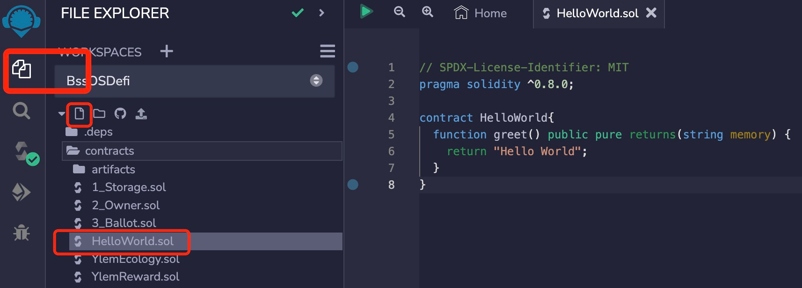
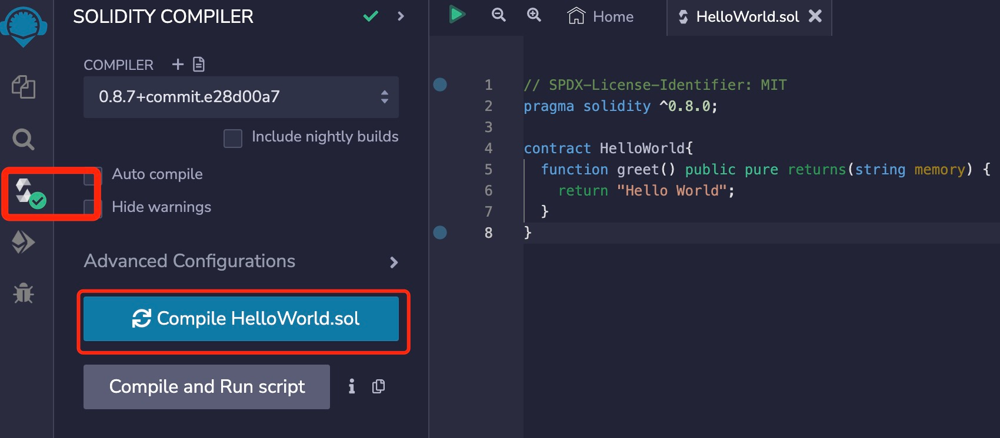

# Solidity基础教程:&nbsp;&nbsp;&nbsp;&nbsp;102.编译、部署和运行智能合约 

本章学习如何编写、编译、部署和运行一个 **`Solidity`** 智能合约。

**视频**：[Bilibili](https://www.bilibili.com/video/BV1NW4y1d7XL)  |  [Youtube](https://youtu.be/oDklL_Bmm04)

<p align="center"></p>

**官网**：[https://BinSchool.Org](https://binschool.org)

**推特**：[@Hita_DAO](https://x.com/hita_dao)    **Discord**：[Hita_DAO](https://discord.gg/dzWY3QYGrx)

**代码**：[https://github.com/hitadao/solidity](https://github.com/hitadao/solidity)

-----
使用 **`Solidity`** 编写的智能合约，并不能直接在以太坊区块链上运行，还需要经过编译和部署两个步骤。

在以太坊上运行智能合约的环境，称为 **“以太坊虚拟机”**，英文缩写为 **`EVM`**。

在 **`EVM`** 上执行的智能合约代码，并不是文本形式的 **`Solidity`** 语言源代码，而是一种**二进制代码**，称为 **`字节码`**。

**二进制代码**非常不直观，难以理解。所以，我们是无法直接编写二进制代码的智能合约的。

通常，我们使用更容易理解的 **`Solidity`** 语言来编写智能合约，然后使用编译器将其编译为**二进制代码**，最后在以太坊虚拟机上执行。

这个过程如下所示：
<p align="center"></p>

## Solidity 智能合约示例

以下代码就是一个简单的 **`Solidity`** 智能合约：

```solidity
// SPDX-License-Identifier: MIT
pragma solidity ^0.8.0;

contract HelloWorld{

  function greet() public pure returns(string memory) { 
    return "Hello World"; 
  } 
}
```
这个智能合约的名称是 **`HelloWorld`**，它提供了一个函数 **`greet`**。当调用函数 **`greet`** 时，它会返回一个字符串 **Hello World**。

对于这个智能合约的详细解释，我们将会在下一章节讲解。

在本章课程中，我们首先学习如何编写、编译、部署和运行一个智能合约。


## Remix 集成开发环境
由于 **`EVM`** 只能运行二进制编码的智能合约，所以，我们就需要一个工具，能够把 **`Solidity`** 编写的代码，翻译为 **`EVM`** 能够运行的二进制代码。这个翻译的过程就叫做 编译，这个翻译的工具称为 **`编译器`**。

**`Solidity`** 编译器有很多，比如：Remix、Solc、Truffle、Hardhat 等。其中，**`Remix`** 就是一款优秀的智能合约开发工具，它集成了编写、编译、部署、运行和测试智能合约的全流程功能，而且简单、直观、易于使用。

更为方便的是，**`Remix`** 可以在线使用，无需在本地电脑上安装。所以，**`Remix`** 非常适合于初学者学习和使用。当然，高级开发者也经常用它来做一些验证和实验等工作。

我们的教程就使用了 **`Remix`** 来编写、编译和部署智能合约。

Remix 开发工具的地址为：[https://remix.ethereum.org/](https://remix.ethereum.org/)，这是一个以太坊基金会的官方开源项目，可放心使用。

如果国内网络无法访问的话，可以使用国内 **`Remix`** 镜像，无需科学上网，而且访问速度快，地址为：[https://remix.binschool.app](https://remix.binschool.app)。

<p align="center"></p>


### 1.  编写代码
在 **`File explorers`** 选项卡下，新建一个 **HelloWorld.sol** 文件。**`Solidity`** 的源代码文件通常以 **.sol** 为后缀。

<p align="center"></p>

将上面的代码原样复制到右边的【代码编辑区】，使用 **`Ctrl+s`** 进行保存。

<p align="center"></p>

### 2. 编译代码
在 **`Compiler`** 选项卡下，点击 **`Compile`** 按钮，开始编译。

<p align="center"></p>

如果代码中没有错误，编译成功，那么就会在编译图标上出现一个绿色对钩。

<p align="center"></p>

如果代码中存在错误，那么就会在下方给出错误提示信息。

### 3. 部署合约
在 **`Run`** 选项卡下，点击 **`Deploy`** 按钮进行部署。

<p align="center"></p>

在 **`Remix`** 的下方，就会出现已部署成功合约的地址： **`HELLOWORLD AT 0XD8B...33FA8`**。

<p align="center"></p>

其中 **`0XD8B...33FA8`** 就是刚刚部署的智能合约的地址。这个地址在不同的机器上可能不相同。

### 4. 运行合约
点击 **`HELLOWORLD AT 0XD...`** 前面的小箭头，会出现 **`greet`** 按钮。 点击 **`greet`** 按钮，将会执行合约的 **`greet`** 函数，并显示执行结果。

<p align="center"></p>

输出结果为：

```solidity
0: string: Hello World
```

这表示，执行结果只返回一个字符串，内容为 **Hello World**。
