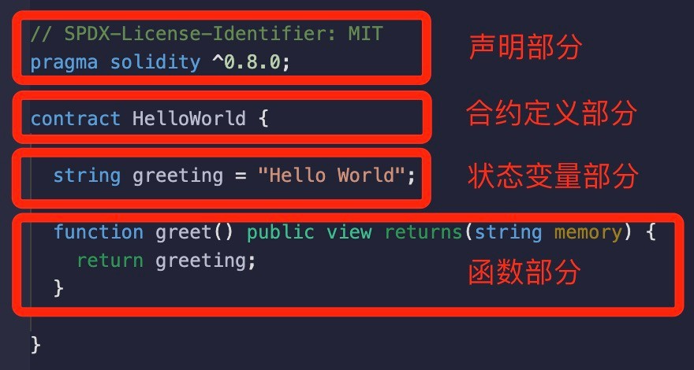
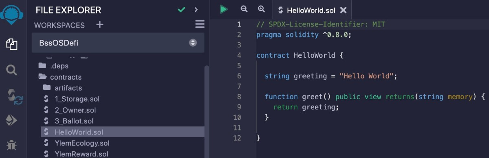

# Solidity基础教程:&nbsp;&nbsp;&nbsp;&nbsp;103.基本结构 

本章学习智能合约的基本结构。

**视频**：[Bilibili](https://www.bilibili.com/video/BV1oh4y157K8)  |  [Youtube](https://youtu.be/lEV-R30TIOw)

<p align="center"></p>

**官网**：[BinSchoolOrg](https://binschool.org)

**代码**：[github.com/hitadao](https://github.com/hitadao)

**推特**：[@Hita_DAO](https://x.com/hita_dao)    **Discord**：[Hita_DAO](https://discord.gg/dzWY3QYGrx)

-----
下面是一个简单的使用 **`Solidity`** 编写的智能合约：

```solidity
// SPDX-License-Identifier: MIT
pragma solidity ^0.8.0;

contract HelloWorld {
  string greeting = "Hello World";

  function greet() public view returns(string memory) { 
    return greeting; 
  } 
}
```

这个智能合约的名称是 **`HelloWorld`**，它包含了一个状态变量 **`greeting`** 和 一个函数 **`greet`**。

当外部调用这个智能合约的函数 **`greet`** 时，它会返回字符串 "Hello World"。

## 智能合约的组成
一个典型的智能合约，通常由 4 个部分组成，分别是：**声明部分**、**合约定义部分**、**状态变量部分** 和 **函数部分**。其中，状态变量部分和函数部分是智能合约的主体。

<p align="center"></p>

下面，我们将逐条语句分析这个合约的代码。

## 第 1 行：版权声明

```solidity
// SPDX-License-Identifier: MIT
```

**`SPDX-License-Identifier`** 是一个用于版权声明的注释语句，它声明了该智能合约代码所使用的软件许可证，规定了他人能否拥有商业开发，以及学习使用的权利。

例子中采用的是 **`MIT`** 许可证，它表明：其它人可以随便使用该代码，但出了问题不负责。

如果智能合约的代码中没有 **`SPDX-License-Identifier`**，那么编译代码时就会给出警告提示，但是程序依然可以正确运行。

版权声明通常位于合约代码的第一句，我们直接复制过来使用就可以了。

关于 **`SPDX-License-Identifier`** 更详细的解释和用法，我们会在后面的章节中单独讲解。

## 第 2 行：版本声明

```solidity
pragma solidity ^0.8.0;
```

**`pragma`** 指令用来指示编译器按照 **`Solidity`** 的哪个版本来编译合约代码。

**`Solidity`** 的发展历史上有很多版本，其中有些版本的差异比较大，我们提倡使用较新的版本，比如目前使用 **0.8.0** 以上版本。

**`pragma`**  声明版本有多种写法，可以使用 **^、~、=、>、>=、<、<=** 符号来指示版本号范围：

```solidity
pragma solidity >=0.8.0 <0.9.0 // 表示 Solidity 版本在 0.8.0 及以上，但在 0.9.0 版本之前
pragma solidity >0.8.0 // 表示 Solidity 版本在 0.8.0 以上，没有任何上限
pragma solidity =0.8.0 // 表示 Solidity 版本只能是 0.8.0
pragma solidity 0.8.0 // 与 pragma solidity =0.8.0 相同
pragma solidity ^0.8.0 // 表示 Solidity 版本在 0.8.0 及以上，但不包括 0.9.0 及以上的版本
pragma solidity ~0.8.0 // 与 pragma solidity ^0.8.0 相同
```

在实际开发中，以上的写法都能找到范例，但常用的写法主要有两种：

```solidity
pragma solidity 0.8.7;
```

这种写法是指：只能使用 **0.8.7** 版本的编译器编译。这种声明的好处是版本明确，以后不会引起混乱。

```solidity
pragma solidity ^0.8.0;
```

这种写法是指：可以使用 **0.8.0** 及以上版本的编译器编译，但是不能高于 **0.9.0** 及以上版本。这种声明的兼容性会更好一些，可供选择的编译器多一些。

## 第 3 行：合约定义

```solidity
contract HelloWorld {
  //...
} 
```

**`contract 是一个保留字，用来声明一个合约。**`contract`** 后面的内容是合约的名称。

合约名称可以是任意字符串，但必须以字母或者下划线 “_” 开头。通常，比较规范的写法是采用 **`驼峰形式`**，以大写字母开头。

**`驼峰模式`** 是指每个单词的首字母大写，其它字母小写来表示。例如，"FirstName"、"GetCustomerName"、"NumberOfStudents" 等都是驼峰模式的示例。

驼峰模式的名称来源于其类似于驼峰形状。在许多编程语言中，驼峰模式是一种常见的命名约定，它有助于提高代码的可读性，并使变量名和函数名等更易于理解。

在上面的代码范例中，我们定义了一个智能合约，名称为 **`HelloWorld`**。

## 第 4 行：状态变量

```solidity
string greeting = "Hello World";
```

**`string`** 是数据类型，表示一个字符串，**`greeting`** 是状态变量的名称。状态变量的名称可以是任意字符串，但必须以字母或者下划线“_”开头。

通常，比较规范的写法是采用驼峰形式，但是整体以小写字母或者下划线“_”开头。

状态变量是智能合约的主体部分之一，用来存储区块链上的数据。

## 第 5 行：函数

```solidity
function greet() public view returns(string memory) {
  //...
}
```

**`function`** 是一个保留字，用来声明一个函数。函数名称可以是任意字符串，但必须以字母或者下划线“_”开头。

通常，比较规范的写法是采用驼峰形式，但是整体以小写字母或者下划线“_”开头。

上面的例子中，定义了一个函数，名称为 **`greet`**。这个函数没有定义输入参数，返回值为字符串。

函数是智能合约的主体部分之一，用来实现智能合约的功能。

## 测试
按照上一章讲述的内容，我们可以使用 **`Remix`** 编写、编译、部署和运行这个合约。

<p align="center"></p>

当我们调用函数 **`greet`** 后，输出结果为：

```solidity
Hello World
```
