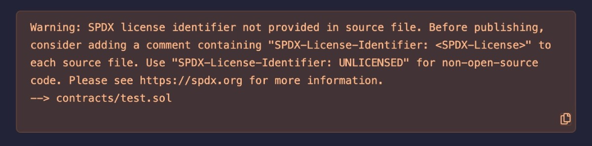

# Solidity基础教程:&nbsp;&nbsp;&nbsp;&nbsp;105.SPDX 版权声明 

本章讲解 **`SPDX`** 语句的作用，以及如何选择版权许可证。

**视频**：[Bilibili](https://www.bilibili.com/video/BV1nj411o7M6)  |  [Youtube](https://youtu.be/3otW_llb6is)

<p align="center"></p>

**官网**：[BinSchoolOrg](https://binschool.org)

**代码**：[github.com/hitadao](https://github.com/hitadao)

**推特**：[@Hita_DAO](https://x.com/hita_dao)    **Discord**：[Hita_DAO](https://discord.gg/dzWY3QYGrx)

-----
下面是一个简单的 **`Solidity`** 编写的智能合约：

```solidity
// SPDX-License-Identifier: MIT
pragma solidity ^0.8.0;

contract HelloWorld {

  function greet() public pure returns(string memory) { 
    return "Hello World"; 
  } 
}
```

**`SPDX`** 语句通常位于 **`Solidity`** 智能合约文件的第一句。

**`SPDX`** 语句是一条注释语句，也就是说，如果合约代码中没有 **`SPDX`** 语句，那么功能也不会受到任何影响，照样可以运行。

但是，如果我们在代码中去除了 **`SPDX`** 语句，那么在编译合约的时候，就会出现下面的警告信息：

```solidity
Warning: SPDX license identifier not provided in source file. Before publishing,
consider adding a comment containing "SPDX-License-Identifier: <SPDX-License>" to each source file.
Use "SPDX-License-Identifier: UNLICENSED" for non-open-source code.
Please see https://spdx.org for more information. 
```
<p align="center"></p>

大意是：源文件缺少 **`SPDX`** 许可证标识，建议在发布前，使用 SPDX-License-Identifier 标识加上注释。

我们也建议在 **`Solidity`** 源文件中加入 **`SPDX`** 许可证标识语句，这样更符合 **`Solidity`** 编程规范。

## SPDX 有什么用处

**`SPDX`** 即软件包数据交换（Software Package Data Exchange），它是一种用于描述软件许可信息的标准格式，它的内容包括许可证、版权和其他相关信息。

**`SPDX`** 规范由 Linux 基金会的 **`SPDX`** 工作组开发，旨在简化在不同的软件开发和分发渠道之间共享和跟踪软件许可信息的过程。

**`SPDX`** 的官方网站为：[SPDX 许可证列表 |软件包数据交换（SPDX）](https://spdx.org/licenses/)，有需要了解细节的可以自行查看。

**简而言之**，**`SPDX`** **用于声明版权信息**。

我们必须清楚，开源代码虽然源代码是公开的，但并不意味着可以免费使用。我们在使用别人代码的时候，先要搞清楚是否允许商用，防止出现侵犯版权的行为。

在 **`Solidity`** 中，就是使用 **`SPDX-License-Identifier`** 语句来声明版权许可证。

比如，**SPDX-License-Identifier: MIT**，就表明了这段代码使用的是 **`MIT`** 版权许可证。

我们在编写智能合约的时候，通常在文件首句使用 **`SPDX`** 来声明版权许可证。

## SPDX 应该如何选择

**`MIT`** 是智能合约中最常见的版权许可证，具体描述如下：

特此免费授予获得（“软件”）副本的任何人不受限制地处理本软件的许可，包括但不限于使用、复制、修改、合并、发布、分发、再许可和/或出售本软件副本的权利。
上述版权声明和本许可声明应包含在本软件的所有副本或大部分内容中。

本软件按“原样”提供，不附带任何明示或暗示的担保，包括但不限于适销性、特定用途的适用性和不侵权的担保。

在任何情况下，对于因本软件或本软件的使用或其他交易而引起、引起或与之相关的任何索赔、损害赔偿或其他责任，无论是在合同诉讼、侵权行为还是其他方面，均不承担任何责任。

**简而言之，采用** **`MIT`** **许可证，就意味着任何人都能以任何方式使用代码，但是出了问题不负责**。

通常，我们都会选择 **`MIT`** 作为智能合约的版权许可证，这也是大多数知名开源项目的选择。

比如，大名鼎鼎的安全基础库 **`OpenZeppelin`**，它使用的就是 **`MIT`** 许可证。

```solidity
// SPDX-License-Identifier: MIT
// OpenZeppelin Contracts (last updated v4.8.0) (token/ERC20/ERC20.sol)
```

我们在编写智能合约的时候，直接抄写一遍放在合约开头即可。

```solidity
// SPDX-License-Identifier: MIT
```

## 合约代码应该开源还是不开源

由于智能合约秉承了区块链数据公开的原则，它的代码通常都是开源的，这也是区块链项目取信于人的一种手段。

如果智能合约的源码不公开，那么就意味着该合约很可能埋伏着一些特殊目的，比如欺诈、后门等。

当然，也有一些项目方为了保护源码版权，或者对代码的安全性不自信，从而选择了不开源。

但是，智能合约最终是要发布到区块链上的，任何人都可以得到它的二进制代码。在代码量不大的情况下，还是非常容易被整体或者局部反编译，因而达不到保护源码的目的。

知名的 **`Defi`** 巨头 **`UniSwap`**，它的合约代码虽然是开源的，但许可证采用了 **`BUSL`**，并不是 **`MIT`**。

```solidity
// SPDX-License-Identifier: BUSL-1.1
```

**`BUSL`** 许可证与 **`MIT`** 非常相似，也是一种比较宽松的许可方式，但与 **`MIT`**  相比，还是附加了一些限制条件。

**`UniSwap`** 加入限制条件的主要原因：**`UniSwap`** 作为最著名的去中心化交易所，很多项目直接抄袭了它的代码，甚至有些项目的交易规模接近甚至反超了它，比如 **`SushiSwap`**，所以 **`UniSwap`** 出于商业利益的考虑，在版权声明中加入了一定的限制。
