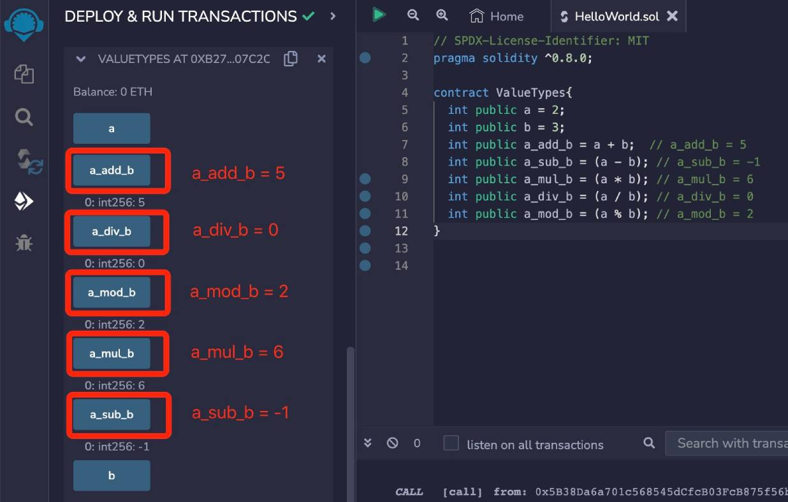
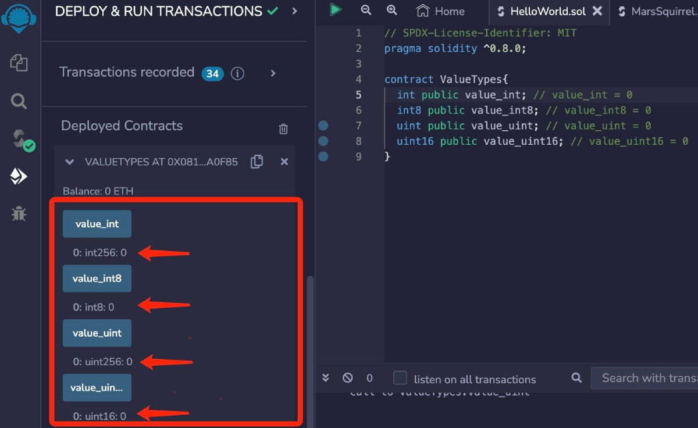

# Solidity基础教程:&nbsp;&nbsp;&nbsp;&nbsp;202.整型 

本章学习 **`Solidity`** 数据类型中的整型，以及整型的相关运算。

**视频**：[Bilibili](https://www.bilibili.com/video/BV1Nh4y1L7B9)  |  [Youtube](https://youtu.be/NrQKOkw5q9ws)

<p align="center"></p>

**官网**：[BinSchoolOrg](https://binschool.org)

**代码**：[github.com/hitadao](https://github.com/hitadao)

**推特**：[@Hita_DAO](https://x.com/hita_dao)    **Discord**：[Hita_DAO](https://discord.gg/dzWY3QYGrx)

-----
由于大多数的智能合约都会涉及到数字资产，因此在 **`Solidity`** 语言中， **`整型`** 是使用最为广泛的数据类型。

**`整型`** 分为两大类：**`无符号整型`** 和 **`有符号整型`**。

## 无符号整型

无符号整型使用 **`uint`** 关键字来表示，它的取值只能是 **正整数** 和 **零**。

例如，我们在合约中定义一个无符号整型变量 **`ucount`**，给它赋值为 16。

```solidity
// 无符号整型
uint ucount = 16;
```

**`uint`** 的内部存储长度是 256 位，因此，它的取值范围为 0 ~ 2^256-1（2的256次方减去1）。

## 有符号整型

有符号整型使用 **`int`** 关键字来表示，它的取值可以是 **正整数**、**负整数** 和 **零**。

例如，定义一个有符号整型变量 **`count`**，赋值为 -1。

```solidity
// 有符号整型
int count = -1; 
```

**`int`** 的内部存储长度是 256 位，因此，它的取值范围为 -2^255 ~ 2^255-1（2的255次方减去1）。

## 数字分割线

如果要表示的数字位数过长，或者需要按照特定位数进行分组，则可以使用下划线对数字进行分割，以便于阅读。

例如：

```solidity
uint num1 = 1000_000_000;
uint num2 = 10_0000_0000;
```

## 算术运算符

用于整型变量的运算符，主要是算术运算符，有如下几个：

 **`+`**  加法、  **`-`**  减法、  **`*`**  乘法、  **`/`**  除法、  **`%`**  取余。

```solidity
// int a = 2,int b = 3
int a_add_b = a + b; // a_add_b = 5
int a_sub_b = a - b; // a_sub_b = -1
int a_mul_b = a * b; // a_mul_b = 6
int a_div_b = a / b; // a_div_b = 0
int a_mod_b = a % b; // a_mod_b = 2
```

整型的除法运算 **`/`**，只取结果的整数部分，不进行四舍五入。例如： 2  /  3 = 0。

整型的取余运算 **`%`** ，就是两数相除以后，取结果的余数部分。例如： 2  %  3 = 2。

以下智能合约，对整型变量进行了各种算术运算。

```solidity
// SPDX-License-Identifier: MIT
pragma solidity ^0.8.0;

contract IntegerOps {
  int public a = 2;
  int public b = 3;
  int public a_add_b = a + b; // a_add_b = 5
  int public a_sub_b = a - b; // a_sub_b = -1
  int public a_mul_b = a * b; // a_mul_b = 6
  int public a_div_b = a / b; // a_div_b = 0
  int public a_mod_b = a % b; // a_mod_b = 2
}
```

我们把合约代码复制到 **`Remix`**，进行编译，并部署到区块链上。

点击部署的合约中变量 a_add_b、a_sub_b、a_mul_b、a_div_b、a_mod_b，就会显示运算后的变量值。

<p align="center"></p>

由于无符号整型的值只能是正数或者零，所以在进行减法运算的时候，如果结果是负数，那么就会报错。

例如：

```solidity
// SPDX-License-Identifier: MIT
pragma solidity ^0.8.0;

contract IntegerError {
  uint public a = 2;
  uint public b = 3;
  uint public a_sub_b = a - b; 
}
```

这段合约代码在部署时就会出错。在运行过程中，如果给无符号整型变量赋值为负数，也会报错，并回滚之前的操作。

## 特定长度的整型
除了 **`uint`** 和 **`int`** 外，**`Solidity`** 中按照存储长度，还定义了一系列特定长度的 **`整型`**。它们的长度从 8 位一直到 256 位，按照 8 的倍数递增。

包括：无符号整型 uint8、uint16、uint24、uint32......uint256，有符号整型 int8、int16、int24、int32......int256。

其中，我们常用的 **`uint`** 就是 **`uint256`** 的别名 ，**`int`** 就是 **`int256`** 的别名 ，它们两者完全相同。

### 1. 极限值

获取某种整型的最大值和最小值，可以使用 **`type`** 函数。这在有些 **`ERC20`** 代币合约中会用到。

例如，获取 **`uint8`** 类型的最大值和最小值：

```solidity
// SPDX-License-Identifier: MIT
pragma solidity ^0.8.0;

contract IntegerLimit {
  uint8 public max = type(uint8).max; 
  uint8 public min = type(uint8).min; 
}
```

### 2. 默认值

在智能合约中声明的整型变量，如果没有赋给初始值，那么它的值默认是 0。

```solidity
// SPDX-License-Identifier: MIT
pragma solidity ^0.8.0;

contract IntegerDefault {
  int public value_int; // value_int = 0
  int8 public value_int8; // value_int8 = 0
  uint public value_uint; // value_uint = 0
  uint16 public value_uint16; // value_uint16 = 0
}
```

我们把合约代码复制到 **`Remix`**，进行编译，并部署到区块链上。

点击部署的合约中变量 value_int、value_int8、value_int8、value_uint16，就会显示各类整型的默认值，它们都是 0。

<p align="center"></p>
