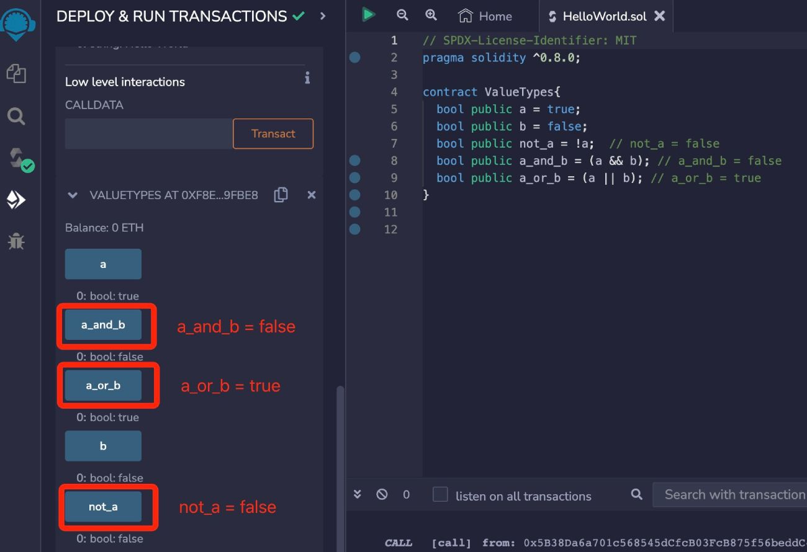

# Solidity基础教程:&nbsp;&nbsp;&nbsp;&nbsp;203.布尔型 

本章学习 **`Solidity`** 数据类型中的布尔型，以及布尔型的相关运算。

**视频**：[Bilibili](https://www.bilibili.com/video/BV18u411L7Ki)  |  [Youtube](https://youtu.be/85RWHNWTugw)

<p align="center"></p>

**官网**：[BinSchoolOrg](https://binschool.org)

**代码**：[github.com/hitadao](https://github.com/hitadao)

**推特**：[@Hita_DAO](https://x.com/hita_dao)    **Discord**：[Hita_DAO](https://discord.gg/dzWY3QYGrx)

-----
**`布尔型`** 是一种非常简单的数据类型，通常应用于条件语句或者循环语句中，用来判断条件是否成立，控制代码的执行流程。

在 **`Solidity`** 中，**`布尔型`** 使用 **`bool`** 关键字来表示，它只能取两个值：**`true`** 或者 **`false`**。

例如，定义一个布尔型的变量 **`condition`**，赋值为 **`true`**。

```solidity
// 布尔类型
bool condition = true;
```

## 逻辑运算符

用于布尔型变量的运算符，主要是逻辑运算符，包括：

### 1. ! 逻辑非
**`!`**  是一个单目运算符，效果等同于 “not”，如果操作数为 true，那么结果为 false；如果操作数为 false，那么结果为 true。

```solidity
// bool a = true
bool b = !a; // b = false
// bool a = false
bool b = !a; // b = true
```

### 2. && 逻辑与

**&&** 效果等同于 “and”，只有两个操作数全部为 true，结果才为 true，否则为 false。

```solidity
// bool a = true，bool b = true
bool c = a && b; // c = true
// bool a = true，bool b = false
bool c = a && b; // c = false
```

### 3. || 逻辑或
**||**  效果等同于 “or”，只要两个操作数中有一个为 true，那么结果为 true；只有全部为 false，结果才为 false。

```solidity
// bool a = true，bool b = true
bool c = a || b; // c = true
// bool a = true，bool b = false
bool c = a || b; // c = true
// bool a = false，bool b = false
bool c = a || b; // c = false
```

下面的智能合约，对布尔型变量进行了各种逻辑运算。

```solidity
// SPDX-License-Identifier: MIT
pragma solidity ^0.8.0;

contract BoolOps {
  bool public a = true;
  bool public b = false;
  bool public not_a = !a;  // not_a = false
  bool public a_and_b = (a && b); // a_and_b = false
  bool public a_or_b = (a || b); // a_or_b = true
}
```

我们把以上合约的代码，复制到 Remix，进行编译，然后部署到区块链上。

点击部署的合约中变量 not_a、a_and_b、a_or_b，就会显示运算后的变量值。

<p align="center"></p>

另外，运算符 **||** 和 **&&** 遵循短路（ short-circuiting ）规则。也就是说在表达式 f(x) || g(y) 中， 如果 f(x) 的值为 true ，那么 g(y) 就不会被执行，直接结束判断，即使g(y) 会出现一些副作用。

## 布尔型的默认值

**`Solidity`** 中 **`布尔型`** 变量的默认值为 **false**。

在智能合约中声明的布尔型变量，如果没有赋给初始值，那么它的值就默认为 **false**。

```solidity
// SPDX-License-Identifier: MIT
pragma solidity ^0.8.0;

contract BoolDefault {
  bool public value_bool; // value_bool = false
}
```