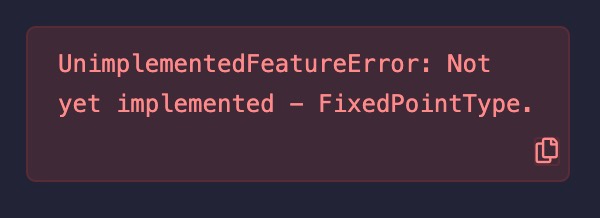

# Solidity基础教程:&nbsp;&nbsp;&nbsp;&nbsp;205.浮点型 

本章学习 **`Solidity`** 数据类型中的浮点型，以及如何正确地处理小数。

**视频**：[Bilibili](https://www.bilibili.com/video/BV1Xz4y147oJ)  |  [Youtube](https://youtu.be/UyNt6mRXb04)

<p align="center"></p>

**官网**：[https://BinSchool.Org](https://binschool.org)

**代码**：[https://github.com/hitadao/solidity](https://github.com/hitadao/solidity)

**推特**：[@Hita_DAO](https://x.com/hita_dao)    **Discord**：[Hita_DAO](https://discord.gg/dzWY3QYGrx)

-----
**`浮点型`** 是 **`Solidity`** 中最不常用的数据类型，用于表示带有小数部分的数字。 

虽然在 **`Solidity`** 语言规范中，**`浮点型`** 有完整的定义，但是目前的编译器并没有完全支持，而且在实际的合约中也没有人使用。

对于本章内容的学习，我们大体了解即可，无需深入研究。

按照 **`Solidity`** 官方文档的说明:

**`浮点型`** 共有两种：**`fixed`** 和 **`ufixed`**，分别代表 **有符号定长浮点数** 和 **无符号定长浮点数**。

另外，还定义了一系列特定长度的浮点数，分别使用关键字 **`fixedMxN`** 和 **`ufixedMxN`** 表示，其中 **M** 表示该类型占用的总位数，**N** 表示可用的小数位数。

**M** 可以取值 8 到 256 位，但必须能够被 8 整除；**N** 可以是从 0 到 80 之间的任意数。

**`fixed`** 和 **`ufixed`** 分别是 **`fixed128x18`** 和 **`ufixed128x18`** 的别名。

## 浮点型的使用方法
我们可以在合约中声明 **`浮点型常量`** ，并给它赋值。比如：

```solidity
// 浮点型
fixed constant PI = 3.14159265;
```

但不能给 **`浮点型变量`** 赋值，否则编译时就会报错。

```solidity
// 浮点型
fixed a = 1.2;
```

报错信息为：

```solidity
UnimplementedFeatureError: Not yet implemented - FixedPointType.
```

<p align="center"></p>

## 如何处理小数

在 **`Solidity`** 中，**`wei`** 是以太币的基本计量单位，也是默认的计量单位，而不是 **`ETH`**。**`wei`** 这个单位是为了向华人密码学家 **Wei Dai** 致敬而来的。

1 个以太币 ETH 等于 10^18（10的18次方）wei。

比如，在 **`Solidity`** 中，对某地址 **`address`** 进行一笔转账：

```solidity
payable(address).transfer(100);
```

这条语句是向地址 **`address`** 转账了 100 **`wei`**，而不是 100 个以太币 ETH，因为 **`wei`** 是 **`Solidity`** 中默认的计量单位。

以太币 ETH 在 **`Solidity`** 中通常记为 **`ether`**，一个以太币 ETH 也就是 1 ether。

正是有了 **`wei`** 这个非常小的计量单位，使得在 **`Solidity`** 中可以使用整数来代替浮点数。

比如：0.01 ether 就等于 10^16 wei。如果使用 **`wei`** 作为计量单位，就可以将原来的小数 0.01 ether 转换为整数 10^16 wei，相关的小数运算也就变为了整数运算。

使用整数代替浮点数进行计算，会带来以下好处：

### 1. 避免精度丢失
由于浮点数在计算机中的表示是有限的，因此使用浮点数来处理货币单位可能会导致精度丢失。这意味着在对浮点数进行运算时，可能会出现微小的舍入误差，这可能会影响智能合约的正确性和安全性。

使用整数可以避免这种问题，因为整数类型在计算机中的表示是精确的。

### 2. 提高运算效率
计算机硬件上执行整数运算比浮点运算更快。由于以太坊网络需要高效地处理大量的数字交易，因此，使用整数可以提高智能合约的执行效率和响应速度。

### 3. 提升安全性
使用整数可以避免一些常见的浮点数漏洞，例如浮点数溢出和浮点数除以零错误等，这些漏洞可能导致智能合约的不安全行为。

所以，在 **`Solidity`** 中以 **`wei`** 作为计量单位，就可以使用整数来代替浮点数进行计算，从而提高智能合约的精度、效率和安全性。

在实际的合约中，**`Solidity`** 中的浮点数类型几乎没有使用。所以，我们只要了解这种数据类型就可以了，无需深入研究。
