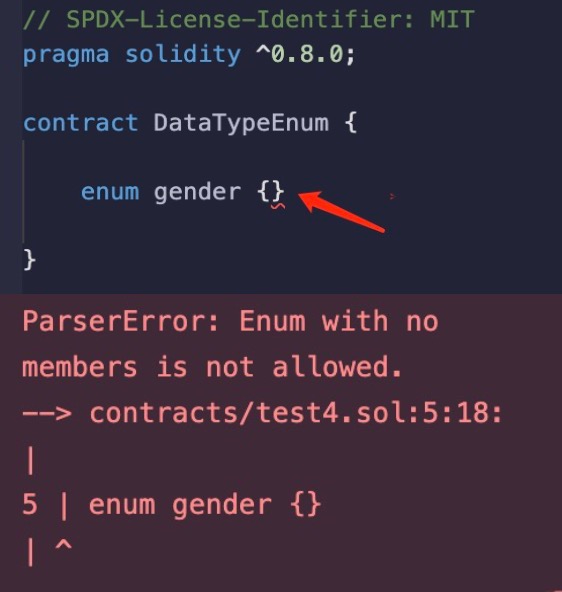
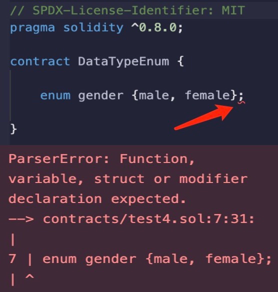

# Solidity基础教程:&nbsp;&nbsp;&nbsp;&nbsp;206.枚举型 

本章学习 **`Solidity`** 数据类型中的枚举型，以及枚举型的使用方法。

**视频**：[BiliBili](https://www.bilibili.com/video/BV1Sh4y1L7uJ) | [Youtube](https://youtu.be/kcAsjDCbFqQ) 

<p align="center"></p>

**官网**：[https://BinSchool.Org](https://binschool.org)

**代码**：[https://github.com/hitadao/solidity](https://github.com/hitadao/solidity)

**推特**：[@Hita_DAO](https://x.com/hita_dao)    **Discord**：[Hita_DAO](https://discord.gg/dzWY3QYGrx)

-----
在 **`Solidity`** 中，**`枚举型`** 是一种用户自定义的数据类型，它需要在使用之前进行定义。

要定义一个 **`枚举型`**，可以使用关键字 **`enum`**。**`枚举型`** 由一组预定义的常量组成，这些常量在枚举列表中定义。

例如：

```solidity
// 定义枚举类型
enum gender {male, female}
```

这里的 **`gender`** 是定义的枚举型的名称，其中 **`male`** 和 **`female`** 组成了枚举列表。换句话说，枚举型 **`gender`** 具有两个可选的值，分别是 **`male`** 和 **`female`**。

然后，我们就可以使用已定义的枚举型 **`gender`** 来声明变量，并给它赋值。

```solidity
// 使用枚举型
gender a = gender.male;
```

**注意事项：**

1.  枚举列表不能为空，至少要包含一个成员，否则编译器将会报错。

<p align="center"></p>

2. 定义枚举型的语句，后面不需要跟着分号。一般大括号的后面都不需要跟着分号，如果跟着分号，编译器会报错。

<p align="center"></p>

3. 枚举型只能在全局空间内声明，不能在函数内声明。通常是在状态变量前面的位置声明。

## 枚举型的本质

枚举型是一种用户自定义的类型，并不是 **`Solidity`** 的原生数据类型。

枚举型在编译后就会转换为无符号整数 **`uint8`**，所以，在 **`Solidity`** 中，枚举值可以转换为整数，它的第一个成员的值默认是 **0**，后面的值依次递增。 

例如：

```solidity
enum status {normal, deleted}
uint8 a = uint8(status.normal) // a = 0
uint8 b = uint8(status.deleted) // b = 1
```

## 枚举型的作用

枚举型的主要作用是提高代码的可读性。

比如，表示数据的两种状态：正常状态和已删除状态，我们就可以这样定义：

```solidity
enum status {normal, deleted}
```

这样在代码中使用时，**`status.deleted`** 就要比用常量数字“1”代表的已删除状态，更为直观。

枚举类型在 **`Solidity`** 中并不常用，而且可以使用常量来代替，我们了解一下就可以了。

## 枚举型使用范例

枚举型编译后，最终会被转换为无符号整数 **`uint8`**，所以，枚举值与整数之间可以互相转换。 

下面的范例中，包含了对枚举型变量的一些常用操作，以及类型之间的转换。

```solidity
// SPDX-License-Identifier: MIT 
pragma solidity ^0.8.0; 

contract EnumOps {
    // 定义枚举型
    enum gender {male, female}

    // 使用枚举型声明状态变量
    gender private myGender = gender.female;

    // 函数内使用枚举类型
    function useEnum() public returns(gender) {
        gender t = myGender;
        myGender =  gender.male;
        return t; 
    }
   // 枚举型用作返回值
    function returnEnum() public pure returns(gender) {
        return gender.female; 
    }
    // 枚举值转换为整型
    function convertInt() public pure returns(uint) {
        return uint(gender.female); 
    }
    // 整型转换为枚举型
    function convertEnum() public pure returns(gender) {
        return gender(1); 
    }
}
```