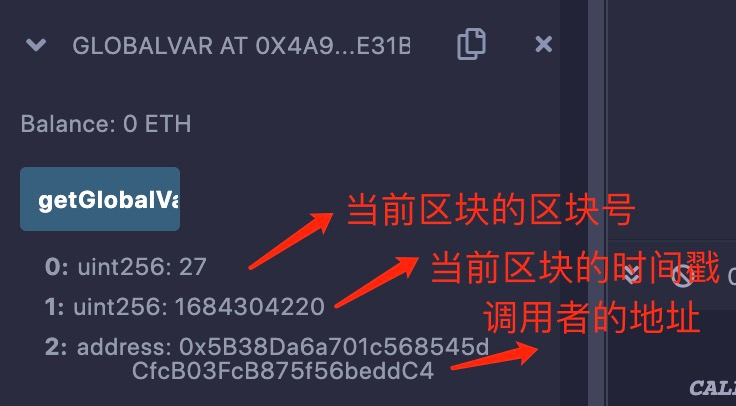

# Solidity基础教程:&nbsp;&nbsp;&nbsp;&nbsp;301.变量 

本章学习 **`Solidity`** 变量的相关知识，包括变量命名、变量类型等。

**视频**：[Bilibili](https://www.bilibili.com/video/BV1jV411L7u2)  |  [Youtube](https://youtu.be/TkPPYdqVFlM)

<p align="center"></p>

**官网**：[https://BinSchool.Org](https://binschool.org)

**代码**：[https://github.com/hitadao/solidity](https://github.com/hitadao/solidity)

**推特**：[@Hita_DAO](https://x.com/hita_dao)    **Discord**：[Hita_DAO](https://discord.gg/dzWY3QYGrx)

-----
变量是指可以保存数据的内部存储单元，里面的数据可以在程序运行时引用或者修改。

变量都有一个名字，称为变量名。变量名是由字母、数字或下划线“_”组成的字符串，但不能包含空格或其他特殊字符，也不能以数字开头。

通常，比较规范的写法是采用驼峰形式，整体以小写字母或者下划线“_”开头。比如：**symbol、totalSupply、_name**。

**`Solidity`** 中变量、函数等名称对字母的大小写敏感，也就是说变量 **symbol** 和 **Symbol** 是两个不同的变量。

**`Solidity`** 是一种静态类型的编程语言，这意味着在变量声明时就需要明确指定变量的类型。

变量声明时，如果没有赋给初值，都会有一个基于其类型的默认值，比如 **`int`** 类型的默认值为 0。

**`Solidity`** 的变量没有 **undefined** 或 **null** 等空值的概念。

**`Solidity`** 提供了 3 种类型的变量：**`状态变量`**、**`局部变量`**、**`全局变量`**。

## 1. 状态变量

状态变量是指在智能合约中声明的持久化存储的变量。它的值在合约的整个生命周期内保持不变，直到被修改或者合约被销毁。

简单来说，状态变量的变动是要记录在区块链上的，永久存储，也就是通常所说的“数据上链”。

状态变量可以用于存储合约的状态信息、用户余额，以及其它记录等数据。

状态变量在合约的不同函数之间共享，可以通过调用函数来读取或修改它的数据值。

状态变量类似于其它编程语言中“类”的成员变量。

在 **`Solidity`** 中，状态变量通常在合约的顶层进行声明，并且定义在全部函数之外。

```solidity
// SPDX-License-Identifier: MIT
pragma solidity ^0.8.0;

contract StatusVar {
   uint256 myStatus = 1;  // 声明状态变量

   function getStatus() public view returns(uint256) {
      return myStatus;   // 使用状态变量
   }
}
```

这里首先声明了一个状态变量 **`myStatus`**，然后在函数 **`getStatus`** 中，把它作为函数的返回值。

运行合约，调用函数 **`getStatus`**，输出结果：

```solidity
0: uint256: 1
```

2. 局部变量

局部变量是指在函数内部声明的变量，其作用域仅限于该函数内部。

局部变量的生命周期仅限于该函数的执行过程中，函数执行完毕后，局部变量将被销毁，其值也将不再可用。

也就是说，状态变量的数据是要上链的，而局部变量不上链。

声明局部变量的语法与状态变量类似，只要在函数内部声明变量即可。

```solidity
// SPDX-License-Identifier: MIT
pragma solidity ^0.8.0;

contract LocalVar {
   function sum() public pure returns(uint256){
      uint256 a = 1;  // 声明局部变量 a
      uint256 b = 2;  // 声明局部变量 b
      uint256 result = a + b; // 声明局部变量 result，并使用局部变量a, b
      return result; // 使用局部变量 result 作为返回值
   }
}
```

运行合约，调用函数 **sum**，输出结果：

```solidity
0: uint256: 3
```

## 3. 全局变量

全局变量是指在合约的顶层预先定义的特殊变量，用于提供有关区块链和交易属性的信息。

全局变量是由 **`Solidity`** 语言提供，用户无权定义或者修改，可以直接在任何位置使用。

例如，常用的全局变量有：当前区块的时间戳 **`block.timestamp`**、区块高度 **`block.number`**、函数调用者地址 **`msg.sender`** 等。

```solidity
// SPDX-License-Identifier: MIT
pragma solidity ^0.8.0;

contract GlobalVar {
   // 返回当前函数调用所在的区块号、时间戳、调用者地址
   function getGlobalVars() public view returns(uint,uint,address){
     return (block.number, block.timestamp, msg.sender);
   }
}
```

运行以上合约，调用函数 **`getGlobalVars`**，输出下面的结果：

<p align="center"></p>

**常用的全局变量：**

| 名称 | 返回|
|:----|:-----|
|blockhash(uint blockNumber) returns (bytes32)|指定区块的哈希值|
|block.coinbase (address payable)|当前区块的矿工地址|
|block.difficulty (uint)|当前区块的难度值|
|block.gaslimit (uint)|当前区块的gaslimit|
|block.number (uint)|当前区块的区块号|
|block.timestamp (uint)|当前区块的时间戳|
|gasleft() returns (uint256)|当前剩余的gas|
|msg.data (bytes calldata)|完成 calldata|
|msg.sender (address payable)|消息发送者的地址，也就是函数调用者的地址|
|msg.sig (bytes4)|消息的函数签名，也就是calldata的前四个字节|
|msg.value (uint)|消息携带的token数量，也就是函数调用时，同时存入的token量|
|tx.gasprice (uint)|交易的gas价格|
|tx.origin (address payable)|交易的发送方地址|

## 4. 变量命名注意问题

在为变量命名时，需要注意以下问题：

不应该使用 **`Solidity`** 保留的关键字作为变量名。例如：**int**、**break** 或 **return** 变量名无效。

不应该以数字开头，必须以字母或下划线开头。例如：**123test** 是一个无效的变量名，但是 **_123test** 是一个有效的变量名。

变量名是区分大小写的。例如：**Name** 和 **name** 是两个不同的变量。
