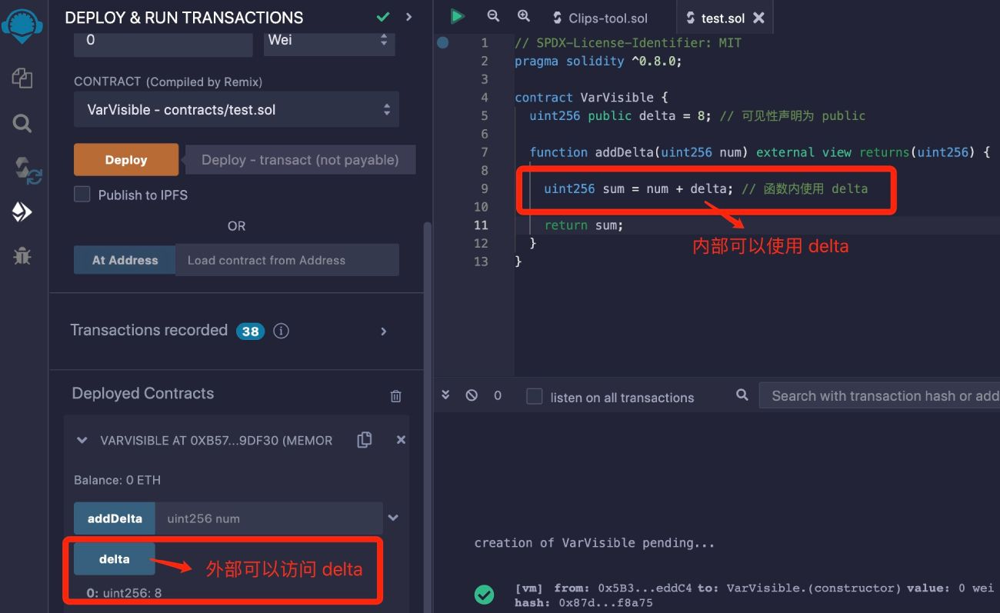
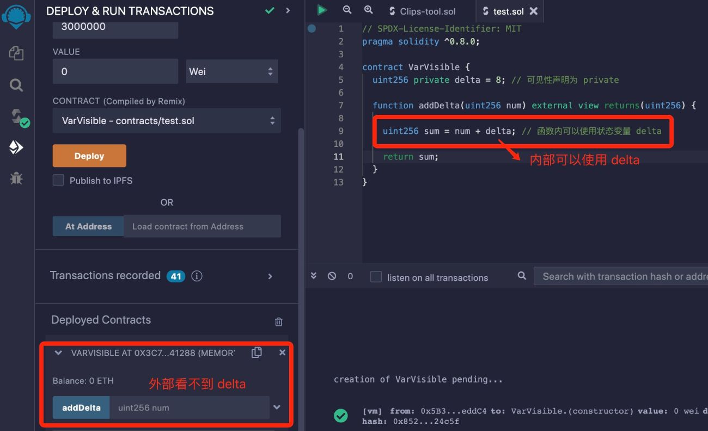
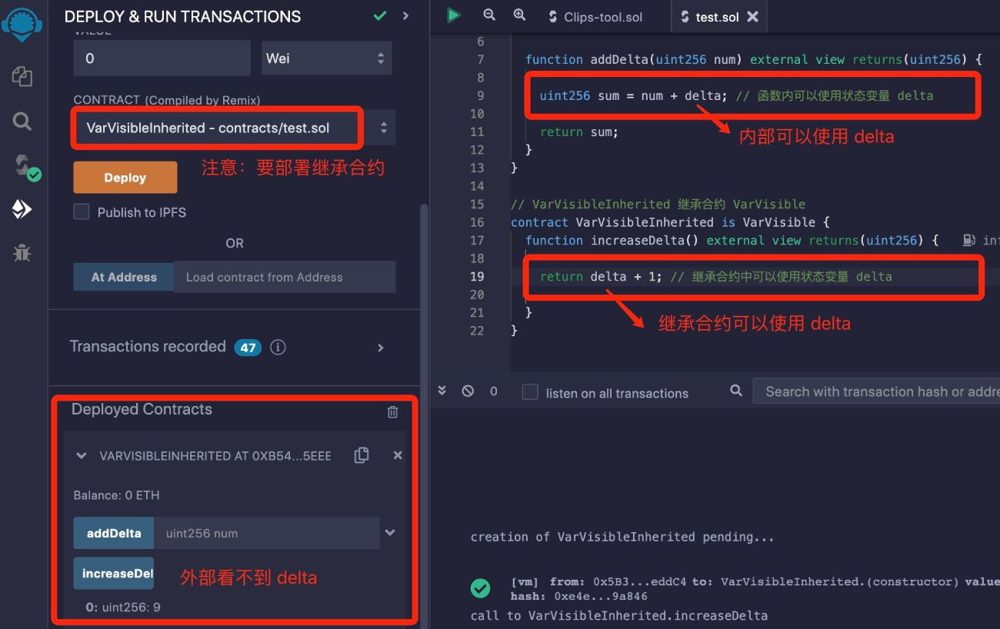

# Solidity基础教程:&nbsp;&nbsp;&nbsp;&nbsp;302.变量可见性 

本章学习 **`Solidity`** 状态变量的可见性。

**视频**：[Bilibili](https://www.bilibili.com/video/BV1ih4y1k71T)  |  [Youtube](https://youtu.be/60_Br5_hQTo)

<p align="center"></p>

**官网**：[BinSchoolOrg](https://binschool.org)

**代码**：[github.com/hitadao](https://github.com/hitadao)

**推特**：[@Hita_DAO](https://x.com/hita_dao)    **Discord**：[Hita_DAO](https://discord.gg/dzWY3QYGrx)

-----
状态变量有一个非常重要的属性，称为可见性。

可见性是用来控制状态变量在合约内部或外部的访问权限。

**`Solidity`** 为状态变量提供了 3 种可见性修饰符，分别是 **`public`**、**`private`** 和 **`internal`**，用于限制状态变量的可见性。

## 1. public
如果状态变量的可见性声明为 **`public`**，也就是公开变量，那么在合约内部和外部都可以访问这个状态变量。

```solidity
// SPDX-License-Identifier: MIT
pragma solidity ^0.8.0;

contract PublicVisibility {
  uint256 public delta = 8; // 可见性声明为 public

  function addDelta(uint256 num) external view returns(uint256) {
    uint256 sum = num + delta; // 函数内可以使用状态变量 delta
    return sum;
  }
}
```

我们把合约代码复制到 **`Remix`**，进行编译，并部署到区块链上：

<p align="center"></p>

我们从外部可以看到状态变量 **`delta`**，并且还可以从外部访问它，点击 **`delta`** 获得返回值为 8。

## 2. private

如果状态变量的可见性声明为 **`private`**，也就是私有变量，那么就只能在合约内部访问这个状态变量，而不能从外部访问。

```solidity
// SPDX-License-Identifier: MIT
pragma solidity ^0.8.0;

contract PrivateVisibility {
  uint256 private delta = 8; // 可见性声明为 private

  function addDelta(uint256 num) external view returns(uint256) {
    uint256 sum = num + delta; // 函数内可以使用状态变量 delta
    return sum;
  }
}
```

我们把合约代码复制到 **`Remix`**，进行编译，并部署到区块链上：

<p align="center"></p>

我们从外部看不到状态变量 **`delta`**，所以无法从外部访问它。

私有变量将数据隐藏在合约内部，不直接暴露给外部访问，可以防止外部代码直接修改或访问内部状态，同时可以减少外部代码对内部实现的依赖，降低模块之间的耦合度，从而提高可维护性。

所以，在 **`Solidity`** 编程中，状态变量尽可能使用 **`private`** 可见性，而不是其它类型。

## 3. internal
如果状态变量的可见性声明为 **`internal`**，也就是内部变量，那么就可以在当前合约和它的继承合约的内部访问这个状态变量，但不能从外部访问。

**`internal`** 与 **`private`** 相比，就是 **`internal`** 变量还可以在继承合约中使用，而 **`private`** 变量就不能在继承合约中使用，只能在当前合约中使用。

```solidity
// SPDX-License-Identifier: MIT
pragma solidity ^0.8.0;

contract InternalVisibility {
  uint256 internal delta = 8; // 可见性声明为 internal

  function addDelta(uint256 num) external view returns(uint256) {
    uint256 sum = num + delta; // 函数内可以使用状态变量 delta
    return sum;
  }
}

// InheritedVisibility 继承合约 InternalVisibility
contract InheritedVisibility is InternalVisibility {
  function getDelta() external view returns(uint256) {
    return delta; // 继承合约中可以使用状态变量 delta
  }
}
```

我们把合约代码复制到 **`Remix`**，进行编译，并部署到区块链上：

<p align="center"></p>

无论是在当前合约，还是在继承合约，我们从外部都看不到状态变量 **`delta`**，所以从外部也无法使用它。
但 **`delta`** 可以在合约 **`InternalVisibility`** 内部和它的继承合约 **`InheritedVisibility`** 中使用。

## 4. 默认可见性

如果状态变量在声明的时候，没有指定可见性，那么它的可见性就为默认值 **`internal`**。

也就是说：

```solidity
uint status = 1;
```

等价于

```solidity
uint internal status = 1;
```

## 5. 可见性的用处

### 1. 访问控制

通过在状态变量上设置适当的可见性，可以实现对合约功能的访问控制。例如，将敏感数据存储在私有状态变量中，只允许合约的内部特定函数访问，从而确保外部只有通过授权才可以访问这些数据。

### 2. 封装数据

通过将状态变量声明为 **`private`**，可以限制对其数据的直接访问，只能通过合约内部的函数来访问，这样可以有效地封装内部数据，避免外部访问者直接操作状态变量，确保数据的安全性和一致性。

另外，除了状态变量外，函数也有可见性的限制，而且函数的可见性增加了一个 **`external`**，我们将在后面的章节中详细讲解。

