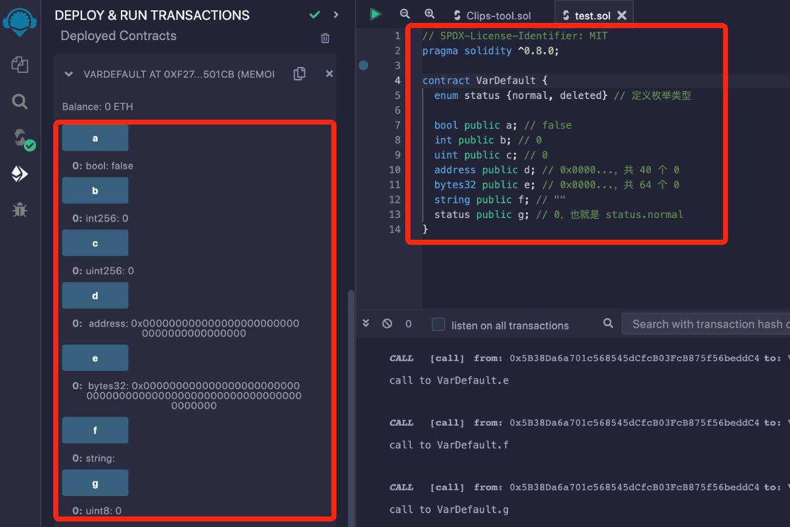
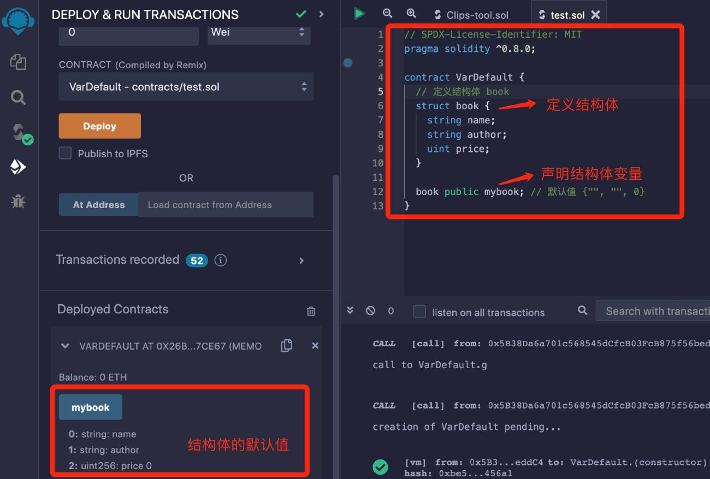

# Solidity基础教程:&nbsp;&nbsp;&nbsp;&nbsp;303.变量默认值

本章学习 **`Solidity`** 变量的默认值。

**视频**：[Bilibili](https://www.bilibili.com/video/BV1vP411W7nR)  |  [Youtube](https://youtu.be/kp_K1-GcWMM)

<p align="center"></p>

**官网**：[BinSchoolOrg](https://binschool.org)

**代码**：[github.com/hitadao](https://github.com/hitadao)

**推特**：[@Hita_DAO](https://x.com/hita_dao)    **Discord**：[Hita_DAO](https://discord.gg/dzWY3QYGrx)

-----

**`Solidity`** 智能合约中所有的状态变量和局部变量，都有默认值，也叫初始值。变量在没有被赋值之前，它的值就等于默认值。

我们在前面学习数据类型的时候，已经讲解了各种数据类型的默认值。

## 本类型的默认值

**`bool`** 类型变量的默认值为 false；

**`int`** 类型变量的默认值为 0，包括各种长度的有符号整型 ，比如 int8、int16....；

**`uint`** 类型变的量默认值为 0，包括各种长度的无符号整型，比如 uint8、uint16....；

**`address`** 类型变量的默认值为：0x0000...，共 40个 0；

**`bytes32`** 类型变量的默认值为：0x0000...，共 64个 0；

**`string`** 类型变量的默认值为：""；

**`enum`** 类型的默认值是它列表中的第一项。

我们可以通过一个合约来学习变量的默认值：

```solidity
// SPDX-License-Identifier: MIT
pragma solidity ^0.8.0;

contract VarDefault { 
  enum status {normal, deleted} // 定义枚举类型 

  bool public a; // false 
  int public b; // 0
  uint public c; // 0
  address public d; // 0x0000...，共 40 个 0 
  bytes32 public e; // 0x0000...，共 64 个 0
  string public f; // ""
  status public g; // 0，也就是 status.normal
}
```

我们将合约代码复制到 **`Remix`**，进行编译，并部署到区块链上：

<p align="center"></p>

## 复合类型的默认值

**`Solidity`** 中有些类型是复合类型，也就是由多个基本类型组合而成，比如结构体类型 **`struct`**。

```solidity
struct book {
  string name;
  string author;
  uint price;
}
```

结构体是一种用户自定义类型，上面的代码定义了一个结构体 **`book`**，用来描述一本书。

这个结构体 **`book`**，就是由多个 **`string`**、**`uint`** 类型的数据项构成。

那么这种复合类型的默认值是什么呢？

复合类型的默认值就是由每一个数据项的默认值组成。

我们可以使用 **`book`** 去声明一个变量 **`mybook`** 测试一下：

```solidity
// SPDX-License-Identifier: MIT
pragma solidity ^0.8.0;

contract VarDefault { 
  // 定义结构体 book
  struct book {
    string name;
    string author;
    uint price;
  }

  book public mybook; // 默认值 {"", "", 0}
}
```

我们将合约代码复制到 **`Remix`**，进行编译，并部署到区块链上：

<p align="center"></p>

## delete 操作符
**`Solidity`** 中有一个 **`delete`** 操作符，它可以对变量重新赋值。

从字面意思来看，似乎是要删除一个变量，其实不是，**`delete`** 操作符只是对变量重新初始化，使其值变为默认值。

```solidity
uint public a = 100;
delete a; // 执行delete后，a = 0
```

执行 **`delete`** 后，变量 **`a`** 依然可以访问，但它的值被初始化为默认值 0。

**`delete`** 操作符的使用频率并不高，我们只需了解它的用法就可以了，不要对它的操作效果有误解。