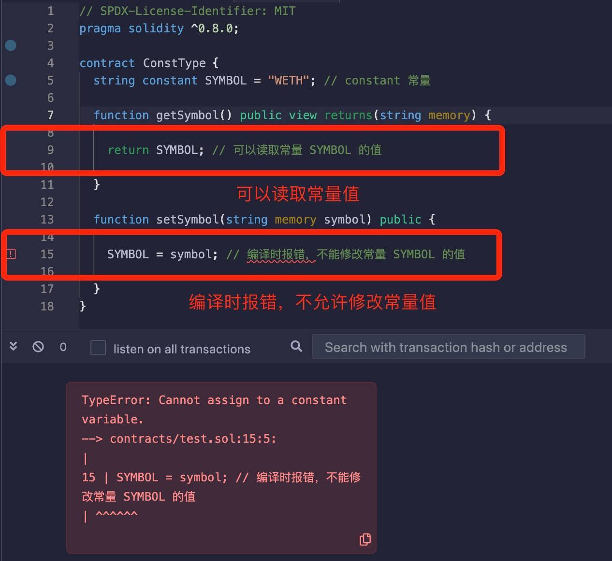

# Solidity基础教程:&nbsp;&nbsp;&nbsp;&nbsp;304.常量

本章学习 **`Solidity`** 中的两种常量的定义和用法，以及使用常量的好处。

**视频**：[Bilibili](https://www.bilibili.com/video/BV1FV4y1e7Bd)  |  [Youtube](https://youtu.be/k1rFT0_xEWI)

<p align="center"></p>

**官网**：[BinSchoolOrg](https://binschool.org)

**代码**：[github.com/hitadao](https://github.com/hitadao)

**推特**：[@Hita_DAO](https://x.com/hita_dao)    **Discord**：[Hita_DAO](https://discord.gg/dzWY3QYGrx)

-----
在智能合约中，如果一个状态变量的值恒定不变，就可以使用关键字 **`constant`** 或者 **`immutable`** 进行修饰，把它定义为常量。

```solidity
string constant SYMBOL = "WETH";
uint256 immutable TOTAL_SUPPLY = 1000;
```

常量的命名规则与变量相同，但通常使用大写字母表示，单词之间用下划线 “_” 连接，这样与变量更容易区分。这不是强制性的规定，而是大家约定俗成的编程规范。

状态变量一旦声明为 **`constant`** 和 **`immutable`** 后，就不能更改它的值了。

```solidity
// SPDX-License-Identifier: MIT
pragma solidity ^0.8.0;

contract ConstType { 
  string constant SYMBOL = "WETH"; // 定义常量 SYMBOL
 
  function getSymbol() public view returns(string memory) {
    return SYMBOL; // 可以读取常量 SYMBOL 的值
  }
  
  function setSymbol(string memory symbol) public {
    SYMBOL = symbol; // 编译时报错，不能修改常量 SYMBOL 的值
  }
}
```

我们将合约代码复制到 **`Remix`**，编译时就会报错，错误信息为：不能给一个常量赋值。

<p align="center"></p>


## constant 和 immutable 的区别

**`constant`** 和 **`immutable`** 虽然都能限制对状态变量的修改，但两者还是有区别的，表现在两个方面：

### 1. 初始化时机

**`constant`** 关键字修饰的状态变量，必须在声明时就立即显式赋值，然后就不再允许修改了。

```solidity
// SPDX-License-Identifier: MIT
pragma solidity ^0.8.0;

contract ConstType {
    uint8  public constant DECIMALS = 18; // 声明时赋值
}
```

**`immutable`** 关键字修饰的状态变量，既可以在声明时显式赋值，还可以在合约部署时赋值，也就是在构造函数 **`constructor`** 中赋值。但是，一旦赋值后就不能再修改了。

比如，在 **`ERC20`** 代币合约中，通常将铸造总量 **`totalSupply`** 定义为 **`immutable`**，这样可以在合约部署时，由部署者按照实际需求填入数量，不用再去修改代码，从而提高了合约的通用性和灵活性。

```solidity
// SPDX-License-Identifier: MIT
pragma solidity ^0.8.0;

contract ConstType {
    uint8  public immutable DECIMALS = 18; // 声明时赋值
    uint256 public immutable TOTAL_SUPPLY;

     constructor() {
        TOTAL_SUPPLY = 1000; // 合约部署时赋值
    }
}
```

### 2. 适用的数据类型

**`constant`** 可以修饰任何数据类型。

**`immutable`** 只能修饰值类型，比如：int、uint、bool、address 等，不能修饰 string、bytes 等引用类型。

```solidity
// SPDX-License-Identifier: MIT
pragma solidity ^0.8.0;

contract ConstType {
    uint256 constant TOTAL_SUPPLY = 100; // 正确
    uint256 immutable TOTAL_SUPPLY_I = 100; // 正确
    string constant SYMBOL = "WETH"; // 正确
    string immutable SYMBOL_I = "WETH"; // 错误
}
```

## 使用常量的好处

### 1. 代码可读性

通过使用常量，可以为代码中使用的特定数值或字符串提供有意义的名称，增加代码的可读性，使代码更易于理解和维护。

### 2. 代码重用

通过将常量定义为可复用的值，避免了在代码中重复输入。如果需要更改常量的值，只需修改它的定义，而不必在整个代码中寻找和替换多个出现的具体值。

### 3. 预防错误

常量的值在编译时就被确定，并且在运行时不可修改。这可以帮助预防意外的值更改和错误的赋值操作，减少人为错误导致的 **`bug`** 和意外行为。

### 4. 节省 Gas

使用常量比变量更节省 **`gas`** 成本，这也是非常重要的一点。常量的值在编译时就已知，且不可改变，编译器会将其值直接嵌入到合约代码中，避免了在运行时进行存储和访问的开销。