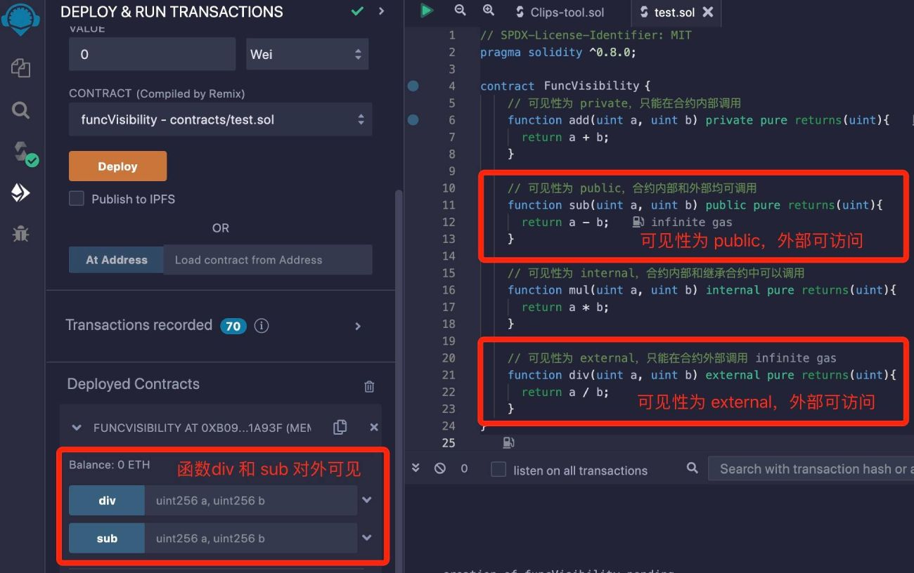

# Solidity基础教程:&nbsp;&nbsp;&nbsp;&nbsp;401.函数

本章学习函数的定义和使用方法。

**视频**：[Bilibili](bilibili.com/video/BV16m4y1T73a)  |  [Youtube](https://youtu.be/2WKdn-xuwbA?si=vgopFd2tEuOWT4vr)

<p align="center"></p>

**官网**：[https://BinSchool.Org](https://binschool.org)

**代码**：[https://github.com/hitadao/solidity](https://github.com/hitadao/solidity)

**推特**：[@Hita_DAO](https://x.com/hita_dao)    **Discord**：[Hita_DAO](https://discord.gg/dzWY3QYGrx)

-----
在 **`Solidity`** 中，函数是合约中的可执行代码块，用于定义合约的行为和操作。

函数里包含一系列语句和业务逻辑，可以接受输入的参数，执行特定的操作，并返回结果。

函数和状态变量是 **`Solidity`** 智能合约中最重要的组成部分。

## 1. 函数定义

在 **`Solidity`** 中， 定义函数的语法如下：

```solidity
function function_name(<parameter list>) <visibility> <state mutability> [returns(<return type>)] {
    ......
}
```

关键字 **`function`** 用来定义一个函数，后面跟着函数名、参数列表、可见性(visibility)、状态可变性(state mutability)以及返回值。

例如，定义一个加法函数：

```solidity
function add(uint a, uint b) public pure returns(uint) {
    return a + b;
}
```

这个函数的名称是 **`add`**，它需要两个整型参数 a 和 b，函数的可见性为 **`public`**，状态可变性是 **`pure`**，最后返回一个整型值。

## 2. 命名规则

函数的命名规则与变量相同。函数名可以是由字母、数字和下划线“_”组成的字符串，但不能包含空格或其他特殊字符，也不能以数字开头。

通常，比较规范的写法是采用驼峰形式，以小写字母或者下划线“_”开头。

例如：increaseAccount、_burnToken、splitString1 等，这都是正确的函数名字，而 1trim、#burnToken 就不正确，是无法通过编译的。

## 3. 可见性

函数可见性共有 4 种，分别是 **`private`**、**`public`**、**`internal`**、**`external`**，用于限制函数的使用范围。

函数可见性的规则与状态变量基本相同，但比状态变量多了一种 **`external`**。

- **private**

**`private`** 修饰的函数只能在所属的智能合约内部调用。

- **public**

**`public`** 修饰的函数可以从任何地方调用。它既可以在智能合约内部调用，也可以从智能合约外部调用。

- **internal**

**`internal`** 修饰的函数可以在所属的智能合约内部调用，也可以在 继承合约中调用该函数。

- **external**

**`external`** 修饰的函数只能从智能合约外部调用，不能在合约内部直接调用。如果一定要在合约内部使用的话，那么需要在函数前面加上 “this.”。

所以，如果智能合约的某个函数要提供给外部使用，那么它的可见性必须为 **`external`** 或者 **`public`**。

### 示例

在 **`Solidity`** 新版本中，函数定义中必须显式地指定可见性，不能省略，否则无法通过编译。

我们要根据实际的业务需求，来确定函数的可见性。不恰当的可见性会造成严重的安全问题，这类事故在实际中经常发生。

```solidity
// SPDX-License-Identifier: MIT
pragma solidity ^0.8.0;

contract FuncVisibility {
    // 可见性为 private，只能在合约内部调用
    function add(uint a, uint b) private pure returns(uint){
      return a + b;
    }
    // 可见性为 public，合约内部和外部均可调用
    function sub(uint a, uint b) public pure returns(uint){
      return a - b;
    }
    // 可见性为 internal，合约内部和继承合约中可以调用
    function mul(uint a, uint b) internal pure returns(uint){
      return a * b;
    }
    // 可见性为 external，只能在合约外部调用
    function div(uint a, uint b) external pure returns(uint){
      return a / b;
    }
}
```

我们将合约代码复制到 **`Remix`**，进行编译，并部署到区块链上：

<p align="center"></p>

从部署后的结果来看，可见性为 **`public`** 的函数 **sub**，可见性为 **`external`** 的 **div**，它们对于外部来说是可以访问的。

而可见性为 **`private`** 的 **add**，可见性为 **`internal`** 的 **mul**，它们对于外部来说是不可见的，当然也无法从外部访问。

## 4. 返回值

在 **`Solidity`** 中，函数可以没有返回值，也可以返回一个或多个值。返回值可以是任何有效的 **`Solidity`** 数据类型。

在函数声明中，需要使用 **`returns`** 关键字指定返回值的类型。

### 返回形式

在函数体中，可以有两种方式来返回结果值：

使用 **`return`** 关键字指定返回值；

使用返回值的参数名称指定返回值。

```solidity
// SPDX-License-Identifier: MIT
pragma solidity ^0.8.0;

contract FuncReturn {
  // 使用 `return` 关键字指定返回值
  function add1(uint a, uint b) public pure returns (uint){
    return a + b;
  }
  // 使用返回值的参数名称指定返回值
  function add2(uint a, uint b) public pure returns (uint result){
    result = a + b;
  }
}
```

### 多返回值

在 **`Solidity`** 中，函数可以有多个值，使用 **`return`** 返回结果时，需要使用括号包裹所有的返回值。

```solidity
// SPDX-License-Identifier: MIT
pragma solidity ^0.8.0;

contract FuncReturn {
  // 多返回值
  function addAndMul(uint a, uint b) public pure returns (uint, uint){
    uint sum = a + b;
    uint product = a * b;
    return (sum, product);
  }
}
```

## 5. 函数调用

要调用函数，只需使用函数名，并传入相应的参数即可。

```solidity
// SPDX-License-Identifier: MIT
pragma solidity ^0.8.0;

contract FuncCall {
  function add(uint a, uint b) internal pure returns (uint){
    return a + b;
  }

  function mul(uint a, uint b) internal pure returns (uint){
    return a + b;
  }

  function addAndMul(uint a, uint b) public pure returns (uint, uint){
    uint sum = add(a, b); // 调用函数 add
    uint product = mul(a, b); // 调用函数 mul
    return (sum, product);
  }
}
```

函数是 **`Solidity`** 合约的核心组成部分，用于实现合约的业务逻辑和功能。

通过定义和调用函数，可以在合约中实现各种业务逻辑和操作，与其它合约进行交互，并实现合约与外部世界的通信。

## 6. 函数重载

**`Solidity`** 语言支持函数重载，是指在同一合约中允许定义多个同名函数，但必须具有不同的参数。

所谓不同的参数，是指参数个数、参数类型或者参数顺序，必须其中之一不同。我们可以参照下面的合约例子进行理解。

```solidity

// SPDX-License-Identifier: MIT
pragma solidity ^0.8.0;

contract Overload {
  // 一个参数
  function foo(uint256 a) pure public returns(uint256){
    return a;
  }
  // 两个参数，参数数量不同
  function foo(uint256 a, address b) pure public returns(uint256, address){
    return (a,b);
  }
  // 两个参数，参数类型不同
  function foo(uint256 a, uint256 b) pure public returns(uint256, uint256){
    return (a,b);
  }
  // 两个参数，参数顺序不同
  function foo(address b, uint256 a) pure public returns(uint256, address){
    return (a,b);
  }
}
```
