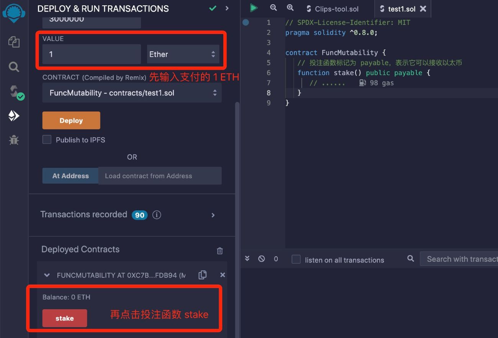
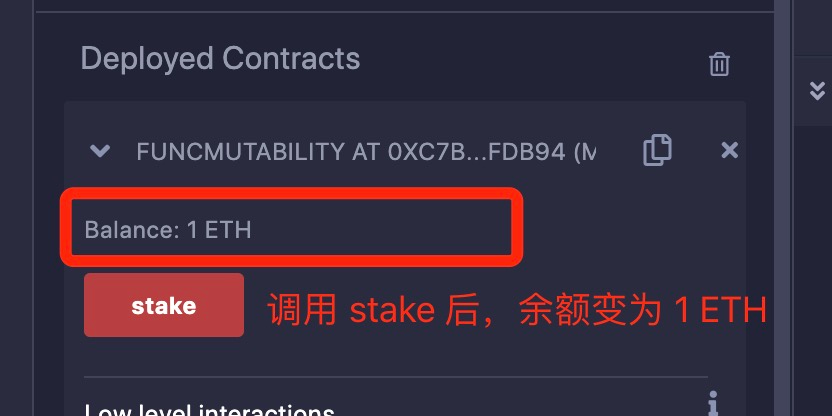

# Solidity基础教程:&nbsp;&nbsp;&nbsp;&nbsp;402.状态可变性

本章学习函数的状态可变性。

**视频**：[Bilibili](https://www.bilibili.com/video/BV1nm4y157qo)  |  [Youtube](https://youtu.be/VXHut7f-yLc?si=dARZTku7moireRmK)

<p align="center"></p>

**官网**：[BinSchoolOrg](https://binschool.org)

**代码**：[github.com/hitadao](https://github.com/hitadao)

**推特**：[@Hita_DAO](https://x.com/hita_dao)    **Discord**：[Hita_DAO](https://discord.gg/dzWY3QYGrx)

-----

函数可以使用状态可变性(state mutability)进行修饰，用于标识函数是否会修改合约的状态。

```solidity
function function_name(<parameter list>) <visibility> <state mutability> [returns(<return type>)] {
    ......
}
```

函数的状态可变性有 4 种：**`pure`**、**`view`**、**`payable`**、未标记状态。函数声明时必须设置正确的状态可变性，否则无法通过编译。  

函数的状态可变性的设计目的是为了确保合约的安全性、可靠性和互操作性。

状态可变性并不是以太坊虚拟机所要求的函数属性，纯粹是编译器的要求，也就是说与区块链本身没有直接关系。

例如，在合约中定义一个加法函数，它的状态可变性设置为 **`pure`**，它定义的位置紧跟在可见性 **`public`** 之后。

```solidity
function add(uint a, uint b) public pure returns(uint) {
    return a + b;
}
```

## 1. pure 状态可变性

状态可变性为 **`pure`** 的函数，也称为纯函数，是指函数不会读取和修改合约的状态。

换言之，**`pure`** 函数不会读取和修改链上的数据，例如：

```solidity
// SPDX-License-Identifier: MIT
pragma solidity ^0.8.0;

contract MutabilityPure {

   function sum() public pure returns(uint){
      uint a = 2;  // 局部变量 a
      uint b = 3;  // 局部变量 b
      return a + b; // 只使用了局部变量 a、b
   }
}
```

上面合约中 **`sum`** 函数的状态可变性设置为 **`pure`**，因为函数中只使用了局部变量a、b，没有使用任何状态变量。

如果函数中存在着以下语句，则被视为读取了状态数据，就不能使用 **`pure`** ，否则无法通过编译。

- 读取状态变量

- 访问 &lt;address&gt;.balance

- 访问任何区块、交易、msg等全局变量

- 调用了任何不是纯函数的函数

- 使用包含特定操作码的内联汇编

## 2. view 状态可变性

状态可变性为 **`view`** 的函数，也称为视图函数，是指函数会读取合约的状态，但不会进行修改。

换言之，**`view`** 函数会读取链上的数据，但不会改变链上的数据，例如：

```solidity
// SPDX-License-Identifier: MIT
pragma solidity ^0.8.0;

contract MutabilityView {
    uint factor = 2;  // 状态变量

    function times(uint num) public view returns(uint){
      return num * factor;  // 使用了状态变量 factor
   }
}
```

上面合约中 **`times`** 函数的状态可变性为 **`view`**，因为它读取了状态变量 **`factor`** 的值，但是并没有进行修改。

如果函数中存在以下语句，则被视为修改了状态数据，就不能使用可见性 **`view`**。

- 修改状态变量

- 触发事件

- 创建其它合约

- 使用了自毁函数 **`selfdestruct`**

- 调用发送以太币

- 调用任何不是 **`view`** 或 **`pure`** 的函数

- 使用了底层调用

- 使用包含特定操作码的内联汇编

## 3. 未标记状态可变性

如果一个函数定义中没有标记任何状态可变性，也就是说，函数既没标记为 **`view`** 也没标记为 **`pure`** ，那么就意味着这个函数是要改变状态的。

比如，修改合约的状态变量或向其它合约发送交易等，例如：

```solidity
// SPDX-License-Identifier: MIT
pragma solidity ^0.8.0;

contract MutabilityNone {
    uint factor = 2;  // 状态变量

    function setFactor(uint _factor) public {
      factor = _factor;  // 重设了状态变量 factor 的值
   }
}
```

上面合约中 **`setFactor`** 函数修改了状态变量 **`factor`** 的值，所以它不能标记为 **`view`** 或者 **`pure`**。

## 4. payable 状态可变性

如果一个函数的状态可变性标记为 **`payable`**，那么就表示它可以接收以太币，这些以太币是由调用者在调用函数时支付的。

因为 **`payable`** 函数接收了以太币，所以它是改变了合约状态的。

**`payable`** 有什么使用场景呢？比如，在一个竞猜世界杯的游戏合约中，它的投注函数就需要支付一定的以太币，因此需要声明为 **`payable`**。

如果没有指定 **`payable`**，那么调用这个函数时就不能支付以太币，否则会报错。例如：

```solidity
// SPDX-License-Identifier: MIT
pragma solidity ^0.8.0;

contract MutabilityPayable {
  
   // 投注函数标记为 payable，表示它可以接收以太币
   function stake(uint teamID) public payable { 
      // ......
   }
}
```

我们把合约代码复制到 **`Remix`**，进行编译，并部署到区块链上。

我们首先在上方的 “Value” 中，输入支付的 1 **`Ether`** 以太币，然后点击投注函数 **`stake`**。

<p align="center"></p>

点击投注函数 **`stake`** 后，合约的余额由 0 **`Ether`** 变为 1 **`Ether`**，说明支付的以太币，已经随着调用 **`stake`** 存入了合约中。

<p align="center"></p>

## 5. 状态可变性的作用

函数的状态可变性的设计目的是为了确保合约的安全性、可靠性和互操作性。

- **安全性**
通过将函数的状态可变性明确地定义为 **`view`**、**`pure`**、**`payable`**，或者默认的未标记状态可变性，可以在编译时对函数的行为进行验证。

这可以帮助开发者避免不经意间修改合约状态或访问未经授权的外部合约，从而减少潜在的安全漏洞。

- **可靠性**

通过明确函数的状态可变性，合约的使用者可以更好地理解和预测函数的行为。

这有助于避免意外的副作用和错误的结果。象 **`view`**、**`pure`** 修饰的函数在调用时不会产生副作用，因此可以安全地被其它函数调用，或者并行执行，提高了合约的可靠性。

- **互操作性**

通过标记函数的状态可变性，可以提供给其它合约和工具有关函数的重要信息。

例如，**`payable`** 函数可以接收以太币作为支付，使其可与其他合约进行交互，并支持支付功能。

这种明确的标记有助于确保合约之间的互操作性，并促进合约生态系统的发展。

## 6.状态可变性与 Gas

为了防止滥用区块链，以太坊规定，对于改变链上的状态的操作，需要支付一定价值的 **`gas`** 费。

因为改变了链上的状态，就需要将这些改变同步到区块链的全部节点，达成全网共识，保证数据一致，这个成本是非常高的。

而对于不改变链上状态的操作，只需要在接入节点上完成，无需全网进行数据同步，这个成本就很低，因此无需付费。

正是基于以上原因，调用 **`view`**、**`pure`** 函数，无需支付 **`gas`**，而调用非 **`view`**、**`pure`** 函数就需要支付一定的 **`gas`**。

所以，我们在设计合约的时候，为了节约成本，减少支付 **`gas`**，就应该仔细划分函数的范围，尽量使用 **`view`**、**`pure`** 函数。
