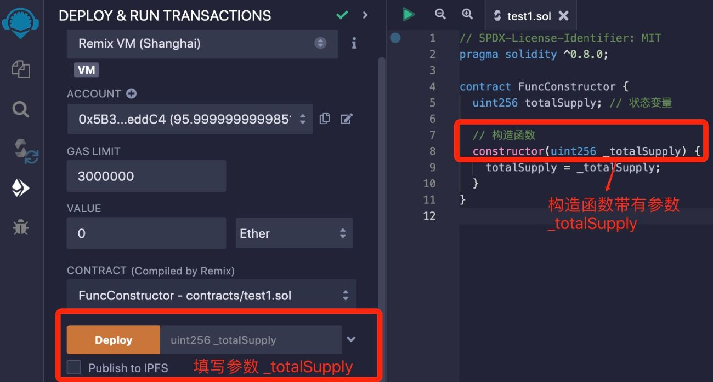
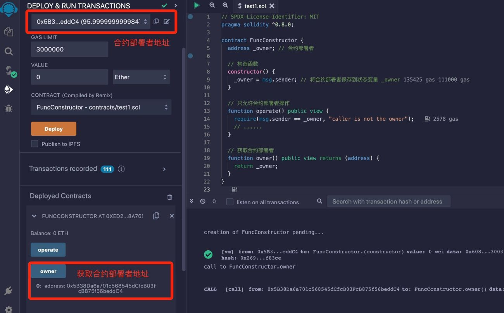
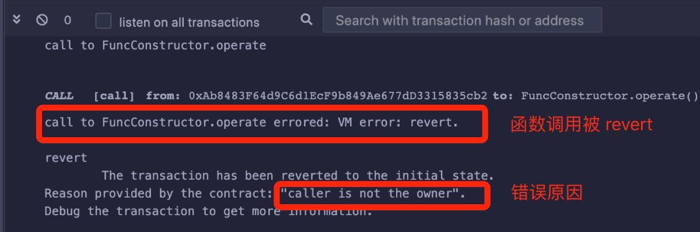

# Solidity基础教程:&nbsp;&nbsp;&nbsp;&nbsp;403.构造函数 constructor

本章学习智能合约的构造函数 constructor。

**视频**：[Bilibili](https://www.bilibili.com/video/BV1uN411J76U)  |  [Youtube](https://youtu.be/F5bEA1kJ8tk)

<p align="center"></p>

**官网**：[BinSchoolOrg](https://binschool.org)

**代码**：[github.com/hitadao](https://github.com/hitadao)

**推特**：[@Hita_DAO](https://x.com/hita_dao)    **Discord**：[Hita_DAO](https://discord.gg/dzWY3QYGrx)

-----
智能合约的构造函数是一个特殊函数，它仅在智能合约部署的时候自动执行，不能被手动调用或者再次执行。

也就是说，构造函数只会在智能合约创建的时候执行一次，而且是唯一的一次。

构造函数通常用来进行状态变量的初始化工作。

构造函数使用关键字 **`constructor`** 作为函数名字，不能使用其它名字。

```solidity
// SPDX-License-Identifier: MIT
pragma solidity ^0.8.0;

contract FuncConstructor {
  uint256 totalSupply; // 状态变量

  // 构造函数
  constructor(uint256 _totalSupply) {
    totalSupply = _totalSupply;
  }
}
```

构造函数 **`constructor`** 前面不需要添加 **`function`** 关键字，而且它没有返回值。

构造函数 **`constructor`** 可以不带参数，也可以带有任意个参数，这些参数用于在合约创建时传递初始值。参数的数据类型可以是任何合法的 **`Solidity`** 类型。

如果构造函数带有参数的话，那么在部署的时候，就必须填写参数值。


<p align="center"></p>

## 可见性和状态可变性

构造函数的可见性不需要设置。

构造函数的状态可变性不能设置为 **`pure`** 或者 **`view`**，因为它是会改变合约状态的，因为构造函数通常用来初始化状态变量。

如果我们在部署一个合约的时候，同时需要向合约内存入一些以太币，那么就需要将构造函数的可见性设置为 **`payable`**。

例如：

```solidity
// SPDX-License-Identifier: MIT
pragma solidity ^0.8.0;

contract FuncConstructor {
  uint256 totalSupply; // 状态变量

  // 构造函数
  constructor(uint256 _totalSupply) payable {
    totalSupply = _totalSupply;
  }
}
```

## 典型案例
下面的代码是使用构造函数来控制操作权限的例子，这段代码存在于很多实际运行的合约中。

```solidity
// SPDX-License-Identifier: MIT
pragma solidity ^0.8.0;

contract FuncConstructor {
  address _owner; // 合约部署者

  // 构造函数
  constructor() {
    _owner = msg.sender; // 将合约部署者保存到状态变量 _owner
  }

  // 只允许合约部署者操作
  function operate() public view {
    require(msg.sender == _owner, "caller is not the owner");
    // ......
  }

  // 获取合约部署者
  function owner() public view returns (address) {
    return _owner;
  }
}
```

这段合约代码在部署的时候，将调用构造函数 **`constructor`**，把合约部署者的地址 **`msg.sender`** 记录在了状态变量 **`_owner`** 中。

**`_owner`** 类似于合约的管理员，比普通用户拥有更大的权限。

比如，下面的函数 **`operate`**，就只能由合约部署者使用，而其它用户不能使用。

```solidity
require(msg.sender == _owner, "caller is not the owner");
```

这里判断调用者是不是合约部署者 **`_owner`**。 如果是合约部署者的话，就继续向后执行；如果不是的话，就会输出错误信息：

```solidity
"caller is not the owner"
```

我们将以上合约代码复制到 **`Remix`**，进行编译，并部署到区块链上：

<p align="center"></p>

部署完成后，点击函数 **`owner`**

然后，我们点击函数 **`operate`**，功能一切正常。也就是说，我们使用部署者账号调用函数 **`operate`**，是允许的。

如果我们在上面选择另外一个账号，再次点击 **`operate`**，就会立即报错，说明不允许非部署者账号调用。

报错信息在右下方的信息提示区：

<p align="center"></p>
