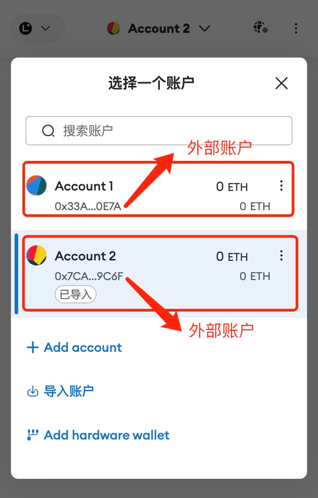
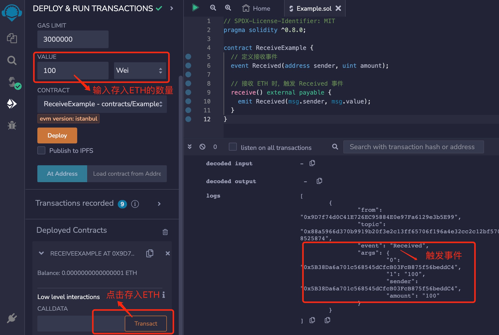

# Solidity基础教程:&nbsp;&nbsp;&nbsp;&nbsp;404.接收函数 receive

本章学习智能合约的接收函数 receive。

**视频**：[Bilibili](https://www.bilibili.com/video/BV1uN411J76U)  |  [Youtube](https://youtu.be/F5bEA1kJ8tk)

<p align="center"></p>

**官网**：[https://BinSchool.Org](https://binschool.org)

**代码**：[https://github.com/hitadao/solidity](https://github.com/hitadao/solidity)

**推特**：[@Hita_DAO](https://x.com/hita_dao)    **Discord**：[Hita_DAO](https://discord.gg/dzWY3QYGrx)

-----
我们在学习智能合约的接收函数 **`receive`** 之前，必须先理解以太坊中的账户类型。

## 1. 账户类型
在以太坊区块链中存在两种类型的账户：**`外部账户`** 和 **`合约账户`**，它们在以太坊上有不同的特性和用途。

### 1）外部账户
外部账户，英文为 Externally Owned Account，缩写为 **`EOA`**。

外部账户，主要用于存储以太币和执行以太币 **`ETH 的交易。这些账户可以向其它账户发送以太币，或者从其它账户接收以太币。

我们在钱包里管理的账户，通常就是外部账户。比如，在小狐狸钱包 **`Metamask`** 里添加或者生成的账户就是外部账户。

外部账户会有一个与之相关的以太坊地址，这个地址是一个以 "0x" 开头，长度为20字节的十六进制数，比如：0x7CA35...9C6F。

外部账户都有一个对应的私钥，只有持有私钥的人才能对交易进行签名，所以，外部账户非常适用于资金管理的身份验证。

我们常说的以太坊账户，在不特别指明的情况下，一般是指外部账户。

<p align="center"></p>

### 2）合约账户

我们在以太坊区块链上部署一个合约后，都会产生一个对应的账户，称为合约账户。

合约账户主要用于托管智能合约，它里面包含着智能合约的二进制代码和状态信息。

合约账户也有一个以太坊地址，也就是在部署智能合约时产生的地址，同样是一个以 "0x" 开头，长度为20字节的十六进制数。

合约账户没有私钥，只能由智能合约中的代码逻辑进行控制。它在一定条件下，也可以用来存储以太币 **`ETH`**。

## 2. Receive 函数

在以太坊区块链上部署智能合约时产生的合约账户，并不都是可以存入以太币  **`ETH`** 的。一个智能合约如果允许存入以太币，就必须实现 **`recieve`** 或者 **`fallback`** 函数。如果一个智能合约中这两个函数都没有定义，那么它就不能接收以太币。

如果只是为了让合约账户能够存入以太币，按照 **`solidity`** 语言规范，推荐使用 **`recieve`** 函数。因为 **`recieve`** 函数简单明了，目的明确，而 **`fallback`**  函数的用途相对复杂一些，我们将在后一章节详细讲解。

定义 **`recieve`** 函数的格式如下：

```solidity
receive() external payable {
    // 这里可以添加自定义的处理逻辑，但也可以为空
}
```

**`recieve`** 函数有如下几个特点：

- 1）无需使用 **`function`** 声明。
- 2）参数为空。
- 3）可见性必须设置为 **`external`**。
- 4）状态可变性必须设置为 **`payable`**。

当外部地址向智能合约地址发送以太币时，将触发执行 **`recieve`** 函数。

我们可以在函数体内不写任何自定义的处理逻辑，它依然能够接收以太币，这也是最常见的使用方式。如果必须在 **`recieve`** 的函数体内添加处理语句的话，最好不要添加太多的业务逻辑。

因为外部调用 **`send`** 和 **`transfer`** 方法进行转账的时候，为了防止重入攻击，**`gas`** 会限制在 2300。如果 **`recieve`** 的函数太复杂，就很容易会耗尽 **`gas`**，触发交易回滚。

**`recieve`** 函数里通常会执行一些简单记录日志的动作，比如触发 **`event`**。

```solidity
// SPDX-License-Identifier: MIT
pragma solidity ^0.8.0;

contract ReceiveExample {
  // 定义接收事件
  event Received(address sender, uint amount);
 
  // 接收 ETH 时，触发 Received 事件
  receive() external payable {
    emit Received(msg.sender, msg.value);
  }
}
```

## 3. 部署测试

我们把合约代码复制到 **`Remix`**，进行编译，并部署到区块链上：

<p align="center"></p>

部署完成后，在 **`Value`** 中输入要存入的 **`ETH`** 数量，比如 100 **`wei`**。然后点击下方的 **`Transact`**，就会把当前账户中的 100 **`wei`** 转入到合约中，你可以看到当前合约的 **`Balance`** 变为 0.0000000000000001 **`ETH`**。 另外，查看右下方控制台的输出日志中，我们可以看到 **`Received`** 事件被触发。