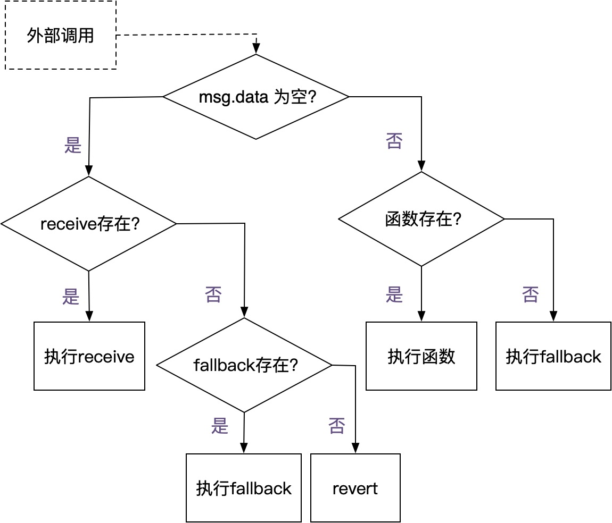
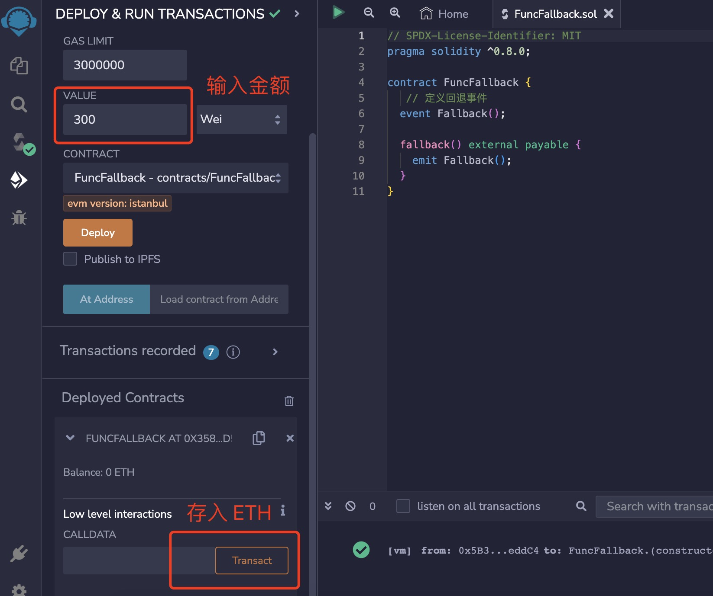
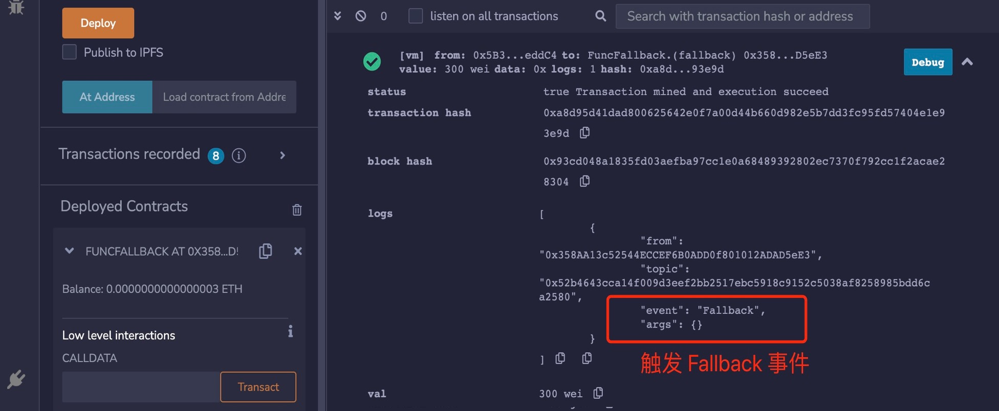
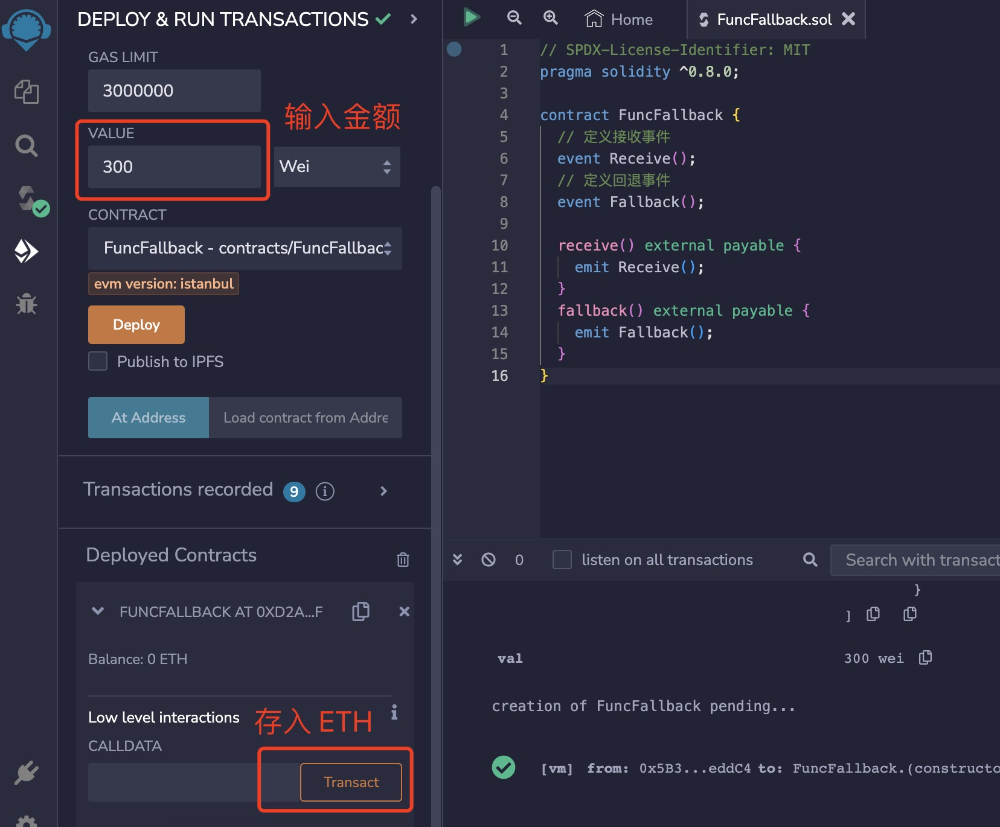
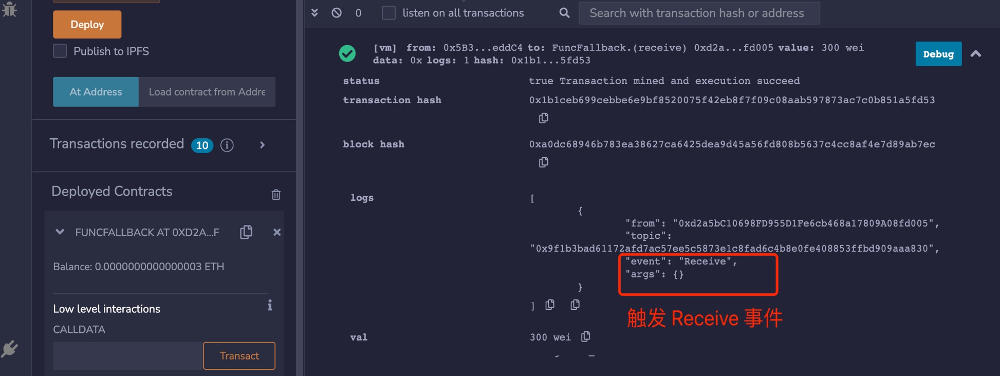
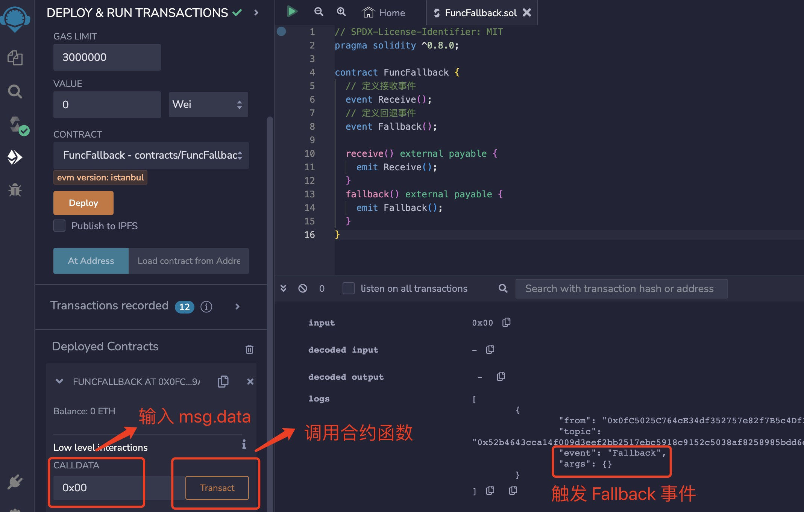

# Solidity基础教程:&nbsp;&nbsp;&nbsp;&nbsp;405.回退函数 fallback

本章学习 **`Solidity`** 中的回退函数 **`fallback`**。

**视频**：[Bilibili](https://www.bilibili.com/video/BV1QM41197Fr)  |  [Youtube](https://youtu.be/L6aKkMrtI60)

<p align="center"></p>

**官网**：[https://BinSchool.Org](https://binschool.org)

**代码**：[https://github.com/hitadao/solidity](https://github.com/hitadao/solidity)

**推特**：[@Hita_DAO](https://x.com/hita_dao)    **Discord**：[Hita_DAO](https://discord.gg/dzWY3QYGrx)

-----
在 **`Solidity`** 语言中，**`fallback`** 是一个预定义的特殊函数，用于在处理未知函数和接收以太币 **`ETH`** 时调用。

定义 **`fallback`** 函数的格式如下：

```solidity
fallback () external [payable] {
  // 这里可以添加自定义的处理逻辑，但也可以为空
}
```

**`fallback`** 函数有如下几个特点：

- 1）无需使用 **`function`** 声明。
- 2）参数为空。
- 3）可见性必须设置为 **`external`**。
- 4）状态可变性可以为空，或者设置为 **`payable`**。


## 1. fallback 调用条件
**`fallback`** 会在两种情况下，被外部事件触发而执行：

### 1) 外部调用了智能合约中不存在的函数

在这种情况下，函数声明中无需设置状态可变性，函数形式如下：

```solidity
fallback () external {
}
```

### 2) 外部向智能合约中存入以太币，并且当前合约中不存在 receive 函数
在这种情况下，函数声明中必须设置状态可变性为 **`payable`**，函数形式如下：

```solidity
fallback () external payable {
}
```

如果合约中已经定义了 **`receive`** 函数，那么向这个合约中存入以太币，将会优先调用 **`receive`** 函数，而不会执行 **`fallback`** 函数。

所以，如果一个智能合约允许存入以太币，那么它就必须实现 **`receive`** 或者 **`payable`** 函数，而且函数的状态可变性设置为 **`payable`**。

如果一个智能合约没有定义这两个函数中的任何一个，那么它就不能接收以太币。

## 2. receive 和 fallback 工作流程

**`receive`** 和 **`fallback`** 的触发条件，可以参考以下流程：

<p align="center"></p>

当参数 **`msg.data`** 为空时，就意味着：外部向合约进行转账，存入以太币。

当参数 **`msg.data`** 不为空时，就意味着：外部在调用合约中的函数。

我们在左边的分支可以看到，**`receive`** 和 **`fallback`** 函数都能够用于接收以太币 **`ETH`**。

一个智能合约在接收 **`ETH`** 时:

如果存在着 **`receive`** 函数，就会触发 **`receive`**；
当不存在 **`receive`** 函数，但存在 **`fallback`** 函数时，就会触发 **`fallback`**；
而当两者都不存在时，交易就会 **`revert`**，存入 **`ETH`** 失败。

## 3. 测试和验证
我们来编写几个合约来测试和验证 **`fallback`** 函数。

### a) 第一种情况
智能合约中只定义 **`fallback`** 函数，而且状态可变性为 **`payable`**。

```solidity
// SPDX-License-Identifier: MIT
pragma solidity ^0.8.0;

contract FuncFallback {
  // 定义回退事件
  event Fallback();

  fallback() external payable {
    emit Fallback();
  }
}
```

当我们向合约中存入以太币时，将会执行 **`fallback`** 函数，从而触发里面的 **`Fallback`** 事件。

我们把这个合约部署在 **`Remix`** 上。然后，在 "VALUE" 栏中填入要发送给合约的金额（单位是 Wei），再点击 "Transact"， 存入以太币。

<p align="center"></p>

我们可以看到交易成功，并且触发了 **`Fallback`** 事件。
<p align="center"></p>

### b) 第二种情况

智能合约中同时定义了 **`receive`** 和 **`fallback`** 函数，而且两者的状态可变性都为 **`payable`**。

```solidity
// SPDX-License-Identifier: MIT
pragma solidity ^0.8.0;

contract FuncFallback {
  // 定义接收事件
  event Receive();
  // 定义回退事件
  event Fallback();

  receive() external payable {
    emit Receive();
  }
  fallback() external payable {
    emit Fallback();
  }
}
```

当我们向合约中存入以太币时，将会执行 **`receive`** 函数，从而触发里面的 **`Receive`** 事件。

我们把这个合约部署在 **`Remix`** 上。然后，在 "VALUE" 栏中填入要发送给合约的金额，再点击 "Transact"， 存入以太币。

<p align="center"></p>

我们可以看到交易成功，并且触发了 **`Receive`** 事件，但没有触发 **`Fallback`** 事件。
<p align="center"></p>

### c) 第三种情况
依然使用上面的合约，当我们调用一个不存在的函数，将会触发 **`Fallback`** 事件。

```solidity
// SPDX-License-Identifier: MIT
pragma solidity ^0.8.0;

contract FuncFallback {
  // 定义接收事件
  event Receive();
  // 定义回退事件
  event Fallback();

  receive() external payable {
    emit Receive();
  }
  fallback() external payable {
    emit Fallback();
  }
}
```

我们在 "CALLDATA" 栏中填入随意编写的 **`msg.data`** 数据，使之不为空，再点击 "Transact"。

我们可以看到交易成功，并且触发了 **`Fallback`** 事件。
<p align="center"></p>


## 4. fallback 使用场景
按照 **`Solidity`** 语言新的规范，如果只是为了让合约账户能够存入以太币，推荐使用 **`receive`** 函数，而不是使用 **`fallback`** 函数。

这样做的好处就是，从函数命名就可以知其用途，职责划分明确，防止引起混乱，导致误用。

**`receive`** 函数，只用于接收以太币。而 **`fallback`**，只用于调用了不存在的合约函数。

**`fallback`** 和 **`receive`** 函数的使用场景：

### a) 空投

利用 **`receive`** 或者 **`fallback`** 函数，用户只需要使用钱包向空投合约发送 0 金额的转账，空投合约就可以向该地址进行空投。

### b) 锁仓

用户使用钱包将代币转账到锁仓合约中，锁仓合约利用 **`receive`** 或者 **`fallback`** 函数接收到请求，就可以执行锁仓逻辑了。

### c) 兑换

在 **`ERC20`** 代币 WETH 合约中，利用 **`receive`** 或者 **`fallback`** 函数，在收到 ETH 后，自动兑换为 WETH 代币。

关于这方面的应用，可以参考 **`BinSchool`** 网站中《Solidity 常用合约》章节。