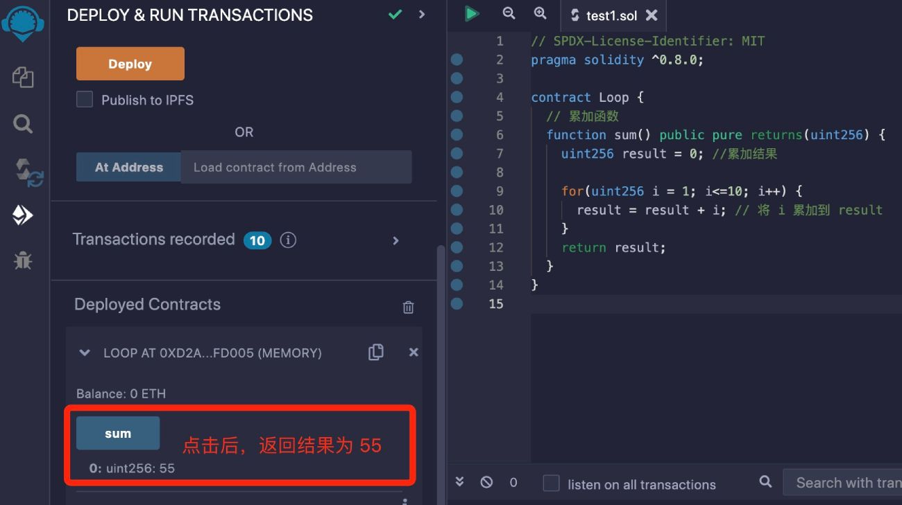

# Solidity基础教程:&nbsp;&nbsp;&nbsp;&nbsp;503.循环语句

本章学习 **`Solidity`** 中的循环语句。

**视频**：[Bilibili](https://www.bilibili.com/video/BV1Ub4y1u7hM)  |  [Youtube](https://youtu.be/G24EPHMrTy8)

**官网**：[BinSchoolOrg](https://binschool.org)

**代码**：[github.com/hitadao](https://github.com/hitadao)

**推特**：[@Hita_DAO](https://x.com/hita_dao)    **Discord**：[Hita_DAO](https://discord.gg/dzWY3QYGrx)

-----
**`Solidity`** 提供了循环语句，用于在合约中重复执行特定的代码块。

**`Solidity`** 支持 3 种循环语句 **`while`** 语句、**`do...while`** 语句、**`for`** 语句。

另外还提供了两个循环控制语句：**`break`**、**`continue`** 语句。

## 1. while 循环

**`while`** 循环语句的语法如下：

```solidity
while (condition) {
   // 如果条件 condition 为 true，就循环执行以下语句
   //......
}
```

这里的 **`condition`** 是一个布尔表达式或条件，如果条件 **`condition`** 为 true，则重复执行 **`while`** 代码块中的代码，直到 **`condition`** 为 false。

以下的智能合约展示了 **`while`** 语句的用法：

```solidity
// SPDX-License-Identifier: MIT
pragma solidity ^0.8.0;

contract LoopWhile {

  // 累加函数 
  function sum() public pure returns(uint256) {
    uint256 result = 0; //累加结果
    uint256 i = 1;

    while (i <= 10) {
      result = result + i; // 将 i 累加到 result
      i++; 
    }
    return result;
  }
}
```

上面智能合约中的 **`sum`** 函数，使用了 **`while`** 语句，计算从 1 累加到 10 的结果。

我们将以上合约代码复制到 **`Remix`**，进行编译，并部署到区块链上。

然后调用 **`sum`** 函数，就会得到返回结果为 55。

## 2. do...while 循环

**`do...while`** 循环语句的语法如下：

```solidity
do {
   // 循环执行以下语句
   //......
} while(condition) // 如果条件 condition 为 true，就继续执行循环
```

重复执行 **`do`** 代码块中的代码，直到条件 **`condition`** 为 false。

这里的 **`condition`** 是一个布尔表达式或条件，如果条件为真，则循环执行 **`while`** 代码块中的代码；否则直接跳出循环。

以下的智能合约展示了 **`while`** 语句的用法：

```solidity
// SPDX-License-Identifier: MIT
pragma solidity ^0.8.0;

contract LoopDoWhile {

  // 累加函数 
  function sum() public pure returns(uint256) {
    uint256 result = 0; //累加结果
    uint256 i = 1;

    do {
      result = result + i; // 将 i 累加到 result
      i++; 
    } while(i <= 10);
    return result;
  }
}
```

**`while`** 语句和 **`do...while`** 语句不同之处，在于 **`do...while`** 语句先执行操作，再判断下一次的条件是否符合。 而 **`while`** 语句是先判断条件，决定是否执行操作。

所以，**`do...while`** 语句至少会执行一次代码块中的代码。

我们将以上合约代码复制到 **`Remix`**，进行编译，并部署到区块链上。

然后调用 **`sum`** 函数，就会得到返回结果为 55。

## 3. for 循环

**`for`** 循环语句的语法如下：

```solidity
for (初始化; 测试条件; 迭代语句) {
   // 如果测试条件为 true，就循环执行以下语句
   //......
}
```

重复执行 **`for`** 代码块中的代码，直到测试条件为 false。

以下的智能合约展示了 **`for`** 语句的用法：

```solidity
// SPDX-License-Identifier: MIT
pragma solidity ^0.8.0;

contract LoopFor {

  // 累加函数 
  function sum() public pure returns(uint256) {
    uint256 result = 0; //累加结果

    for(uint256 i=1; i<=10; i++) {
      result = result + i; // 将 i 累加到 result
    }
    return result;
  }
}
```

我们将以上合约代码复制到 **`Remix`**，进行编译，并部署到区块链上。

然后调用 **`sum`** 函数，就会得到返回结果为 55。

<p align="center"></p>

## 4. break 语句

在 **`Solidity`** 中， **`break`** 是一种控制语句，用于在循环语句中提前终止代码块的执行。

当执行到 **`break`** 语句时，程序会立即退出当前循环，并继续执行循环语句之后的代码。

```solidity
for (uint256 i=1; i<=10; i++) {
    if (i == 5) {
        break;  // 当 i 等于 5 时提前结束循环
    }
    // 循环体代码块
}
```

在这段代码，当执行到 i 等于 5 的时候，就会提前结束循环，退出 **`for`** 循环。

也就是说，循环体代码块只执行了 4 次，而不是 10 次。

需要注意的是，在嵌套的多层循环语句中，**`break`** 语句只会退出当前层的循环。

## 5. continue 语句

在 **`Solidity`** 中，**`continue`** 是一种控制语句，用于在循环中跳过当前迭代的剩余代码，并继续下一次迭代。

我们可以使用 **`continue`** 语句，在满足某个条件时，提前结束当前迭代，进行下一次迭代。

**`continue`** 不会跳出当前的循环语句，而是忽略后面的循环体代码，直接跳走，去执行下一次迭代。

```solidity
for (uint256 i=1; i<=10; i++) {
    if (i == 5) {
        continue;  // 当 i 等于 5 时跳转到 for 语句
    }
    // 循环体代码块
}
```

在这段代码中，当执行到 i 等于 5 的时候，就会跳转到 **`for`** 语句，再次执行循环。

也就是说，循环体代码块会执行了 9 次，而不是 10 次，因为在第 5 次的时候，跳转到了 **`for`** 语句。