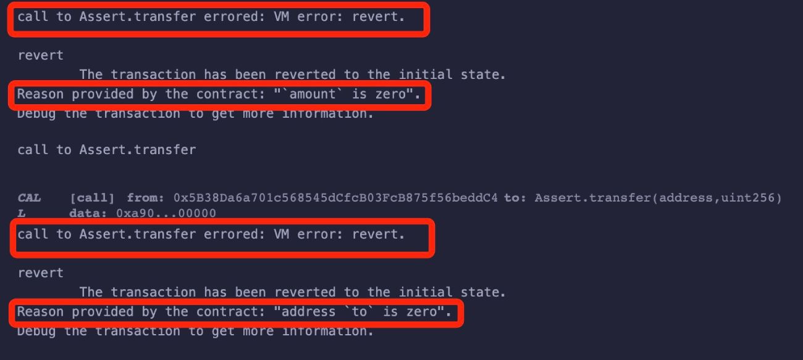

# Solidity基础教程:&nbsp;&nbsp;&nbsp;&nbsp;504.断言语句

本章学习 **`Solidity`** 中的断言语句。

**视频**：[Bilibili](https://space.bilibili.com/2112923943)  |  [Youtube](https://www.youtube.com/@BinSchoolApp)

**官网**：[BinSchoolOrg](https://binschool.org)

**代码**：[github.com/hitadao](https://github.com/hitadao)

**推特**：[@Hita_DAO](https://x.com/hita_dao)    **Discord**：[Hita_DAO](https://discord.gg/dzWY3QYGrx)

-----
**`Solidity`** 提供了断言语句，用于在合约执行过程中进行条件检查和错误处理。

**`Solidity`** 支持两种断言语句：**`require`** 和 **`assert`**。

## 1. require

**`require`** 语句用于检查函数执行的先决条件，也就是说，确保满足某些特定条件后才能继续执行函数。

如果条件不满足，则会中止当前函数的执行，并回滚(**`revert`**)所有的状态改变。

```solidity
// SPDX-License-Identifier: MIT
pragma solidity ^0.8.0;

contract AssertRequire {

  // 转账函数  
  function transfer(address to, uint256 amount) public pure {
    require(to != address(0), "address `to` is zero");
    require(amount > 0, "`amount` is zero");
    // 执行转账操作
  }
}
```

合约中有一个转账函数 **`transfer`**，在调用的时候，需要首先检测接收地址 **`to`** 是否为 0，如果为 0 ，就会输出日志：address `to` is zero，终止转账。

其次检测转账金额 **`amount`** 是否为 0，就会输出日志：`amount` is zero，终止转账。

只有满足接收地址和转账金额不为 0 的条件，才会执行转账操作。

我们将以上合约代码复制到 **`Remix`**，进行编译，并部署到区块链上。

调用 **`transfer`** 函数时，分别输入参数 to 的值 0x0000000000000000000000000000000000000000，和参数 **`amount`** 的值 0，那么执行中就会报错：

<p align="center"></p>

其实，**`require`** 完全可以使用 **`revert`** 语句来代替。比如：

```solidity
require(amount > 0, "`amount` is zero");
```

就可以使用 **`revert`** 语句改写为：

```solidity
if(amount <= 0) { 
  revert("`amount` is zero");
}
```

以上两种写法完全等价。关于 **`revert`** 实现原理，将在后面的章节中详细讲解。

## 2. assert

**`assert`** 语句的行为 **`require`** 非常类似，通常用于捕捉合约内部编程错误和异常情况。

如果捕捉到了异常，则会中止当前函数的执行，并回滚(**`revert`**)所有的状态改变。

```solidity
// SPDX-License-Identifier: MIT
pragma solidity ^0.8.0;

contract Assert {

  // 除法函数
  function divide(uint256 dividend, uint256 divisor) public pure returns(uint256) {
    assert(divisor != 0); // 确保除数不为零
    return dividend / divisor;
  }
}
```

合约中有一个除法函数 **`divide`**，在调用的时候，需要首先检测除数 **`divisor`** 是否为 0，如果为 0 ，触发异常，函数终止运行。只有除数 **`divisor`** 不为 0 ，才会执行除法操作。

## 3. require 和 assert 的区别

**`require`** 和 **`assert`** 都能终止函数的执行，并回滚交易，但两者有一些区别。

**`require`** 和 **`assert`** 参数不同，**`require`** 可以带有一个说明原因的参数，**`assert`** 没有这个参数。

**`require`** 通常用于检查外部输入是否满足要求，而 **`assert`** 用于捕捉内部编程错误和异常情况。

**`require`** 通常位于函数首部来检查参数，**`assert`** 则通常位于函数内部，当出现严重错误时触发。

assert 是 **`Solidity`** 早期版本遗留下来的函数，不再建议使用，最好使用 **`require`** 和 **`revert`** 代替。

**`require`** 在实际运行的合约中使用广泛，通常用来检查输入参数的正确性，我们要熟练掌握它的使用方法。