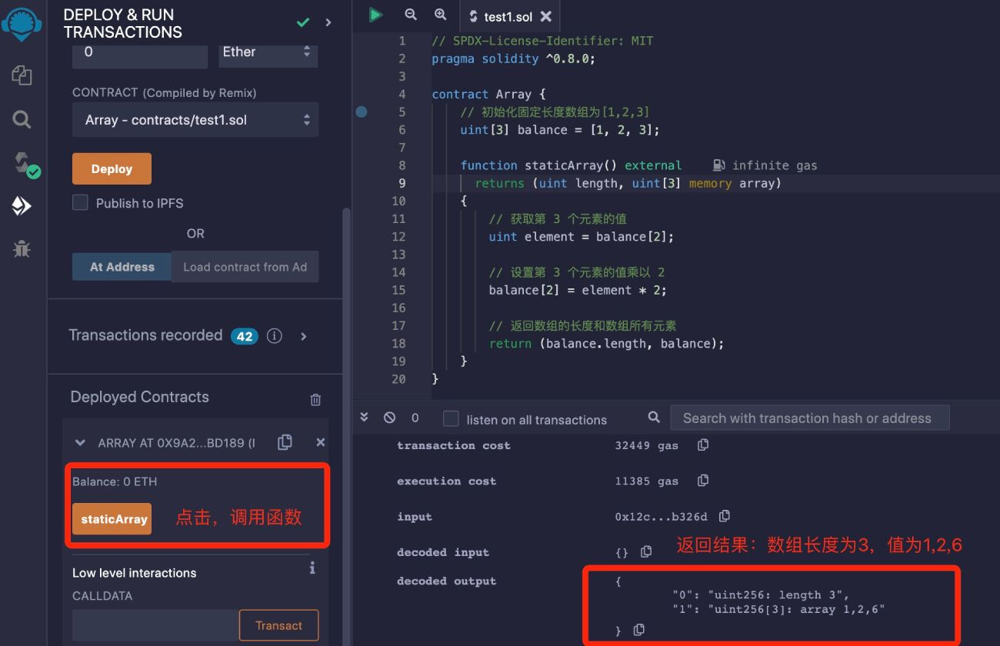
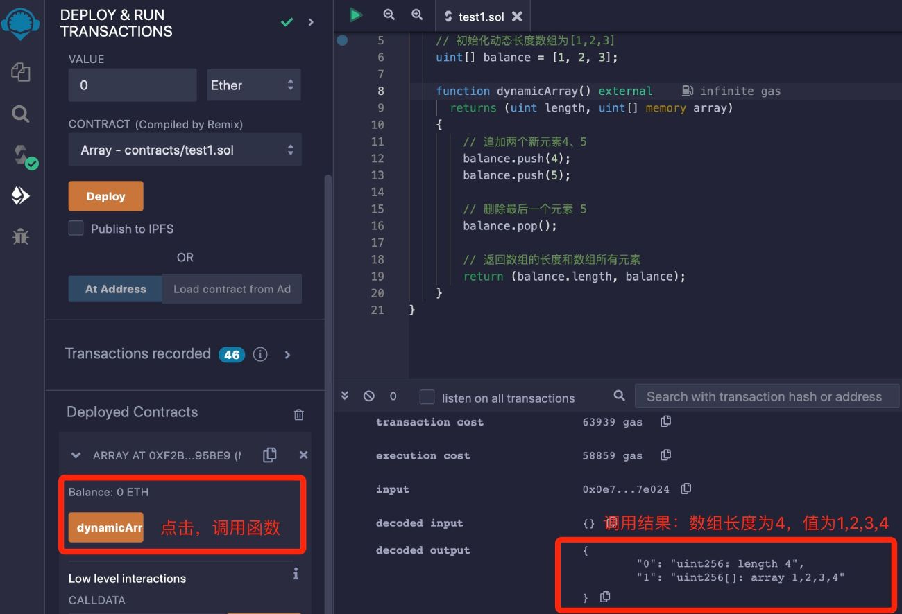

# Solidity基础教程:&nbsp;&nbsp;&nbsp;&nbsp;601.数组

本章学习 **`Solidity`** 数组的定义语法和使用方法。

**视频**：[Bilibili](https://space.bilibili.com/2112923943)  |  [Youtube](https://www.youtube.com/@BinSchoolApp)

**官网**：[BinSchoolOrg](https://binschool.org)

**代码**：[github.com/hitadao](https://github.com/hitadao)

**推特**：[@Hita_DAO](https://x.com/hita_dao)    **Discord**：[Hita_DAO](https://discord.gg/dzWY3QYGrx)

-----
在 **`Solidity`** 中，数组是一种用于存储相同类型元素的数据结构。

例如，声明一个数组变量 uint numbers[10]，那么变量 numbers 存储了 10 个 uint 类型的数据。

数组中的特定元素可以通过索引访问，索引值从 0 开始。

例如，上面声明的数组 numbers，可以使用 numbers[0]、numbers[1] 分别表示前两个变量。

**`Solidity`** 支持 **`固定长度数组`** 和 **`动态长度数组`** 两种类型。

## 1. 固定长度数组
**`固定长度数组`** 在声明时需要指定数组的长度，并这个长度在编译时就确定了，无法更改。

声明一个 **`固定长度数组`**，需要指定元素类型和数量，语法如下：

type_name arrayName [ length ];

其中数组长度 **length** 必须是一个大于零的整数数字，**type_name** 可以是任何数据类型。

例如，声明一个 **`uint`** 类型，长度为 10 的数组：balance，如下所示：

```solidity
uint balance[10];
```

初始化一个 **`固定长度数组`**，可以使用下面的语句：

```solidity
uint balance[3] = [uint(1), 2, 3]; // 初始化固定长度数组
balance[2] = 5; // 设置第 3 个元素的值为 5
```

这里的数组 balance 的初值，为什么写为 [uint(1), 2, 3]，而不是 [1,2,3] 呢？

这是因为在 **`Solidity`** 中，如果一个类型的字面量没有显式指定，那么就会由编译器自行推断。

整数字面量的解析规则是根据其值的范围来确定默认的类型。当你提供一个整数字面量时，编译器会尝试确定最小的类型来容纳该值。

如果整数字面量的值在 **`uint8`** 的取值范围内（0 到 255），编译器会将其默认解析为 **`uint8`** 类型。因为在这种情况下，使用 **`uint8`** 类型可以使用更少的存储空间，来提高存储效率。

如果整数字面量的值超出了 **`uint8`** 的取值范围，编译器会根据需要自动升级到更大的整数类型，如 **`uint16`**、**`uint32`**。

所以，我们在编写程序的时候，尽量显式指定某些字面量的类型，防止异常情况发生。

我们可以通过数组的索引来访问数组元素，例如：

```solidity
uint salary = balance[2];
```

我们可以使用下面的合约，来展示 **`固定长度数组`** 的用法。

```solidity
// SPDX-License-Identifier: MIT
pragma solidity ^0.8.0;

contract StaticArray {
    // 初始化固定长度数组为[1,2,3]
    uint[3] balance = [uint(1), 2, 3];

    function staticArray() external returns (uint length, uint[3] memory array) {
        // 获取第 3 个元素的值
        uint element = balance[2];

        // 设置第 3 个元素的值乘以 2
        balance[2] = element * 2;

        // 返回数组的长度和数组所有元素
        return (balance.length, balance);
    }
}
```

我们将合约代码复制到 **`Remix`**，进行编译，并部署到区块链上：

<p align="center"></p>

点击 **`staticArray`**，返回结果：数组长度为 3，数组元素为 1,2,6。

## 2. 动态长度数组

**`动态长度数组`** 与 **`固定长度数组`** 相比，就是长度是可以改变的。

声明一个 **`动态长度数组`**，只需要指定元素类型，无需指定数量，语法如下：

```solidity
type_name arrayName[];
```

**`动态长度数组`** 初始化后，是一个长度为 0 的空数组。我们可以使用 **`push`** 方法，在数组末尾追加一个元素；使用 **`pop`** 方法，截掉末尾的一个元素。

其中，**`push`** 方法有两种用法：一种是带参数 push(x)，第二种是不带参数 push()，如果不带参数，那么就会在数组末尾添加一个具有默认值的元素。

**`动态长度数组`** 元素的访问方法，与固定长度数组相同，也是通过索引来访问数组元素。

我们可以使用下面的合约，来展示动态数组的用法。

```solidity
// SPDX-License-Identifier: MIT
pragma solidity ^0.8.0;

contract DynamicArray {
    // 初始化动态长度数组为[1,2,3]
    uint[] balance = [uint(1), 2, 3];

    function dynamicArray() external returns (uint length, uint[] memory array) {
        // 追加两个新元素4、5
        balance.push(4);
        balance.push(5);

        // 删除最后一个元素 5
        balance.pop();

        // 返回数组的长度和数组所有元素
        return (balance.length, balance);
    }
}
```

我们将合约代码复制到 **`Remix`**，进行编译，并部署到区块链上：

<p align="center"></p>
 
点击 **`dynamicArray`**，返回结果：数组长度为 4，数组元素为 1,2,3,4。

## 3. new、delete 操作

我们可以使用 **`new`** 关键字来动态创建一个数组。

```solidity
// SPDX-License-Identifier: MIT
pragma solidity ^0.8.0;

contract Array {
   function newArray() external pure returns(uint[] memory) {
      uint[] memory arr = new uint[](3);
      arr[0] = 1;
      return arr;  // 返回结果 arr = [1,0,0]
   }
}
```

通过 **`new`** 关键字创建的数组是一个动态长度数组。它是无法一次性赋予初值的，只能对每一个元素的值分别进行设置。

另外，在 **`Solidity`** 中可以使用 **`delete`** 操作符来操作数组元素，但 **`delete`** 操作并不是用于删除数组的某个元素，这与我们直观的理解是不相同的。

我们在前面章节中已经讲过，**`delete`** 操作符只是对变量值重新初始化，使其值变为默认值，而不是删除这个变量。

在数组上使用 **`delete`** 操作，效果也是一样的。

delete arr[i]，并不是要删除一个数组中的元素，而是将该元素恢为默认值，例如：

```solidity
uint[] balance = [uint(1), 2, 3];
delete balance[0]; // 执行 delete 后，balance = [0,2,3]
```

除了动态长度数组的 **`pop`** 函数外，**`Solidity`** 并没有提供删除某个特定元素的函数。如果非要删除数组中某个特定的元素，只能使用其它变通的方法。

数组是 **`Solidity`** 中比较常用的数据类型之一，我们要熟练掌握。