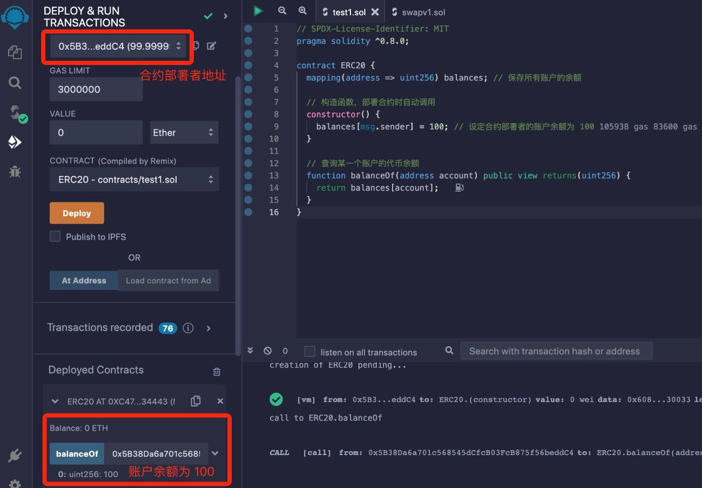

# Solidity基础教程:&nbsp;&nbsp;&nbsp;&nbsp;604.映射 mapping

本章学习 **`Solidity`** 映射类型的定义和使用方法。

**视频**：[Bilibili](https://space.bilibili.com/2112923943)  |  [Youtube](https://www.youtube.com/@BinSchoolApp)

**官网**：[BinSchoolOrg](https://binschool.org)

**代码**：[github.com/hitadao](https://github.com/hitadao)

**推特**：[@Hita_DAO](https://x.com/hita_dao)    **Discord**：[Hita_DAO](https://discord.gg/dzWY3QYGrx)

----- 
**`Solidity`** 中的映射类型，用于以键-值对的形式存储数据，它的主要作用是提供高效的键值存储和查找功能，类似于其它编程语言的哈希表或者字典。

在智能合约中，映射类型声明的状态变量，经常用来保存一个方便检索的数据集。

映射类型是智能合约中最常用的数据类型之一，我们必须熟练掌握。

## 1. 定义
定义一个映射类型使用 **`mapping`** 关键字，它的语法如下：

```solidity
mapping(key_type => value_type)
mapping 类型是将一个键(key) 映射到一个值(value)。 
```

其中：**`key_type`** 可以是任何基本数据类型(整型、地址型、布尔型、枚举型等)，以及 **`bytes`** 和 **`string`**，但是部分引用类型或复杂对象不允许使用，比如动态数组、结构体、映射等。

e**`value_typ`** 可以是任何数据类型。

例如，在合约中声明一个 **`mapping`** 类型的变量：

```solidity
  struct MyStruct { uint256 value; } // 定义一个结构体

  mapping(address => uint256) a; // 正确
  mapping(string => bool[]) b; // 正确
  mapping(int => MyStruct) c; // 正确
  mapping(address => mapping(address => uint)) d; // 正确

  // mapping(uint[] => uint) public e;  // 错误
  // mapping(MyStruct => addrss) public f; // 错误
  // mapping(mapping(string=>int)) => uint) g; // 错误
```

## 2. 使用方法

在智能合约中，**`mapping`** 类型的使用非常普遍。比如，在 **`ERC20`** 代币合约中，经常会使用 **`mapping`** 类型的变量作为内部账本，用来记录每一个钱包地址拥有的代币余额。

比如，我们模拟一个稳定币 **`USDT`** 的合约：

```solidity
// SPDX-License-Identifier: MIT
pragma solidity ^0.8.0;

contract USDT {
  mapping(address => uint256) balances; // 保存所有持有 USDT 账户的余额
  
  // 构造函数，部署合约时自动调用
  constructor() {
    balances[msg.sender] = 100; // 初始设定合约部署者的账户余额为 100 USDT
  }

  // 查询某一个账户的USDT余额
  function balanceOf(address account) public view returns(uint256) {
    return balances[account];
  }
}
```

在这个合约中，首先定义了一个保存所有持有 **`USDT`** 账户余额的 **`mapping`** 类型的变量 **`balances`**，用来作为一个内部账本。

```solidity
mapping(address => uint256) balances; // 保存所有持有 USDT 账户的余额
```

获取某个账号地址 0x5B38...ddC 持有 **`USDT`** 的数量：

```solidity
uint256 value = balances[0x5B38...ddC];
```

设置某个账号地址 0x5B38...ddC 持有 **`USDT`** 的数量：

```solidity
balances[0x5B38...ddC4] = 100 ;
```

我们把合约代码复制到 **`Remix`**，进行编译，并部署到区块链上：

<p align="center"></p>

将上方的合约部署者地址，填写到函数 **`balanceOf`** 的参数位置，点击 **`balanceOf`** 后，返回的调用结果为 100。

如果我们使用另外一个地址作为参数，比如 0xAb8483F64d9C6d1EcF9b849Ae677dD3315835cb2，点击 **`balanceOf`** 后，返回的调用结果为 0。

注意：在 **`mapping`** 类型的变量中获取一个不存在的键的值，并不会报错，而是会返回值类型的默认值。比如，整型会返回 0，布尔型会返回 false 等。


## 3. 优缺点

### 优点

**`mapping`** 可以用来存储数据集，并且提供了高效的键值存储和查找功能。通过使用 **`mapping`**，可以根据键快速定位内部存储的特定元素。

我们知道，数组也可以用来存储数据集，但是在数组里面查找特定元素就必须通过循环语句，通过遍历整个数组进行匹配，效率非常低。

### 缺点

**`mapping`** 无法直接遍历。你不能像使用 **`for`** 循环那样遍历 **`mapping`** 中的键值对，它也没有提供获取全部 **`key`** 或者 **`value`** 的功能。因此，在合约中遍历或迭代 **`mapping`** 类型的数据时，通常需要设计其他数据结构来辅助实现。

我们在后面的课程中，会单独讲解这方面的内容。