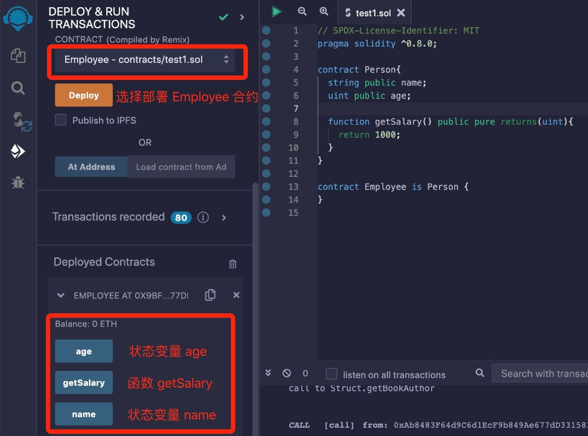

# Solidity基础教程:&nbsp;&nbsp;&nbsp;&nbsp;701.合约继承

本章学习 **`Solidity`** 合约继承。

**视频**：[Bilibili](https://space.bilibili.com/2112923943)  |  [Youtube](https://www.youtube.com/@BinSchoolApp)

**官网**：[BinSchoolOrg](https://binschool.org)

**代码**：[github.com/hitadao](https://github.com/hitadao)

**推特**：[@Hita_DAO](https://x.com/hita_dao)    **Discord**：[Hita_DAO](https://discord.gg/dzWY3QYGrx)

-----
封装、继承和多态是面向对象编程的三大特性。**`Solidity`** 作为一种面向对象的编程语言，它支持合约的继承。

合约继承是指一个智能合约从另一个智能合约中继承功能和属性，前者称为子合约，后者称为父合约。

通过合约继承，子合约能够重用父合约中已经定义的数据结构和代码逻辑，从而减少代码冗余，提高代码的可复用性。

## 1. 语法

在 **`Solidity`** 中，一个合约通过关键字 **`is`** 来继承其它合约：

```solidity
contract child_contract is parent_contract {
    // ......
}
```

其中，**`child_contract`** 是子合约，**`parent_contract`** 是父合约。

**`child_contract`** 继承了 **`parent_contract`** 的状态变量和函数，并根据实际需要，覆盖或扩展这些继承的部分。

我们以下面的智能合约为例，来展示继承合约的方法：

```solidity
// SPDX-License-Identifier: MIT
pragma solidity ^0.8.0;

contract Person{
  string public name;
  uint public age;
  function getSalary() public pure returns(uint){
    return 1000;
  }
}

contract Employee is Person {
}
```

在这个例子中，合约 **`Employee`** 继承了合约 **`Person`** 的所有状态变量和函数。其中，**`Employee`** 是子合约，而 **`Person`** 是父合约。

我们把合约代码复制到 **`Remix`**，进行编译，并部署到区块链上：

<p align="center"></p>

我们可以看到，虽然合约 **`Employee`** 中没有定义任何状态变量和方法，但是由于它继承了合约 **`Person`**，所以在 **`Employee`** 中就自动拥有了状态变量 **`name`**name、**`age`** 和方法 **`getSalary`**。

注意：子合约只能继承父合约中可见性为 **`public`**、**`internal`** 和 **`external`** 的状态变量和方法，而可见性为 **`private`** 的状态变量和方法，是不能被子合约继承的。

## 2. virtual 和 override

**`Solidity`** 在合约继承的语法中，引入了 **`virtual`** 和 **`override`** 两个关键字，用于重写父合约中的函数。

父合约首先需要使用 **`virtual`** 关键字声明一个虚函数，然后，在子合约中使用 **`override`** 关键字来覆盖父合约的方法。例如：

```solidity
// SPDX-License-Identifier: MIT
pragma solidity ^0.8.0;

contract Person{
  string public name;
  uint public age;
  
  // 使用 virtual 声明此函数可以被子合约覆盖
  function getSalary() public pure virtual returns(uint){
     return 1000;
  }
}

contract Employee is Person {
    // 使用 override 表示此函数覆盖了父合约的同名函数
    function getSalary() public pure override returns(uint){
      return 3000;
  }
}
```

子合约 **`Employee`** 的 **`getSalary`** 方法覆盖了父合约 **`Person`** 的 同名方法。

我们调用子合约 **`Employee`** 的 **`getSalary`** 方法，输出结果是 3000，而不是父合约中的 1000。

在上面的例子中，如果父合约的方法不声明为 **`virtual`**，或者子合约的方法不声明为 **`override`**，那么在编译合约的时候就会报错。

## 3. 构造函数的继承

在 **`Solidity`** 中，如果父合约没有定义构造函数，或者构造函数没有参数，那么子合约可以直接继承父合约，无需显式调用父合约的构造函数。例如：

```solidity
// SPDX-License-Identifier: MIT
pragma solidity ^0.8.0;

contract Person{
  constructor() { // 构造函数没有参数
  }
}

contract Employee is Person {
}
```

如果父合约的构造函数带有参数，那么子合约在继承父合约时，就需要在自己的构造函数中显示地调用父合约的构造函数。

子合约继承合约时，调用父合约的构造函数有两种方式：**`直接传值`** 和 **`传入输入值`**。

### 1）直接传值

```solidity
// SPDX-License-Identifier: MIT
pragma solidity ^0.8.0;

contract Parent {
  uint public data;
  constructor(uint _data){
    data = _data;
  }
}

contract Child is Parent(1) {
}
```

### 2）传入输入值

```solidity
// SPDX-License-Identifier: MIT
pragma solidity ^0.8.0;

contract Parent {
  uint public data;
  constructor(uint _data){
    data = _data;
  }
}

contract Child is Parent {
  constructor(uint _data) Parent(_data) {
  }
}
```

## 4. 调用父合约函数

子合约可以随时调用父合约中的函数，包括被覆盖掉的函数。

子合约调用父合约的函数有两种方法：使用关键字 **`super`** 和 **使用合约名称**。

```solidity
// SPDX-License-Identifier: MIT
pragma solidity ^0.8.0;

// 父合约 Person
contract Person {
  function getSalary() public pure virtual returns(uint){
    return 1000;
  }
}

// 子合约 Employee
contract Employee is Person {
  function getSalary() public pure override returns(uint){
    return 3000;
  }

  function getPersonSalaryBySuper() public pure returns(uint){
    return super.getSalary(); // 使用 super 调用父合约函数
  }

  function getPersonSalaryByName() public pure returns(uint){
    return Person.getSalary(); // 使用合约名称调用父合约函数
  }
}
```

我们把合约代码复制到 **`Remix`**，进行编译，并将合约 **`Employee`** 部署到区块链上，然后调用函数 **`getSalary`**，返回的结果为 3000。

当我们调用函数 **`getPersonSalaryBySuper`** 和 **`getPersonSalaryByName`** 时，都会返回结果 1000，因为它们都调用了父合约 **`Person`** 中的函数 **`getSalary`**。