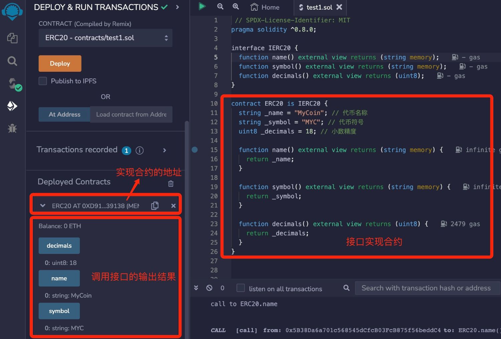
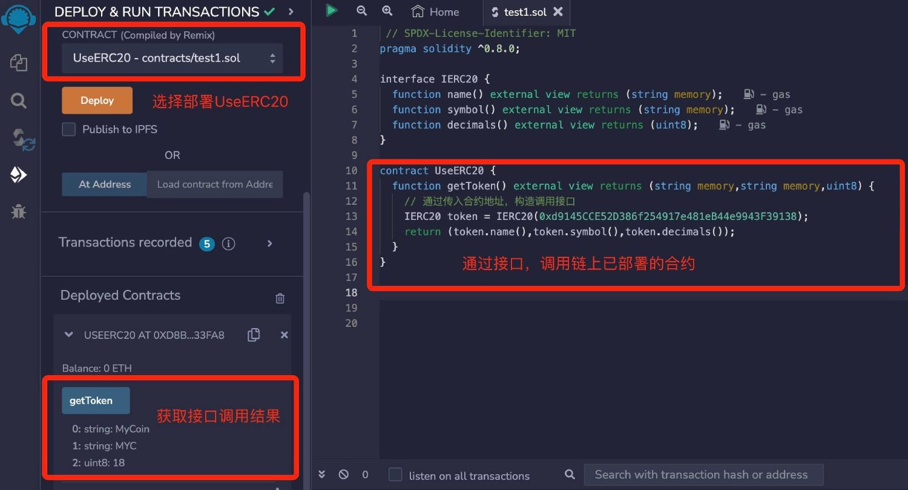

# Solidity基础教程:&nbsp;&nbsp;&nbsp;&nbsp;702.抽象合约和接口

本章学习抽象合约和接口。

**视频**：[Bilibili](https://space.bilibili.com/2112923943)  |  [Youtube](https://www.youtube.com/@BinSchoolApp)

**官网**：[BinSchoolOrg](https://binschool.org)

**代码**：[github.com/hitadao](https://github.com/hitadao)

**推特**：[@Hita_DAO](https://x.com/hita_dao)    **Discord**：[Hita_DAO](https://discord.gg/dzWY3QYGrx)

-----
**`Solidity`** 中的抽象合约和接口提供了一种规范化的方式来定义合约之间的交互和通信。

它们促进了代码的可重用性、可扩展性，并提供了一种灵活的机制来实现合约的多态。

## 1. 抽象合约

**`Solidity`** 允许在一个合约中只声明函数的原型，而没有具体实现，然后在继承的子合约中再去实现，这样的合约称为抽象合约。

抽象合约使用 **`abstract`** 关键字进行声明。

```solidity
// SPDX-License-Identifier: MIT
pragma solidity ^0.8.0;

abstract contract Person{
  string public name;
  uint public age;
  
  // 使用 virtual，表示函数可以被子合约覆盖
  function getSalary() public pure virtual returns(uint);
}

contract Employee is Person {

    // 使用 override，表示覆盖了子合约的同名函数
    function getSalary() public pure override returns(uint){
      return 3000;
  }
}
```

使用 **`abstract`** 声明的抽象合约，通常包含至少一个未实现的函数。另外，抽象合约是不能单独进行部署的。

## 2. 接口

在 **`Solidity`** 中，接口是一种极端的抽象合约，它定义了合约应该实现的函数名和事件，但没有实现任何函数的具体逻辑。

换句话说，接口中的所有函数只有声明，而没有具体实现，它只是提供了一种约定和规范，用于与其他合约进行交互和通信。

编写接口有以下限制规则：

- 不能包含状态变量

- 不能定义结构体

- 不能包含构造函数

- 不能继承除接口外的其它合约

- 所有函数的可见性都必须是 **`external`**，而且不能有函数体

- 继承接口的合约必须实现接口定义的所有功能

### 1) 声明接口

**`Solidity`** 使用关键字 **`interface`** 声明接口。接口内部只需要有函数的声明即可，无需实现。

语法如下：

```solidity
interface 接口名{
    函数声明;
}
```

例如，我们定义一个 **`ERC20`** 代币合约接口 **`IERC20`**，用于查询代币的名称、符号和小数精度。

```solidity
interface IERC20 {
  function name() external view returns (string memory);
  function symbol() external view returns (string memory);
  function decimals() external view returns (uint8);
}
```

### 2) 实现接口

我们可以写一个具体的 **`ERC20`** 代币合约来实现上面定义的 **`IERC20`** 接口。

```solidity
// SPDX-License-Identifier: MIT
pragma solidity ^0.8.0;

interface IERC20 {
  function name() external view returns (string memory);
  function symbol() external view returns (string memory);
  function decimals() external view returns (uint8);
}

contract ERC20 is IERC20 {
  string _name = "MyCoin"; // 代币名称
  string _symbol = "MYC"; // 代币符号
  uint8 _decimals = 18; // 小数精度

  function name() external view returns (string memory) {
    return _name;
  }

  function symbol() external view returns (string memory) {
    return _symbol;
  }

  function decimals() external view returns (uint8) {
    return _decimals;
  }
}
```

我们把合约代码复制到 **`Remix`**，进行编译，并部署到区块链上：

<p align="center"></p>

我们可以看到有 3 个接口函数 name、symbol 和 decimals 可以提供给外部调用。

另外，我们复制一下刚部署的实现合约的地址，将在下面的课程中使用。这里是 0xd9145CCE52D386f254917e481eB44e9943F39138，它在不同的测试环境中并不相同。

## 3. 使用接口

接口的作用是提供了一种约定和规范，用于与其他合约进行交互和通信。 

在上面的例子中，我们编写了一个代币合约 **`ERC20`**，它实现了接口 **`IERC20`**。 如果另外有一个合约，要调用已经部署在区块链上的 **`ERC20`** 合约，应该如何操作呢？

非常简单，我们只需要知道它的地址，并且知道它实现了 **`IERC20`** 接口，就可以在合约中使用它。

```solidity
// SPDX-License-Identifier: MIT
pragma solidity ^0.8.0;

interface IERC20 {
  function name() external view returns (string memory);
  function symbol() external view returns (string memory);
  function decimals() external view returns (uint8);
}

contract UseERC20 {
  function getToken() external view returns (string memory,string memory,uint8) {
    // 通过传入合约地址，构造调用接口
    IERC20 token = IERC20(0xd9145CCE52D386f254917e481eB44e9943F39138); 
    return (token.name(),token.symbol(),token.decimals());
  }
}
```

其中 0xd9145CCE52D386f254917e481eB44e9943F39138 就是上面部署的实现接口的合约地址。

通过传入实现接口的合约地址，构造出 **`IERC20`** 接口对象 **`token`**，然后就可以使用 **`IERC20`** 接口的函数了。

我们把合约代码复制到 **`Remix`**，进行编译，并部署到区块链上：

<p align="center"></p>

点击 **`getToken`**，就可以获得链上已部署合约的相关信息。

通过以上测试合约，我们可以看到，接口 **`IERC20`** 的作用就是提供了一种约定和规范，用于在 **`ERC20`** 和 **`UseERC20`** 两个合约之间进行交互和通信。

关于接口的知识必须熟练掌握，我们将在后续课程中经常使用。