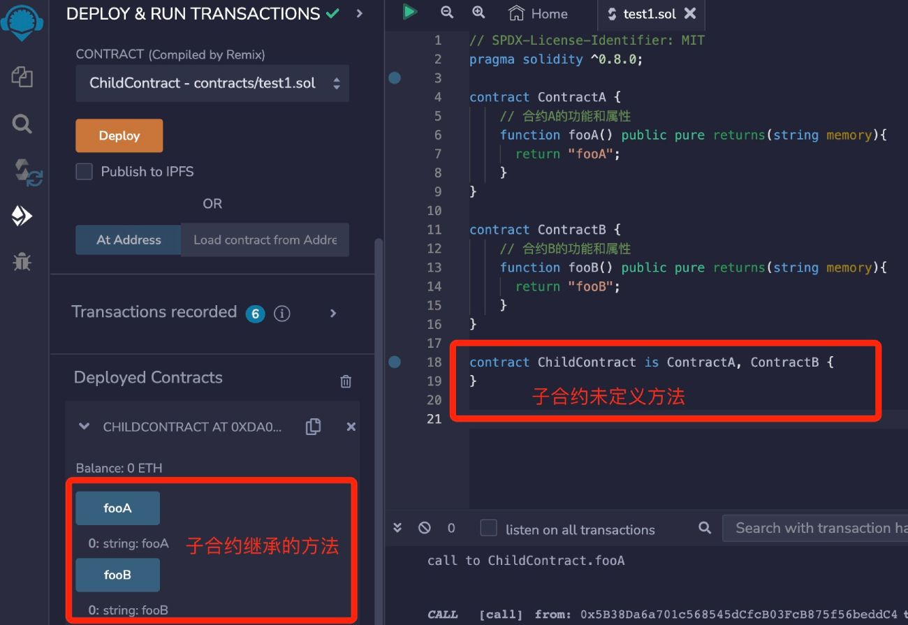

# Solidity基础教程:&nbsp;&nbsp;&nbsp;&nbsp;703.多重继承

本章学习合约的多重继承。

**视频**：[Bilibili](https://space.bilibili.com/2112923943)  |  [Youtube](https://www.youtube.com/@BinSchoolApp)

**官网**：[https://BinSchool.Org](https://binschool.org)

**代码**：[https://github.com/hitadao/solidity](https://github.com/hitadao/solidity)

**推特**：[@Hita_DAO](https://x.com/hita_dao)    **Discord**：[Hita_DAO](https://discord.gg/dzWY3QYGrx)

-----
**`Solidity`** 支持多重继承，也就是允许一个合约同时继承多个合约，从而将它们的功能和属性组合在一个合约中。

多重继承的语法如下：

```solidity
contract child_contract is parent_contract1, parent_contract2... {
    // ......
}
```

多重继承的示例如下：

```solidity
// SPDX-License-Identifier: MIT
pragma solidity ^0.8.0;

contract ContractA {
    // 合约A的功能和属性
    function fooA() public pure returns(string memory){
      return "fooA";
    }
}

contract ContractB {
    // 合约B的功能和属性
    function fooB() public pure returns(string memory){
      return "fooB";
    }
}

contract ChildContract is ContractA, ContractB {
}
```

ChildContract 继承了合约 ContractA 和合约 ContractB，它就可以使用 ContractA 和 ContractB 中定义的功能和属性了。

我们把合约代码复制到 **`Remix`**，进行编译，并部署到区块链上：

<p align="center"></p>
 
我们可以看到，子合约 ChildContract继承了合约 ContractA 和合约 ContractB，虽然它自身未定义任何方法，但是可以使用继承的函数 fooA 和 fooB。

## 线性继承

我们再看一个特殊的合约继承的例子：

```solidity
// SPDX-License-Identifier: MIT
pragma solidity ^0.8.0;

contract ContractA {
    function foo() public pure virtual returns(string memory){
      return "ContractA";
    }
}

contract ContractB {
    function foo() public pure virtual returns(string memory){
      return "ContractB";
    }
}

contract ChildContract is ContractA, ContractB {
    function foo() public pure override(ContractA, ContractB) returns(string memory){
      return super.foo();
    }
}
```

在上面的例子中，继承的父合约 ContractA 和合约 ContractB 里都有一个名字为 foo 的 **`virtual`** 函数，子合约 ChildContract 将其覆盖，并返回结果 super.foo()。

那么 ChildContract 中的 **`super`** 到底是 ContractA 还是 ContractB 呢？这就涉及到多重继承所遵循的继承原则。

**`Solidity`** 多重继承采用了线性继承原则，它会按照合约定义中父合约的顺序，从左到右依次继承父合约的功能和属性。

例如，以下合约继承的定义：

contract ChildContract is ContractA, ContractB 
按照线性继承原则，合约的继承顺序是 ContractA 、ContractB、ChildContract。

也就是说，ChildContract 先继承 ContractA 的属性和方法，再继承 ContractB 的属性和方法，所以上面例子中的 **`super`** 是 ContractB ，调用 super.foo() 的返回结果为 "ContractB"。

如果合约继承的定义如下所示：

```solidity
contract ChildContract is ContractB, ContractA  
```

那么 ChildContract 里面的 **`super`** 就是 ContractA ，调用 super.foo() 的返回结果为 "ContractA"。

## 多重继承分析

在定义合约多重继承的时候，必须正确地设置父合约的顺序，使之符合线性继承原则。如果顺序设置不正确，那么合约将无法编译。

### 第一种情况

合约 Y 继承了合约 X，合约 Z 同时继承了 X，Y。如图所示：

```solidity
  X 
/   \
Y   |
\   /
  Z
```

这种情况下，我们按照线性继承原则，最基本的合约放在最前面，合约的继承顺序应该为：X，Y，Z。

```solidity
contract Z is X,Y {
}
```

如果写成：

```solidity
contract Z is Y,X {
}
```

那么编译器就会报错。

### 第二种情况

合约 Y 继承了合约 X；合约 A 也继承了合约 X，合约 B 又继承了 A；合约 Z 同时继承了 Y，B。如图所示：

```solidity
   X 
 /   \
Y     A
|     |
|     B
 \   / 
   Z
```
这种情况下，我们按照线性继承原则，最终理清的合约继承顺序为：X，Y，A，B，Z。

```solidity
contract Z is Y,B {
}
```