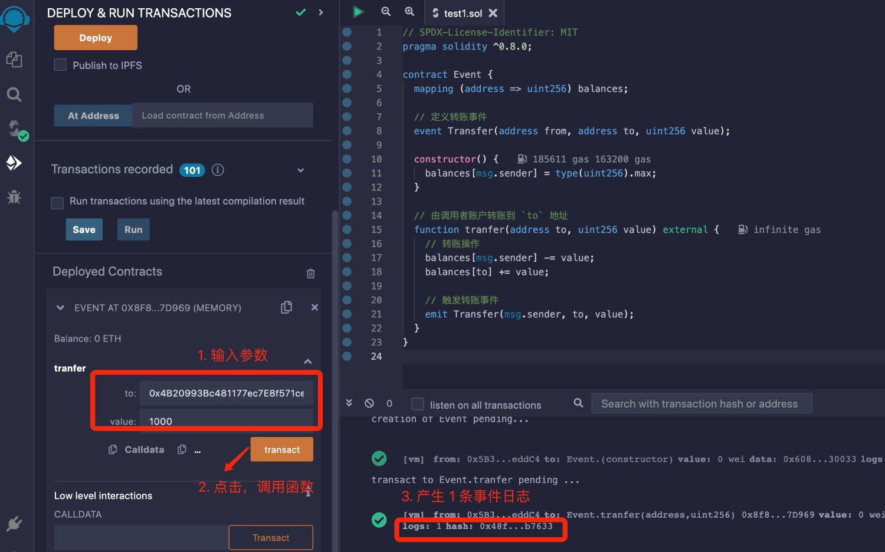
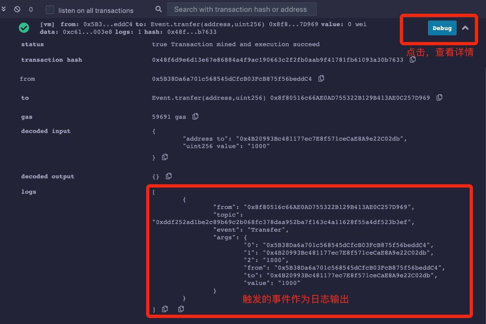

# Solidity基础教程:&nbsp;&nbsp;&nbsp;&nbsp;801.事件 event

本章学习合约的多重继承。

**视频**：[Bilibili](https://space.bilibili.com/2112923943)  |  [Youtube](https://www.youtube.com/@BinSchoolApp)

**官网**：[https://BinSchool.Org](https://binschool.org)

**代码**：[https://github.com/hitadao/solidity](https://github.com/hitadao/solidity)

**推特**：[@Hita_DAO](https://x.com/hita_dao)    **Discord**：[Hita_DAO](https://discord.gg/dzWY3QYGrx)

-----
在 **`Solidity`** 中，事件（**`Event`**）是一种通知机制，用于智能合约向外部程序或其他合约通知某个事件的发生。

触发一个事件后，相关数据就会存储到日志中，并与交易关联，记录在区块链上，以便外部应用程序监听和处理。

事件可以用于记录状态变化、触发通知或者作为日志。

## 1. 定义

在 **`Solidity`** 代码中，使用 **`event`** 关键字来定义一个事件，语法如下：

```solidity
event event-name(<parameter list>);
```

例如，在 **`ERC20`** 代币合约中，定义了一个用来记录转账的事件。

```solidity
event Transfer(address from, address to, uint256 value);
```

其中，事件名称为 **`Transfer`**，事件中包含 3 个参数：from、to、value，分别代表转出者地址、接收者地址和转账金额。

## 2. 使用方法

在 **`Solidity`** 代码中，使用 **`emit`** 关键字来触发事件，语法如下：

```solidity
emit event-name(<parameter list>);
```

例如，触发 **`ERC20`** 代币合约中的 **`Transfer`** 事件。

```solidity
emit Transfer(0xAb...b2, 0x4B...db, 1000);
```

以下，我们使用一个完整的合约范例来展示事件的定义和使用方法。

```solidity
// SPDX-License-Identifier: MIT
pragma solidity ^0.8.0;

contract Event {
  mapping (address => uint256) balances;

  // 定义转账事件
  event Transfer(address from, address to, uint256 value);

  // 构造函数，设置合约部署者的余额无限大
  constructor() {
    balances[msg.sender] = type(uint256).max;
  }
 
  // 由调用者账户转账到 `to` 地址
  function tranfer(address to, uint256 value) external {
    // 转账操作
    balances[msg.sender] -= value;
    balances[to] += value;

    // 触发转账事件
    emit Transfer(msg.sender, to, value);
  }
}
```

我们把合约代码复制到 **`Remix`**，进行编译，并部署到区块链上：

<p align="center"></p>

我们输入参数 **`to`** 的地址，比如 0x4B20993Bc481177ec7E8f571ceCaE8A9e22C02d，再输入转账数量 1000，点击 **`transact`** 按钮，就会在右下方输出执行结果。

执行结果显示，产生了 1 条事件日志，我们可以继续查看详情。

<p align="center"></p>

## 3. indexed

在 **`Solidity`** 中，使用 **`emit`** 触发的事件中，有一种特殊形式称为索引事件，语法如下：


```solidity
event event-name(type-name indexed parameter-name,...);
```

例如，在 **`ERC20`** 代币合约中，定义了一个用来记录转账的索引事件。

```solidity
event Transfer(address indexed from, address indexed to, uint256 value);
```

外部应用程序可以根据 **`indexed`** 标记过的参数进行高效的过滤和搜索事件。比如，可以应用于以下场景：

- 过滤事件

通过索引参数，外部应用程序可以过滤感兴趣的事件。例如，根据发送者或接收者地址过滤特定用户的交易事件。

- 高效搜索

通过索引参数，外部应用程序可以快速搜索具有特定属性或条件的事件。例如，按照特定金额范围搜索交易事件。

外部应用程序如何使用索引事件，我们将在后面的课程中详细讲解。

**注意：**

1. 一个事件中 **`indexed`** 标记的参数最多有 3 个。

2. 记录区块链的日志，可以使用事件，也可以使用状态变量，但事件使用的 **`gas`** 要比状态变量低。