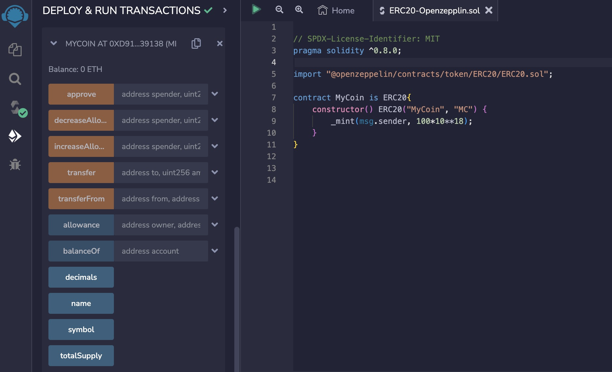

# Solidity基础教程:&nbsp;&nbsp;&nbsp;&nbsp;803.导入合约 import

本章学习如何使用关键字 **`import`** 导入其它合约。

**视频**：[Bilibili](https://space.bilibili.com/2112923943)  |  [Youtube](https://www.youtube.com/@BinSchoolApp)

**官网**：[https://BinSchool.Org](https://binschool.org)

**代码**：[https://github.com/hitadao/solidity](https://github.com/hitadao/solidity)

**推特**：[@Hita_DAO](https://x.com/hita_dao)    **Discord**：[Hita_DAO](https://discord.gg/dzWY3QYGrx)

-----
当智能合约的业务逻辑比较复杂的时候，我们通常会按照单一职能的原则，将其划分为不同的模块，从而会形成多个合约文件。那么在多合约的情况下，合约文件之间该如何引用呢？

在 Solidity 中，可以使用 **`import`** 导入其它合约文件的内容，以供当前合约使用。

**`import`** 语句的声明位置，通常紧随在合约的版本声明之后。例如：

```solidity
// SPDX-License-Identifier: MIT
pragma solidity ^0.8.0;

import "./Math.sol";
```

## 1. import 的作用

**`import`** 有两个主要作用：

### 模块化

通过 **`import`**，可以将合约代码拆分到不同的文件中，使代码更具有可读性和可维护性。

### 代码重用

通过 **`import`**，可以在多个合约中重复使用相同的合约代码，从而避免多次重复编写。

## 2. import 的用法

**`import`** 的常见的用法有三种：

### a) 导入本地文件

**`import`** 可以使用相对路径或者绝对路径导入本地文件。例如：

```solidity
import "./Math.sol";
```

这表示当前合约要导入的文件 **`Math.sol`**，跟它位于相同的目录。这里使用的就是相对路径。

```solidity
import "/home/Math.sol";
```

这表示当前合约要导入的文件 **`Math.sol`**，位于 **`/home`** 目录下。这里使用的就是绝对路径。

### b) 导入远程文件

**`import`** 可以导入网络上的远程文件。

比如：

```solidity
import "https://github.com/OpenZeppelin/openzeppelin-contracts/blob/master/contracts/utils/Base64.sol";
```

这是是导入了 **`github`** 上 **`OpenZeppelin`** 代库码中 **`Base64`** 编码的合约。

### c) 引用依赖包
我们在使用 **`Remix`**、**`Hardhat`** 等集成开发和测试框架中，可以使用 **`import`** 引用 **`npm`** 下载到本地的依赖包。

**`import`** 使用 **`@`** 符号加上包名和文件名的方式，来引入需要的合约文件。例如：

```solidity
import "@openzeppelin/contracts/token/ERC20/ERC20.sol";
```

其中，**`@openzeppelin/contracts`** 表示 **`Remix`** 或者 **`Hardhat`** 中已经下载的 **`OpenZeppelin`** 合约库。

所以，当前合约中是从 **`npm`** 依赖包里导入了 **`ERC20`** 合约文件。

## 3. 测试和验证
我们可以利用 **`OpenZeppelin`** 的 **`ERC20`** 合约，来编写一个定制的代币合约。

下面的合约是通过引用依赖包的形式，导入 **`OpenZeppelin`** 的 **`ERC20`** 合约。

```solidity
// SPDX-License-Identifier: MIT
pragma solidity ^0.8.0;
import "@openzeppelin/contracts/token/ERC20/ERC20.sol";

contract MyCoin is ERC20{
    constructor() ERC20("MyCoin", "MC") {
        _mint(msg.sender, 100*10**18);
    }
}
```
在上面这个合约中，它继承了 **`OpenZeppelin`** 的 **`ERC20`** 合约，发布了一种名字为 **`MyCoin`**， 代号为 **`MC`** 的代币。整个合约的代码看起来非常简洁，几行代码就达到了需要的效果。

只要我们修改一下名称和符号参数，就能够通过复用 **`OpenZeppelin`** 代码库，发布不同的代币。

我们将以上合约代码复制到 **`Remix`**，进行编译，并部署到区块链上：

<p align="center"></p>

我们可以看到，**`MyCoin`** 合约具有了 **`ERC20`** 标准中规定的所有操作方法。