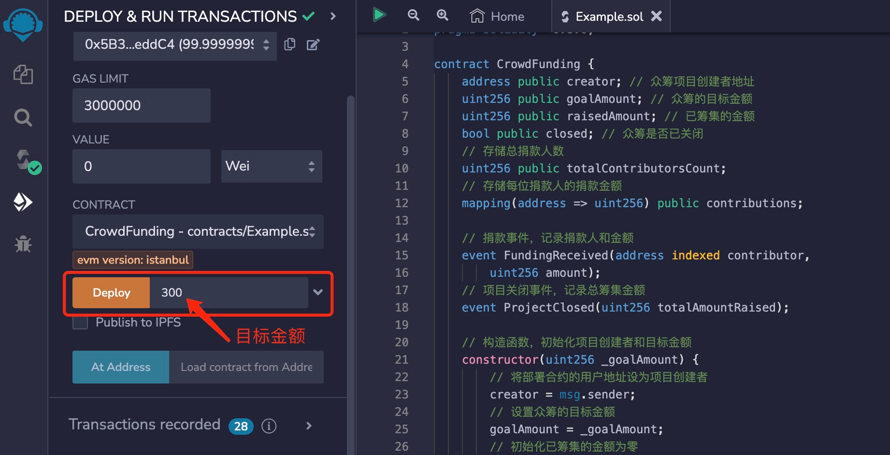
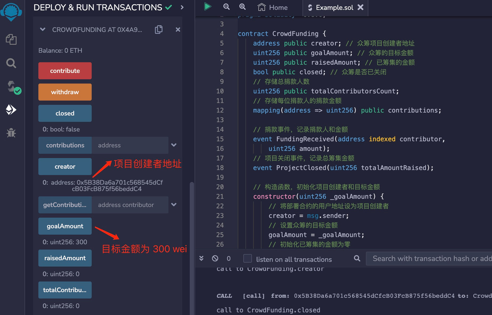
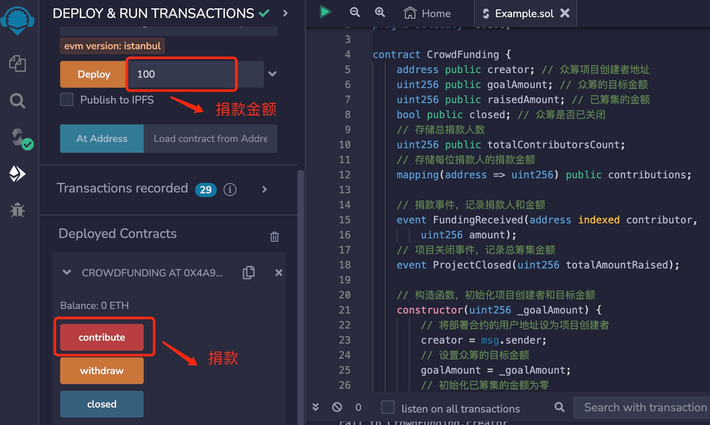
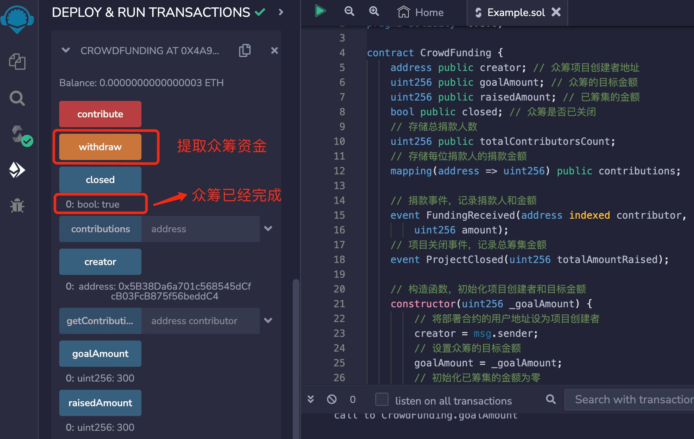

# Solidity常用合约:&nbsp;&nbsp;&nbsp;&nbsp;201.众筹合约 

本章讲解什么是众筹合约，以及众筹合约的算法和实现。

**视频**：[Bilibili](https://space.bilibili.com/2112923943)  |  [Youtube](https://www.youtube.com/@BinSchoolApp)

**官网**：[https://BinSchool.Org](https://binschool.org)

**代码**：[https://github.com/hitadao/solidity](https://github.com/hitadao/solidity)

**推特**：[@Hita_DAO](https://x.com/hita_dao)    **Discord**：[Hita_DAO](https://discord.gg/dzWY3QYGrx)

-----
众筹合约是帮助众筹项目筹集资金的智能合约。项目创建者需要发布一个众筹活动的合约，然后请求用户向合约捐款，以实现项目的筹集目标。

捐款人可以参与众筹活动，向项目提供资金支持。而项目创建者在达成众筹目标之后，可以提取合约中筹集的资金。

## 1. 众筹合约的算法
一个完整的众筹合约至少包含以下函数和数据：

### 1.1 构造函数
合约的构造函数 **`constructor`** 用于初始化众筹项目的初始状态。构造函数通常需要设置一个目标金额，并将合约部署者的地址记录为项目创建者。

只有项目创建者才能提取合约中的资金。

### 1.2 捐款函数
合约提供了一个名为 **`contribute`** 的外部函数，允许用户捐款。

捐款人可以通过这个函数向众筹项目捐款。

合约会记录每位捐款人的捐款金额，并发出捐款事件以记录捐款人和金额。

如果已筹集金额达到或超过目标金额，众筹合约将会被标记为已关闭。

### 1.3 提取资金函数
合约提供了一个名为 **`withdraw`** 的外部函数，该函数用于将合约中已筹集的资金提取到项目创建者的地址。

这个函数只有项目创建者可以执行，其它用户没有权限。

另外，还有一些其它限制条件，比如：达到众筹总额等等。

### 1.4 获取捐款金额函数
合约提供了一个名为 **`getContributionAmount`** 的外部函数，用于查询某位捐款人的捐款金额。

### 1.5 状态变量
合约包含多个状态变量来存储项目信息，例如：项目创建者、目标金额、已筹集金额、众筹状态和总捐款人数。

### 1.6 事件
合约还定义了两个事件，**`FundingReceived`** 用于记录捐款事件，**`ProjectClosed`** 用于记录众筹关闭事件。

这两个事件可以提供给外部程序进行监控或者查询统计。


## 2. 众筹合约的实现

```solidity
// SPDX-License-Identifier: MIT
pragma solidity ^0.8.0;

contract CrowdFunding {
    address public creator; // 众筹项目创建者地址
    uint256 public goalAmount; // 众筹的目标金额
    uint256 public raisedAmount; // 已筹集的金额
    bool public closed; // 众筹是否已关闭
    // 存储总捐款人数
    uint256 public totalContributorsCount; 
    // 存储每位捐款人的捐款金额
    mapping(address => uint256) public contributions; 

    // 捐款事件，记录捐款人和金额
    event FundingReceived(address indexed contributor, 
        uint256 amount);
    // 项目关闭事件，记录总筹集金额
    event ProjectClosed(uint256 totalAmountRaised);

    // 构造函数，初始化项目创建者和目标金额
    constructor(uint256 _goalAmount) {
        // 将部署合约的用户地址设为项目创建者
        creator = msg.sender; 
        // 设置众筹的目标金额
        goalAmount = _goalAmount; 
        // 初始化已筹集的金额为零
        raisedAmount = 0; 
        // 初始化众筹状态为未关闭
        closed = false; 
    }

    // 捐款函数，允许用户捐款
    function contribute() external payable {
        // 检查捐款金额必须大于零
        require(msg.value > 0, 
            "Donation amount must be greater than zero");
        // 检查众筹必须尚未关闭
        require(!closed, "Crowdfunding is already closed");
        // 增加已筹集的金额
        raisedAmount += msg.value; 
        // 发出捐款事件，记录捐款人和金额
        emit FundingReceived(msg.sender, msg.value); 

        // 统计总捐款人数，剔除重复捐款者
        if (contributions[msg.sender] == 0) {
            totalContributorsCount++;
        }
        // 存储捐款人的捐款金额
        contributions[msg.sender] += msg.value;

        if (raisedAmount >= goalAmount) {
            // 如果已筹集金额达到或超过目标金额，将众筹标记为已关闭
            closed = true; 
            // 发出众筹关闭事件，记录总筹集金额
            emit ProjectClosed(raisedAmount); 
        }
    }

    // 获取指定捐款人的捐款金额
    function getContributionAmount(address contributor) 
           external view returns (uint256) {
       // 从状态变量 contributions 中，查询指定地址的金额
        return contributions[contributor];
    }

    // 提取筹集的资金，只有项目创建者可以执行
    function withdraw() external {
        // 检查众筹必须已关闭
        require(closed, "Crowdfunding is not closed yet");
        // 检查只有项目创建者可以提取资金
        require(msg.sender == creator,
            "Only the project creator can withdraw funds");
        // 检查捐款金额是否大于0
        require(raisedAmount > 0, 
            "Raiseed amount must be greater than zero");

        // 向项目创建者转移合约中的全部资金
        payable(creator).transfer(raisedAmount); 
        // 将已筹集的金额重置为零
        raisedAmount = 0; 
    }
}
```

## 3. 部署和测试
我们可以把上面编写的众筹合约，复制到 **`Remix`** 里进行编译，然后部署到区块链上。

第一步：部署合约的时候需要填写众筹目标金额，比如：填写为 300 **`wei`**。
<p align="center"></p>

合约部署后，我们会看到各个状态变量值都已经初始化，其中筹集目标 **`goalAmount`** 变为 300 **`wei`**。
<p align="center"></p>

第二步：我们通过 **`contribute`** 开始捐款，先填写捐款金额，比如 100 **`wei`**， 然后点击 **`contribute`**。
我们可以不断捐款，直至达到或超过目标金额。
<p align="center"></p>

第三步：当达到目标金额后，我们可以查看它的状态，**`close`** 变为 **`true`**，表示众筹完成。
我们就可以通过 **`withdraw`** 提走筹集的资金。
<p align="center"></p>