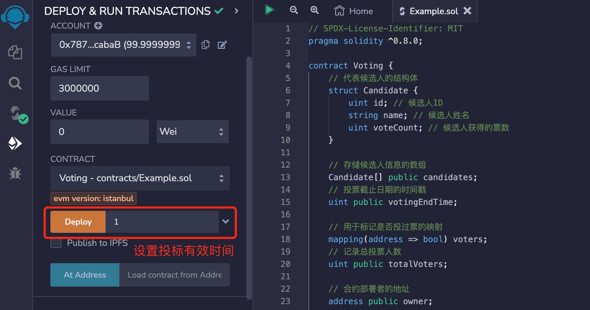
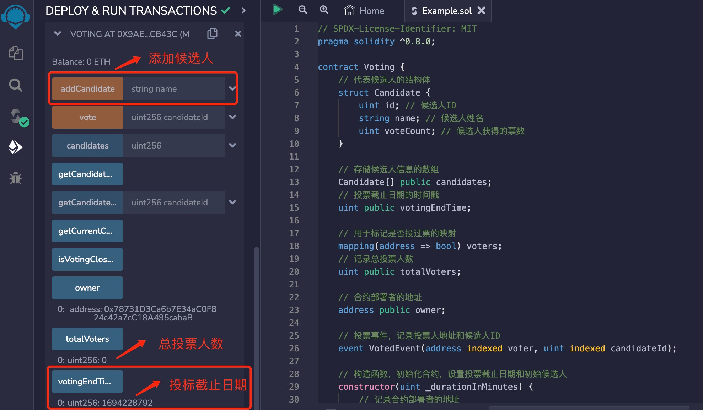
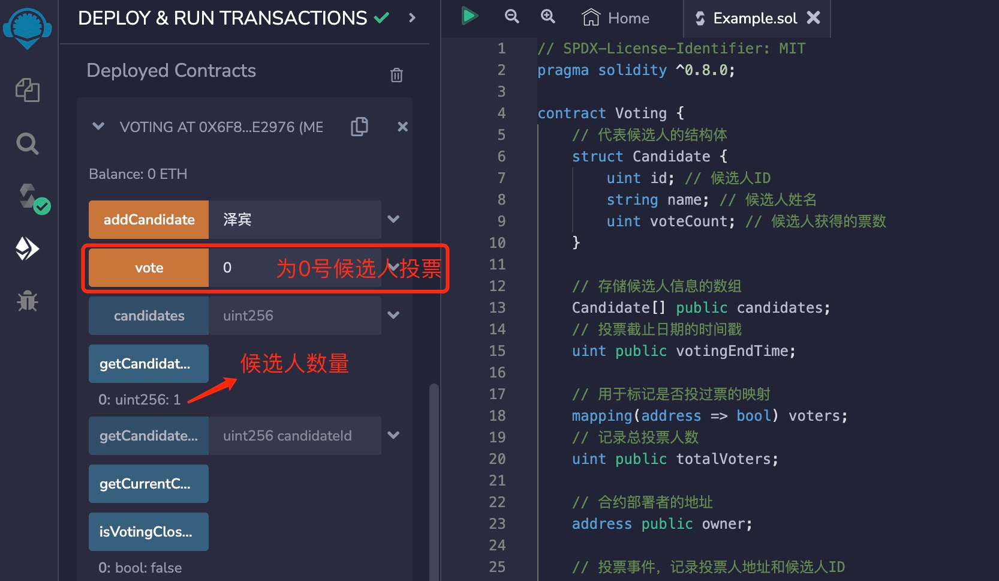
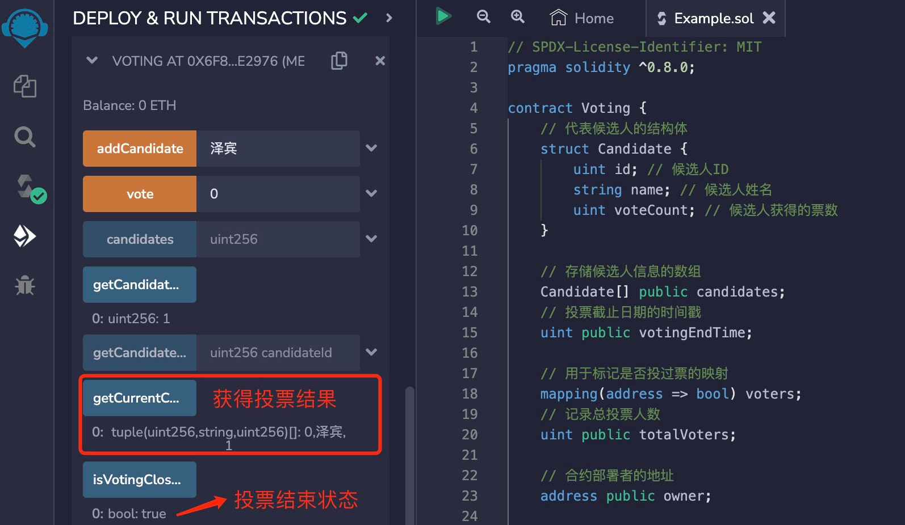

# Solidity常用合约:&nbsp;&nbsp;&nbsp;&nbsp;202.投票合约 

本章讲解什么是投票合约，以及投票合约的算法和实现。

**视频**：[Bilibili](https://space.bilibili.com/2112923943)  |  [Youtube](https://www.youtube.com/@BinSchoolApp)

**官网**：[BinSchoolOrg](https://binschool.org)

**代码**：[github.com/hitadao](https://github.com/hitadao)

**推特**：[@Hita_DAO](https://x.com/hita_dao)    **Discord**：[Hita_DAO](https://discord.gg/dzWY3QYGrx)s

-----

投票合约的目标是创建一个基于区块链的去中心化投票系统，以确保投票的公平性、透明性和安全性。

投票合约中被投票的对象，既可以是人员，又可以是提案，我们为了简单起见，统称为候选人。

合约部署者首先添加所有的候选人，然后发起一个投票。投票人在规定时间内，对候选人进行投票。投票的最终结果可以公开查询。

## 1. 投票合约的算法
投票合约具有以下主要功能和算法：

### 1.1 添加候选人
合约部署者可以通过 **`addCandidate`** 函数添加候选人。这些候选人将被存储在合约中，供投票人选择。

### 1.2 投票
任何人都可以使用 **`vote`** 函数投票给他们选择的候选人。投票人的地址将被记录，以确保他们不能多次投票。

### 1.3 计票和排名
合约允许投票人查询候选人的当前票数和排名。排名按照候选人获得的票数从高到低排列。

### 1.4 状态变量
合约包含多个状态变量来存储投票信息，例如：合约部署者、投票截止日期、投票人数、候选人信息等。

### 1.5 事件
投票事件被记录，以便后续审计和验证。这有助于确保投票的透明性。

### 1.6 排序算法
当查询候选人排名时，合约使用冒泡排序算法对候选人按照票数进行排序，以确定他们的排名。


## 2. 投票合约的实现

```solidity
// SPDX-License-Identifier: MIT
pragma solidity ^0.8.0;

contract Voting {
    // 代表候选人的结构体
    struct Candidate {
        uint id; // 候选人ID
        string name; // 候选人姓名
        uint voteCount; // 候选人获得的票数
    }

    // 存储候选人信息的数组
    Candidate[] public candidates;
    // 投票截止日期的时间戳
    uint public votingEndTime;

    // 用于标记是否投过票的映射
    mapping(address => bool) voters;
    // 记录总投票人数
    uint public totalVoters;
    
    // 合约部署者的地址
    address public owner;

    // 投票事件，记录投票人地址和候选人ID
    event VotedEvent(address 
      indexed voter, uint indexed candidateId);

    // 构造函数，初始化合约，设置投票截止日期和初始候选人
    constructor(uint _durationInMinutes) {
        // 记录合约部署者的地址
        owner = msg.sender;
        // 设置投票截止日期时间戳
        votingEndTime = block.timestamp + (_durationInMinutes * 1 minutes);
    }

    // 添加候选人，只能通过外部调用触发
    function addCandidate(string memory name) external {
        // 只有合约部署者可以添加候选人
        require(msg.sender == owner, 
             "Only the contract deployer can add candidates");
        
        // 将候选人信息添加到数组
        candidates.push(Candidate(candidates.length, name, 0));
    }

    // 投票函数，使用本地化的提示信息
    function vote(uint candidateId) external {
        // 检查候选人是否存在
        require(candidateId < candidates.length, 
            "Invalid candidate");
        // 检查是否已经投过票
        require(!voters[msg.sender], 
            "You have already voted");
        // 检查投票是否已结束
        require(block.timestamp < votingEndTime, 
            "Voting has ended");

        // 更新候选人的票数
        candidates[candidateId].voteCount++;
        // 标记投票人已投票
        voters[msg.sender] = true;
        // 增加总投票人数
        totalVoters++;
        // 触发投票事件，记录投票人地址和候选人ID
        emit VotedEvent(msg.sender, candidateId);
    }

    // 获取特定候选人的投票数
    function getCandidateVoteCount(uint candidateId) 
         public view returns (uint) {
        // 检查候选人是否存在
        require(candidateId < candidates.length, 
            "Invalid candidate");
        
        // 返回候选人的票数
        return candidates[candidateId].voteCount;
    }

    // 获取候选人总数
    function getCandidateCount() 
        public view returns (uint) {
        // 返回候选人数组的长度
        return candidates.length;
    }

    // 检查投票是否已经结束
    function isVotingClosed() public view returns (bool) {
        // 检查当前时间是否超过投票截止日期
        return block.timestamp >= votingEndTime;
    }

    // 获取当前的候选人排名
    function getCurrentCandidateRanking() 
        public view returns (Candidate[] memory) {
        // 检查投票是否已结束
        require(isVotingClosed(), "Voting is not closed yet");

        // 复制候选人数组以进行排序
        Candidate[] memory rankedCandidates = candidates;

        // 使用冒泡排序按票数排名
        for (uint i=0; i<rankedCandidates.length-1; i++) {
            for (uint j=0; j<rankedCandidates.length-i-1; j++) {
               if (rankedCandidates[j].voteCount<rankedCandidates[j+1].voteCount) {
                    (rankedCandidates[j], rankedCandidates[j+1]) = (rankedCandidates[j+1], rankedCandidates[j]);
                }
            }
        }

        // 返回排名后的候选人数组
        return rankedCandidates;
    }
}
```

## 3. 部署和测试
我们可以把上面编写的投票合约，复制到 **`Remix`** 里进行编译，然后部署到区块链上。

第一步：部署合约的时候需要填写投标有效期，以分钟为单位，比如：填写 1，就表示投标有效时间为1分钟。
<p align="center"></p>

合约部署后，我们会看到各个状态变量值都已经初始化，其中投标截止时间已经变为合约部署时间加上1分钟。

另外，我们还需要通过 **`addCandidate`** 添加候选人。
<p align="center"></p>

第二步：我们通过 **`vote`** 开始投标，填写想要投给的候选人的序号，进行投票。每个人只能投票一次，投过票后不允许再次投票。你可以切换不同的地址进行投票。

投票后，状态变量的值都按照规则进行了更新。
<p align="center"></p>

第三步：当超过截止投票截止时间后，也就是 **`isVotingClosed`** 返回 **`true`** 时，我们就可以查看投票结果。投票结果按照得票数从高到低排列。
<p align="center"></p>