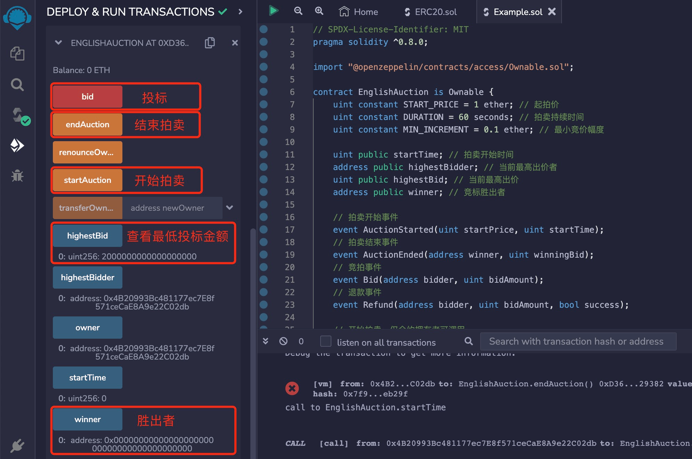

# Solidity常用合约:&nbsp;&nbsp;&nbsp;&nbsp;301.英国拍卖 

本章讲解什么是英国拍卖，以及英国拍卖合约的算法和实现。

**视频**：[Bilibili](https://space.bilibili.com/2112923943)  |  [Youtube](https://www.youtube.com/@BinSchoolApp)

**官网**：[BinSchoolOrg](https://binschool.org)

**代码**：[github.com/hitadao](https://github.com/hitadao)

**推特**：[@Hita_DAO](https://x.com/hita_dao)    **Discord**：[Hita_DAO](https://discord.gg/dzWY3QYGrx)

-----

拍卖是一种通过竞价来出售商品或服务的交易方式，最终会以最高的出价成交。  

## 1. 拍卖分类
拍卖可以分为多种类别，常见以下三种方式：

### 1.1 英国拍卖
英国拍卖，英文为 English Auction。这是一种最为常见的拍卖形式，参与者通过竞价不断提高价格，拍卖会以最高价出售商品或服务。

### 1.2 荷兰拍卖
荷兰拍卖，英文为 Dutch Auction。它与英国拍卖相反，是从一个较高的价格开始，然后逐渐降低，第一个愿意接受的出价即成交。

### 1.3 封闭式拍卖
封闭式拍卖，英文为 Sealed-Bid Auction。参与者在不知道其他人出价的情况下，私下提交出价，最高价者获胜。

## 2. 英国拍卖算法
英国拍卖是一种开放式拍卖。在英国拍卖中，拍卖师会逐渐提高价格，参与者可以选择是否继续竞标。竞价最高的人将以其出价获得拍卖物品或服务。

英国拍卖因其竞争性和公开性而受到欢迎，常用于各种拍卖场景，包括艺术品、房地产、古董、珠宝等。它提供了一个公平且透明的方式，让参与者根据市场需求和供给情况来确定价格。

英国拍卖的主要算法是逐步提高价格，直到只有一个竞标者愿意出更高的价格，然后以该价格成交。

我们把英国拍卖结合区块链技术，并根据实际情况，编写成一个智能合约，算法可以分为以下步骤：

### 1）起拍
拍卖者首先确定一个起拍价，参与者的投标不能低于这个价格。

### 2）提价
参与者根据自己的意愿提高价格，进行投标，每次提价不小于一定的幅度。

### 3）结束
每次拍卖都限定时间，一旦到达这个时间，投标结束。

### 4）成交
投标结束后，与最后一个有效的投标者成交，他也是本次拍卖出价最高的竞标者。


## 4. 英国拍卖合约
英国拍卖合约包括 3 个函数：开始拍卖函数 **`startAuction`**、结束拍卖函数 **`endAuction`**，以及竞价函数 **`bid`**。

其中，开始拍卖和结束拍卖函数，只有合约拥有者有权调用， 而竞价函数 **`bid`** 可以由任何人调用。

在英国拍卖合约中，结束拍卖必须由人工操作，它无法做到自动结束，而荷兰拍卖是可以做到自动结束的。 

```solidity
// SPDX-License-Identifier: MIT
pragma solidity ^0.8.0;

import "@openzeppelin/contracts/access/Ownable.sol";

contract EnglishAuction is Ownable {
    uint constant START_PRICE = 1 ether; // 起拍价
    uint constant DURATION = 60 seconds; // 拍卖持续时间
    uint constant MIN_INCREMENT = 0.1 ether; // 最小竞价幅度

    uint public startTime; // 拍卖开始时间
    address public highestBidder; // 当前最高出价者
    uint public highestBid; // 当前最高出价
    address public winner; // 竞标胜出者
   
    // 拍卖开始事件
    event AuctionStarted(uint startPrice, uint startTime);
    // 拍卖结束事件
    event AuctionEnded(address winner, uint winningBid);
    // 竞拍事件
    event Bid(address bidder, uint bidAmount);
    // 退款事件
    event Refund(address bidder, uint bidAmount, bool success);

    // 开始拍卖，仅合约拥有者可调用
    function startAuction() public onlyOwner {
        // 确保拍卖还未开始
        require(startTime == 0, "auction already started"); 

        // 记录拍卖开始时间为当前时间戳
        startTime = block.timestamp; 
        // 将最高出价者清零
        highestBidder = address(0); 
        // 最高出价初始化为起拍价
        highestBid = START_PRICE;
        // 竞标胜出者清零
        winner = address(0); 
        // 触发拍卖开始事件，传入起拍价和开始时间
        emit AuctionStarted(START_PRICE, block.timestamp); 
    }

    // 竞拍出价
    function bid() public payable {
        // 确保拍卖已经开始
        require(startTime > 0, "auction not yet started"); 
        // 确保拍卖还未结束
        require(winner == address(0), "auction is over");
        // 出价必须高于当前最高出价
        require(msg.value > highestBid, 
            "bid must be greater than the current maximum bid");
        // 出价提高幅度不小于最小幅度
        require(msg.value - highestBid >= MIN_INCREMENT,
            "bid increment must be not less than minIncrement"); 
        // 确保在拍卖期间内
        require(block.timestamp < startTime + DURATION, "exceed auction time"); 

        // 退还之前最高出价者的款项
        bool sent = payable(highestBidder).send(highestBid);
        // 触发 Refund 事件，记录退款是否成功
        Refund(highestBidder, highestBid, sent);

        // 更新最高出价者为当前出价者
        highestBidder = msg.sender; 
        // 更新最高出价为当前出价
        highestBid = msg.value;
        // 触发出价事件，传入出价者和出价金额
        emit Bid(msg.sender, msg.value); 
    }

    // 结束拍卖，仅合约拥有者可调用
    function endAuction() public onlyOwner {
        // 确保拍卖已经开始
        require(startTime > 0, "auction not yet started"); 
        // 确保结束时间已到
        require(block.timestamp >= startTime + DURATION, 
            "the end time has not yet been reached"); 
        // 竞标胜出者设置为当前最高出价人
        winner = highestBidder;
        // 触发拍卖结束事件，传入最高出价者和最高出价
        emit AuctionEnded(highestBidder, highestBid); 
        // 拍卖开始时间清零
        startTime = 0;
        // 提取合约余额资金给合约拥有者
        payable(owner()).transfer(address(this).balance); 

        //这里可以加入对竞拍成功者的任意操作
        //.....
    }
}
```

**注意**：这个合约 **`bid`** 函数代码中有一句：

```solidity
bool sent = payable(highestBidder).send(highestBid);
```
为什么使用了 **`send`** 转账，而不是 **`tranfer`** 呢？这是为了避免拍卖合约被 **`DOS`** 拒绝服务攻击。

有关智能合约安全的内容，可以参照我已经发布的安全系列教程。

## 4. 部署和测试
我们可以把上面编写的众筹合约，复制到 **`Remix`** 里进行编译，然后部署到区块链上。
使用2-3个地址模拟竞拍场景，来测试各项功能。

点击 **`startAuction`** 开始竞标，我们可以通过 **`highestBid`** 方法，查看当前所需的最低投标额。

按照我们设定参数，设定的拍卖时长为 60 秒，拍卖起始价为 1 **`ETH`**，每次加价不小于 0.1 **`ETH`**。

我们可以选择时机，在上方的 **`Value`** 处填写出价，点击 **`bid`** 进行投标。

拍卖时间到达后，合约拥有者可以通过 **`endAuction`** 结束本次拍卖，合约中的资金会自动转入合约拥有者的账户。
<p align="center"></p>