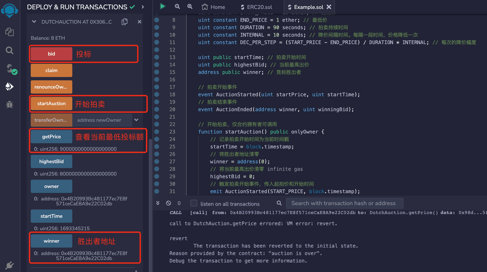

# Solidity常用合约:&nbsp;&nbsp;&nbsp;&nbsp;302.荷兰拍卖 

本章讲解什么是荷兰拍卖，以及荷兰拍卖合约的算法和实现。

**视频**：[Bilibili](https://space.bilibili.com/2112923943)  |  [Youtube](https://www.youtube.com/@BinSchoolApp)

**官网**：[https://BinSchool.Org](https://binschool.org)

**代码**：[https://github.com/hitadao/solidity](https://github.com/hitadao/solidity)

**推特**：[@Hita_DAO](https://x.com/hita_dao)    **Discord**：[Hita_DAO](https://discord.gg/dzWY3QYGrx)

-----
拍卖是一种通过竞价来出售商品或服务的交易方式，最终会以最高的出价成交。  

## 1. 拍卖分类
拍卖可以分为多种类别，常见以下三种方式：

### 1.1 英国拍卖
英国拍卖，英文为 English Auction。这是一种最为常见的拍卖形式，参与者通过竞价不断提高价格，拍卖会以最高价出售商品或服务。

### 1.2 荷兰拍卖
荷兰拍卖，英文为 Dutch Auction。它与英国拍卖相反，是从一个较高的价格开始，然后逐渐降低，第一个愿意接受的出价即成交。

### 1.3 封闭式拍卖
封闭式拍卖，英文为 Sealed-Bid Auction。参与者在不知道其他人出价的情况下，私下提交出价，最高价者获胜。

## 2. 荷兰拍卖算法
荷兰拍卖，英文名称 Dutch Auction，它是一种特殊的拍卖形式。 亦称“减价拍卖”，它是指拍卖标的的竞价由高到低依次递减，直到第一个竞买人应价时击槌成交的一种拍卖，特殊情况下会到达底价。

荷兰拍卖非常适合于在区块链的业务场景，很多 **`NFT`** 通过荷兰拍卖发售，其中包括 Azuki 和 World of Women，其中 Azuki 通过荷兰拍卖筹集了超过 8000 枚 **`ETH`**。

项目方非常喜欢这种拍卖形式，主要有三个原因：

价格由最高慢慢下降，能让项目方获得最大的收入。
能够做到自动成交，无人值守。
拍卖持续较长时间，可以避免 **`gas`** 大战。
我们把荷兰拍卖结合区块链技术，并根据实际情况，编写成一个智能合约，算法可以分为以下步骤：

### 1）起拍
拍卖者首先确定一个较高的起拍价和一个最低价，参与者的投标不能低于最低价，也不会高于起拍价。

### 2）降价
按照预定的价格衰减周期，每隔一段时间，价格就降低一定的幅度。

如果无人投标，那么会直至降低到最低价。

### 3）结束
一旦有人投标，拍卖立即结束。

### 4）成交
投标结束后，与唯一的投标者成交，他也是本次拍卖出价最高的竞标者。


## 3. 荷兰拍卖合约
荷兰拍卖合约包括 4 个函数：开始拍卖函数 **`startAuction`**、竞价函数 **`bid`**、查看当前最低投标额的函数 **`getPrice`**，以及提取合约资金的函数 **`claim`**。

其中，开始拍卖函数 **`startAuction`** 和提取合约资金的函数 **`claim`** ，只有合约拥有者有权调用， 而竞价函数 **`bid`** 和查看当前最低投标额的函数 **`getPrice`** ，可以由任何人调用。

在拍卖开始后，投标者可以通过函数 **`getPrice`** 查看当前的当前最低投标额，然后使用竞拍函数 **`bid`** ，填入合适的投标金额进行投标。

在函数 **`bid`** 中，一旦有人投标，拍卖就会结束。拍卖者可以通过函数 **`claim`** 取走合约里投标的资金。

```solidity
// SPDX-License-Identifier: MIT
pragma solidity ^0.8.0;

import "@openzeppelin/contracts/access/Ownable.sol";

contract DutchAuction is Ownable {
    uint constant START_PRICE = 10 ether; // 起拍价
    uint constant END_PRICE = 1 ether; // 最低价
    uint constant DURATION = 90 seconds; // 拍卖持续时间
    uint constant INTERNAL = 10 seconds; // 降价间隔时间。每隔一段时间，价格降低一次
    uint constant DEC_PER_STEP = (START_PRICE - END_PRICE) / DURATION * INTERNAL; // 每次的降价幅度
    
    uint public startTime; // 拍卖开始时间
    uint public highestBid; // 当前最高出价
    address public winner; // 竞标胜出者
   
    // 拍卖开始事件
    event AuctionStarted(uint startPrice, uint startTime);
    // 拍卖结束事件
    event AuctionEnded(address winner, uint winningBid);

    // 开始拍卖，仅合约拥有者可调用
    function startAuction() public onlyOwner {
        // 记录拍卖开始时间为当前时间戳
        startTime = block.timestamp;
        // 将胜出者地址清零
        winner = address(0);
        // 将当前最高出价清零
        highestBid = 0;
        // 触发拍卖开始事件，传入起拍价和开始时间
        emit AuctionStarted(START_PRICE, block.timestamp); 
    }

    // 竞拍出价
    function bid() public payable {
        // 确保拍卖已经开始
        require(startTime > 0, "auction not yet started"); 
        // 确保拍卖还未结束
        require(winner == address(0), "auction is over");

        // 计算当前拍卖价格
        uint currentPrice =  START_PRICE - ((block.timestamp - startTime)  / INTERNAL * DEC_PER_STEP);
        if (currentPrice < END_PRICE) {
            currentPrice = END_PRICE;
        }
        // 出价必须高于当前拍卖价格
        require(msg.value >= currentPrice, 
            "bid must be not less than the current price");

        // 更新胜出者为当前出价者
        winner = msg.sender; 
        // 更新最高出价为当前出价
        highestBid = msg.value;
        // 触发竞拍事件
        emit AuctionEnded(msg.sender, msg.value);

        //这里可以加入对竞拍成功者的任意操作
        //..... 
    }

    // 提取合约中的资金。仅合约拥有者可调用
    function claim() public onlyOwner {
        // 提取合约余额资金给合约拥有者
        payable(owner()).transfer(address(this).balance);
    }

    // 查看当前最低投标额
    function getPrice() public view returns(uint) {
        // 确保拍卖已经开始
        require(startTime > 0, "auction not yet started"); 
        // 确保拍卖还未结束
        require(winner == address(0), "auction is over");
        // 返回当期投标需要的金额
        return START_PRICE - ((block.timestamp - startTime)  / INTERNAL * DEC_PER_STEP);
    }
}
```

## 4. 部署和测试
我们可以把上面编写的荷兰拍卖合约，复制到 **`Remix`** 里进行编译，然后部署到区块链上。

点击 **`startAuction`** 开始竞标，我们可以通过 **`getPrice`** 方法，查看当前所需的最低投标额。

按照我们设定参数，最低投标额从 10 **`ETH`** 开始，每 10 秒就会降价 1 **`ETH`**，直至将至最低价 1 ETH。

我们可以选择时机，在上方的 **`Value`** 处填写出价，点击 **`bid`** 进行投标。

<p align="center"></p>