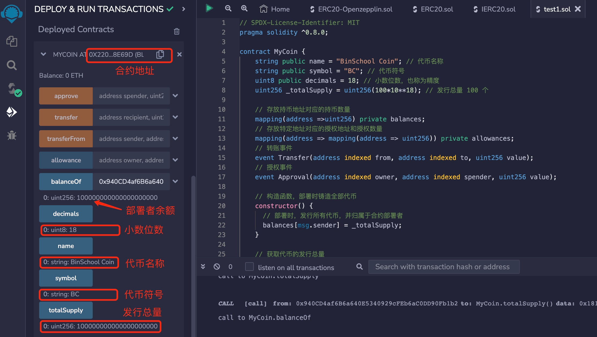
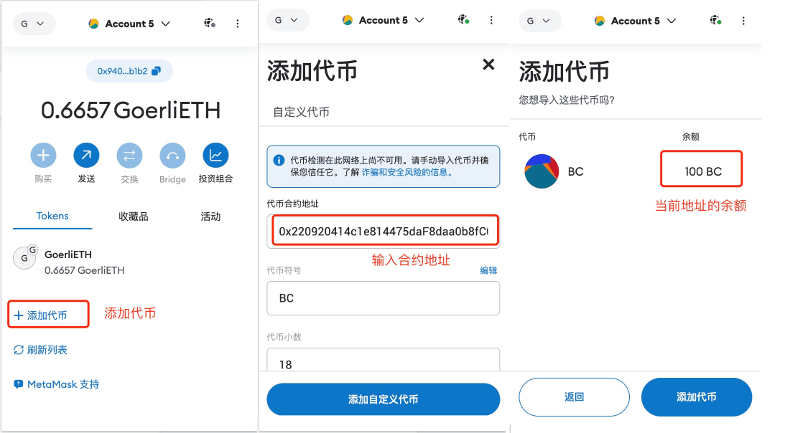

# Solidity常用合约:&nbsp;&nbsp;&nbsp;&nbsp;401.ERC-20 代币合约

本章讲解 **`ERC-20`** 代币合约的用途、要求，以及如何编写代币合约。

**视频**：[Bilibili](https://space.bilibili.com/2112923943)  |  [Youtube](https://www.youtube.com/@BinSchoolApp)

**官网**：[BinSchoolOrg](https://binschool.org)

**代码**：[github.com/hitadao](https://github.com/hitadao)

**推特**：[@Hita_DAO](https://x.com/hita_dao)    **Discord**：[Hita_DAO](https://discord.gg/dzWY3QYGrx)

-----

**`ERC-20`** 是以太坊上智能合约的一个重要接口标准，用于定义和实现可互操作的代币。

**`ERC-20`** 标准描述了代币合约应该遵循的规则和方法，以便能够在以太坊网络上实现代币的发行、传输和管理。只有遵循 **`ERC-20`** 标准编写的智能合约，才能被钱包软件、其它合约或者应用程序识别为一种特定代币，进而正确地呈现它的信息，以及便捷地使用它。

**`ERC-20`** 标准要求必须实现 6 个方法和 2 个事件，分别用于：查询总供应量、查询余额、转账，以及授权转账。

另外，合约还可以选择性地提供代币名称、代币符号 和 小数位数。虽然这部分信息是非强制性的，但是合约里通常都会提供这些功能。

**`ERC-20`** 合约非常重要，也非常简单，它应该是去中心化金融 **`DeFi`** 中最基础的合约。

对于一个 **`Web3`** 从业者，无论是从事开发还是进行投资，都应该熟练掌握它。


## 1. ERC-20 标准方法
**`ERC-20`** 标准方法，是提供给外部应用或者其它合约可以调用的函数。**`ERC-20`** 标准规定：代币合约必须实现 6 个特定的方法。

### 1.1 totalSupply
```solidity
function totalSupply() public view returns (uint256)
``` 
获取代币的总供应量。

### 1.2 balanceOf
```solidity
function balanceOf(address account) external view returns (uint256)
``` 
获取指定地址 **`account`** 的代币余额。

### 1.3 transfer
```solidity
function transfer(address to, uint256 amount) external returns (bool)
``` 
从调用者的地址，向目标地址 **`to`** 转移指定数量 **`amount`** 的代币。

### 1.4 approve
```solidity
function approve(address spender, uint256 amount) external returns (bool)
``` 
授权指定地址 **`spender`** 能够从调用者的地址转移一定数量 **`amount`** 的代币。


### 1.5 allowance
```solidity
function allowance(address owner, address spender) external view returns (uint256)
``` 
获取一个地址 **`owner`** 授权给另一个地址 **`spender`** 能够转移的代币数量。

### 1.6 transferFrom
```solidity
function transferFrom(address from, address to, uint256 amount) external returns (bool)
``` 
在授权的情况下，从一个地址 **`from`** 向另一个地址 **`to`** 转移指定数量 **`amount`** 的代币。

**注意**：在 **`ERC-20`** 代币合约中，有一组委托操作的方法，分别是：**`approve`**、**`allowance`**、**`transferFrom`**。某个地址的特定数量代币可以授权给第三方操作。比如：在去中心化交易所进行交易时，用户不需要把自己的代币转入交易所的账户，而是将一定数量的代币授权给交易所操作即可，而且还可以随时收回权限。这样的操作方法非常安全和灵活。

## 2. ERC-20 标准事件
在 **`Solidity`** 中，事件是一种通知机制，智能合约用来向外部程序或其它合约通知某个事件的发生。

触发一个事件后，事件中携带的数据就会存储到收据中，并与交易关联，记录在区块链上，以便外部应用监听和处理。

**`ERC-20`** 标准规定：代币合约必须实现 2 个特定的事件。

区块浏览器会使用 **`ERC-20`* 代币合约的事件，对交易数据进行统计。

### 2.1 Transfer
```solidity
event Transfer(address indexed from, address indexed to, uint256 value)
``` 
当代币被成功转移时，就会触发该事件，它记录转移的发起地址、目标地址和转移的数量。

### 2.2 Approval
```solidity
event Approval(address indexed owner, address indexed spender, uint256 value)
``` 
当一个地址授权另一个地址，能够转移一定数量的代币时，就会触发该事件，它记录所有者、被授权者和授权数量的变化。


## 3. 编写 ERC-20 代币合约
编写 **`ERC-20`** 合约有两种方法：继承 **`OpenZepplin`** 合约 和 自行实现。

### 3.1 继承 OpenZepplin 合约
继承 **`OpenZepplin`** 库中的 **`ERC-20`** 合约，只需要几行代码就可以实现自己的代币合约，这也是最常用的方法。

假如，我们要发行一个代币，它的名称为 BinSchool Coin，符号为 **`BC`** 100 个，归属于合约部署者，那么就可以这样编写：

```solidity
// SPDX-License-Identifier: MIT
pragma solidity ^0.8.0;

// 引入代币合约需要继承的 openzeppelin 的 ERC-20 合约
import "@openzeppelin/contracts/token/ERC20/ERC20.sol";

contract MyCoin is ERC20{
    // 构造函数，调用了openzeppelin的ERC-20合约的构造函数，传入代币名称和符号
    constructor() ERC20("BinSchool Coin", "BC") {
        // 铸造 100 个 BC 给合约部署者
        _mint(msg.sender, 100*10**18);
    }
}
```

### 3.2 自行实现
自己从头编写一个 **`ERC-20`** 代币合约的技术难度不高，就是一些简单的变量操作，需要实现标准中规定的 6 个方法。

编写 **`ERC-20`** 合约首先需要理解两个变量：**`balances`** 和 **`allowances`**。这两个变量都是 **`mapping`** 数据类型。

#### a) 变量 balances
**`balances`** 用来存放所有持币地址对应的持币数量。比如： bob 的地址为 0x1111...2222，他持有 100 wei个代币，那么在 **`balances`** 中会产生这样一条记录：

```solidity
balances[0x1111...2222] = 100
```

#### b) 变量 allowances
**`allowances`** 存放特定地址对应的授权地址和授权数量。 比如：交易所的地址为 0xaaaa...bbbb，bob 的地址为 0x1111...2222，bob 授权给交易所，可以转移他持有的 100 wei个代币，那么在 **`allowances`** 中会产生这样一条记录：

```solidity
allowances[0x1111...2222][0xaaaa...bbbb] = 100
```

以下是完整的代币合约和注释：
```solidity
// SPDX-License-Identifier: MIT
pragma solidity ^0.8.0;

contract MyCoin {
    string public name = "BinSchool Coin"; // 代币名称
    string public symbol = "BC"; // 代币符号
    uint8 public decimals = 18; // 小数位数，也称为精度
    uint256 _totalSupply = uint256(100*10**18); // 发行总量 100 个

    // 存放持币地址对应的持币数量
    mapping(address =>uint256) private balances;  
    // 存放特定地址对应的授权地址和授权数量
    mapping(address => mapping(address => uint256)) private allowances; 
    // 转账事件
    event Transfer(address indexed from, address indexed to, uint256 value);  
    // 授权事件
    event Approval(address indexed owner, address indexed spender, uint256 value);
 
    // 构造函数，部署时铸造全部代币
    constructor() {
      // 部署时，发行所有代币，并归属于合约部署者
      balances[msg.sender] = _totalSupply;
    }

    // 获取代币的发行总量
    function totalSupply() external view returns (uint256) {
        return _totalSupply;
    }
    
    // 获取地址 account 的余额
    function balanceOf(address account) external view returns (uint256) {
        // 余额记录全部存放在映射 balances 中，balances 就是一个内部账本
        // 从映射 balances 中取得地址 account 的余额
        return balances[account];
    }

    // 调用者 msg.sender 转给接收者 recipient ，共 amount 个代币
    function transfer(address recipient, uint256 amount) external returns (bool) {
        // 检查接收者地址是否为空地址
        require(recipient != address(0), "ERC20: transfer recipient is zero");
        // 检查调用者（发送者）的余额是否足够进行转移
        require(balances[msg.sender] >= amount, "ERC20: transfer amount exceeds balance");
        // 扣除调用者的代币数量
        balances[msg.sender] -= amount;
        // 增加接收者的代币数量
        balances[recipient] += amount;
        // 触发 Transfer 事件，通知其他应用程序转移发生了
        emit Transfer(msg.sender, recipient, amount);
        // 返回转移是否成功
        return true;
    }

    // 调用者 msg.sender 授权给地址 spender ，共可转移 amount 个代币
    function approve(address spender, uint256 amount) external returns (bool){
        // 检查授权的地址是否为空地址
        require(spender != address(0), "ERC20: approve to the zero address");
        // 更新调用者（代币所有者）授权给 spender 的代币数量
        allowances[msg.sender][spender] = amount;
        // 触发 Approval 事件，通知其他应用程序授权发生了变化
        emit Approval(msg.sender, spender, amount);
        // 返回授权是否成功
        return true;
    }

    // 调用者 msg.sender 将发送者 sender 的 amount 个代币转给接收者 recipient
    function transferFrom(address sender, address recipient, uint256 amount) external returns (bool) {
        // 检查发送者的余额是否足够进行转移
        require(balances[sender] >= amount, "ERC20: transferFrom amount exceeds balance");
        // 获取发送者授权给接收者的代币数量
        uint256 senderAllowance = allowances[sender][msg.sender];
        // 检查授权数量是否足够进行转移
        require(senderAllowance >= amount, "ERC20: insufficient allowance");
        // 扣除发送者的代币数量
        balances[sender] -= amount;
        // 增加接收者的代币数量
        balances[recipient] += amount;
        // 更新发送者的授权余额
        allowances[sender][recipient] = senderAllowance - amount;
        // 触发 Approval 事件，通知其他应用程序授权发生了变化
        emit Approval(sender, recipient, amount);
        // 返回转移是否成功
        return true;
    }

    // 获取地址 owner 授权给地址 spender 能够转移的代币数量
    function allowance(address owner, address spender) external view returns (uint256) {
        // 授权记录全部存放在映射 allowances 中
        // 取出地址 owner 授权给地址 spender 能够转移的代币数量
        return allowances[owner][spender];
    }
}
```

## 4. 部署和测试
我们可以把自行实现的 **`ERC-20`** 代币合约，复制到 **`Remix`** 里进行编译，然后部署到区块链。比如，我们可以把它部署到以太坊测试网 **`goerli`** 上。

这是部署后的 **`ERC-20`** 代币合约，我们可以得到它在区块链上的合约地址，还可以直接调用它提供的方法。比如：查看代币名称、符号、发行总量，还可以测试转账功能。

<p align="center"></p>

合约部署成功后，我们可以在钱包 **`MetaMask`** 里，添加我们发行的代币。只需要在钱包里添加 **`Token`**，填入代币合约的地址，就可以自动显示出代币的名称、符号等信息，并能够直接交易和管理代币。

<p align="center"></p>