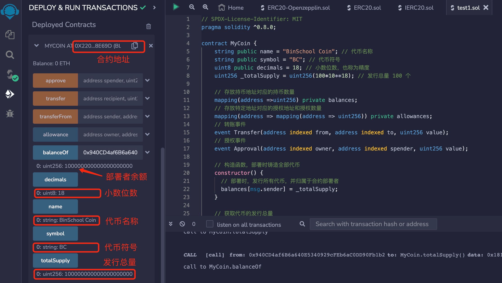

# Solidity常用合约:&nbsp;&nbsp;&nbsp;&nbsp;402.通用权限控制合约

本章讲解智能合约的权限控制，以及如何编写一个通用权限控制合约。

**视频**：[Bilibili](https://space.bilibili.com/2112923943)  |  [Youtube](https://www.youtube.com/@BinSchoolApp)

**官网**：[BinSchoolOrg](https://binschool.org)

**代码**：[github.com/hitadao](https://github.com/hitadao)

**推特**：[@Hita_DAO](https://x.com/hita_dao)    **Discord**：[Hita_DAO](https://discord.gg/dzWY3QYGrx)

-----
智能合约通常也有权限控制功能，有些功能可以提供给任何人使用，而有些功能只能由管理员，也就是合约拥有者使用。

在智能合约中，通过对于调用者地址的判断，来决定调用者是否有权利使用。它的实现通常有两种方法：使用 if 语句判断，或者使用 **`require`** 判断。

其实，**`Openzepplin`** 库中专门实现了这样的一个通用的抽象合约，名称为 Ownable，我们可以直接拿来使用。

**`Ownable`** 合约对外提供了 3 个主要功能：

### 1. 提供 onlyOwner 修饰器
**`onlyOwner`** 修饰器用来限制函数的调用者，只有合约拥有者 **`owner`** 才能使用。其它地址调用，都会报错，交易被 **`revert`**。

### 2. 转移控制权 transferOwnership 函数
当前合约拥有者将合约的所有权转移到新帐户。

### 3. 放弃控制权 renounceOwnership 函数
当前合约拥有者放弃对合约的所有权。这将造成合约没有拥有者，从而禁用了仅供拥有者使用的任何功能。 这么做的好处就是增强了用户对合约的信任，因为任何人都没有特权，无法操纵合约。

## 1. 编写 Ownable 合约
我们可以来编写一下这个合约，名称为 **`Ownable`**。**`Ownable`** 合约提供了一个基本的访问控制机制，可以授予一个帐户对特定函数的独占访问权，这个账户成为合约拥有者。

默认情况下，合约拥有者帐户就是部署合约的帐户，部署后可以使用 **`transferOwnership`** 更改它。

另外，这个合约是一个抽象 **`abstract`** 合约，也就是说，这个合约不能单独使用，不能单独部署，只能由其它合约通过继承来使用。

以下就是 **`Ownable`** 合约的代码：

```solidity
// SPDX-License-Identifier: MIT
pragma solidity ^0.8.0;

/**
 * 这个合约模块提供了一个基本的访问控制机制，其中有一个帐户（拥有者）可以被授予对特定函数的独占访问权。
 * 默认情况下，拥有者帐户将是部署合约的帐户。可以使用 {transferOwnership} 后来更改它。
 * 这个模块通过继承来使用。它将提供修饰符 `onlyOwner`，可以应用于您的函数，以将它们的使用限制为拥有者。
 */
abstract contract Ownable {
    address private _owner; // 合约拥有者
    // 合约控制权转移事件
    event OwnershipTransferred(address indexed previousOwner, address indexed newOwner);

    // 初始化合约，将合约部署者设置为初始拥有者
    constructor() {
        // 将合约部署者设置为初始拥有者
        _transferOwnership(msg.sender);
    }
    // 如果由拥有者以外的任何帐户调用，则抛出异常
    modifier onlyOwner() {
        // 确保调用者是合约的拥有者
        require(owner() == msg.sender, "Ownable: caller is not the owner");
        // 继续执行被修饰的函数
        _;
    }
    // 返回当前合约拥有者的地址
    function owner() public view virtual returns (address) {
       // 返回当前合约拥有者地址
        return _owner;
    }
    /**
     * 放弃合约的控制权。
     * 它只能由当前拥有者调用。
     * 注意：放弃所有权将使合约没有拥有者，从而禁用仅供拥有者使用的任何功能。
     */
    function renounceOwnership() public virtual onlyOwner {
        // 调用内部函数，将合约拥有权设置为零地址，从而放弃控制权
        _transferOwnership(address(0));
    }
    /**
     * 将合约的所有权转移到新帐户 newOwner。
     * 它只能由当前拥有者调用。
     */
    function transferOwnership(address newOwner) public virtual onlyOwner {
        // 确保新拥有者不是零地址
        require(newOwner != address(0), "Ownable: new owner is the zero address");
        // 将合约的所有权转移到新帐户 newOwner
        _transferOwnership(newOwner);
    }

    /**
     * 将合约的所有权转移到新帐户 newOwner。
     * 这是一个内部函数，仅运行内部或者继承合约的函数调用。
     */
    function _transferOwnership(address newOwner) internal virtual {
        // 记录当前拥有者地址
        address oldOwner = _owner;
        // 更新拥有者地址
        _owner = newOwner;
        // 触发拥有权转移事件
        emit OwnershipTransferred(oldOwner, newOwner);
    }
}
```

## 2. 使用 Ownable 合约
如果一个合约需要控制访问权限，那么可以直接继承 **`Ownable`** 合约即可。
```solidity
// SPDX-License-Identifier: MIT
pragma solidity ^0.8.0;

// MyCoin 继承 Ownable 合约的功能
contract MyCoin is Ownable {
    mapping (address => bool) blacklist; // 记录账户是否在黑名单中
    // 设置账户进出黑名单
    function setBlacklist(address account, bool flag) public onlyOwner {
        // 设置账户在黑名单中的状态为 flag
        blacklist[account] = flag;
    }
    // 检查账户是否在黑名单中
    function isBlaclisted(address account) public view returnsl(bool) {
        // 返回账户在黑名单中的状态
        return blacklist[account];
    }
}
``` 
这是一个实现黑名单功能的合约。

其中，函数 **`setBlacklist`** 用来设置一个账户是否进入黑名单。它只能由合约拥有者使用，而其它用户无权使用。所以，这个函数后面增加了 **`onlyOwner`** 修饰器。

函数 **`isBlaclisted`**，就没有设置权限控制，任何人都可以调用。

我们在编写合约的时候，如果需要进行权限控制，就可以导入并继承 **`Ownable`** 合约。

## 3. 部署和测试
我们在编写合约的时候，如果需要进行权限控制，就可以导入并继承 **`Ownable`** 合约。

比如，**`ERC-20`** 代币合约、**`ERC-721`** **`NFT`** 合约，往往要求具有权限控制的功能。 **`NFT`** 交易市场 **`OpenSea`**，就明确要求实现 **`Ownable`** 功能。

我们以 **`ERC-20`** 代币合约为例，添加权限控制功能，代码如下：

```solidity
// SPDX-License-Identifier: MIT
pragma solidity ^0.8.0;

// 引入代币合约需要继承的 openzeppelin 的 ERC-20 合约
import "@openzeppelin/contracts/token/ERC20/ERC20.sol";
import "@openzeppelin/contracts/access/Ownable.sol";

contract MyCoin is ERC20, Ownable{
    // 构造函数，调用了openzeppelin的ERC-20合约的构造函数，传入代币名称和符号
    constructor() ERC20("BinSchool Coin", "BC") {
        // 铸造 100 个 BC 给合约部署者
        _mint(msg.sender, 100*10**18);
    }
}
``` 
我们把上面的代码复制到 **`Remix`** 进行编译，然后部署到区块链上。那么，这个代币合约就已经拥有了权限控制的功能了。

<p align="center"></p>