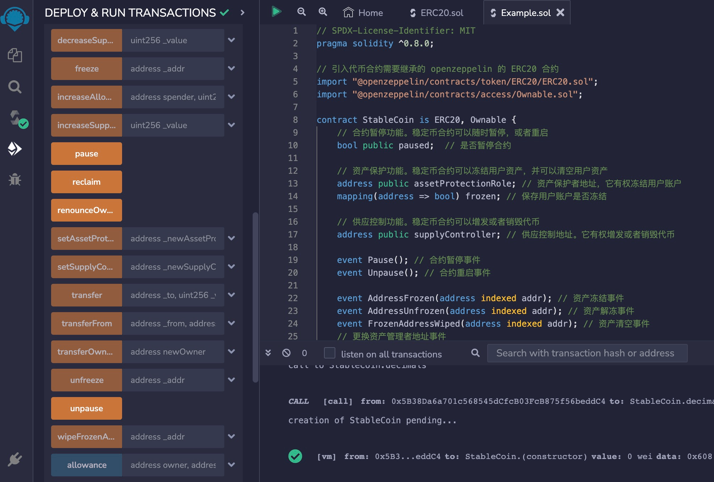

# Solidity常用合约:&nbsp;&nbsp;&nbsp;&nbsp;403.法币型稳定币

本章讲解货币型稳定币合约的功能和实现。

**视频**：[Bilibili](https://space.bilibili.com/2112923943)  |  [Youtube](https://www.youtube.com/@BinSchoolApp)

**官网**：[BinSchoolOrg](https://binschool.org)

**代码**：[github.com/hitadao](https://github.com/hitadao)

**推特**：[@Hita_DAO](https://x.com/hita_dao)    **Discord**：[Hita_DAO](https://discord.gg/dzWY3QYGrx)

-----

稳定币 **`Stablecoin`** 是一种区块链上的 **`ERC-20`** 代币，它的价值相对稳定，通常与一篮子资产挂钩，比如法币、商品或其它加密货币，以维持相对稳定的价值。

稳定币的主要目标是解决加密货币市场中价格波动的问题，使用户能够在数字资产的基础上进行交易和储存，同时避免传统加密货币的剧烈价格波动。

法币型稳定币是稳定币中最常见的一种形式，其价值与传统法定货币（如美元、欧元、人民币等）挂钩，比如：**`USDT`**、**`USDC`**、**`PYUSD`** 等。

它的主要特点是维持与特定法定货币的 1:1 汇率，使用户能够以加密形式持有和交易法定货币，从而在加密货币市场中获得价格稳定性。

法币型稳定币的主要作用包括：

### 1）交易媒介
法币型稳定币允许用户在加密货币交易所中交易，同时避免了通常与其他加密货币相关的价格波动。

### 2）价值储存
由于法币型稳定币的价值与法定货币挂钩，用户可以在市场波动时将资产转移到稳定币中以保值。

### 3） 跨境转账
法币型稳定币可以作为一种有效的跨境转账方式，降低了传统银行间转账的时间和费用。

### 4） 支付方式
一些商家开始接受法币型稳定币作为支付方式，因为它们不仅可以提供快速的交易确认，还可以避免汇率波动对商家的影响。

### 5）金融服务
法币型稳定币为未接触到传统金融服务的人们提供了一种接入金融服务的途径，特别是在没有银行账户的地区。

总之，法币型稳定币旨在提供加密货币市场中的稳定性和可预测性，使用户能够在数字资产领域更加自信地进行交易和储存。

## 1. 稳定币合约的功能
一个标准的稳定币合约至少包含以下功能：

### 1）ERC-20 合约标准功能
包括 6 个函数和 2 个事件。主要是：转账、授权、查询总量和查询余额等功能。

我们的实现的稳定币合约，直接继承了 **`OpenZeppelin`** 的 **`ERC-20`** 标准合约，所以它具备了所有的 **`ERC-20`** 合约的标准功能。

### 2）权限控制功能
权限控制功能，主要是指合约拥有者具有的特定权限。它可以限制某些函数只能由合约拥有者调用。

另外，合约拥有者可以将所有权转移给另外一个地址，或者直接销毁。

大多数的 **`ERC-20`** 代币合约，都具有这个功能，这属于常规功能。

我们的实现的稳定币合约，继承了 **`OpenZeppelin`** 的 **`Ownable`** 标准合约，所以它直接具备了权限控制功能。

### 3）合约启停功能
合约拥有者可以在特定情况下，暂停使用合约，也可以再次启动合约。

我们的实现的稳定币合约，通过状态变量 **`paused`** 控制合约的启停状态。

### 4）资产冻结功能
我们的实现的稳定币合约，引入了一个资产保护角色，称为 **`assetProtectionRole`**。

资产保护角色有权冻结任何用户的代币，并能够直接销毁用户所持有的代币。所以，特定情况下，资产保护角色可以冻结非法用户的资产，甚至销毁。

### 5）供应控制功能
我们的实现的稳定币合约，引入了一个供应控制器角色，称为 **`supplyController`**。

供应控制器角色有权发行或者销毁稳定币，对稳定币的总供应量进行调控。

## 2. 稳定币合约的实现
以下代码完整实现了一个 **`USDT`** 稳定币合约。它继承了 **`OpenZeppelin`** 的 **`ERC-20`** 和 **`Ownable`** 标准合约，并增加了启停控制、供应控制，以及资产冻结功能。

```solidity
// SPDX-License-Identifier: MIT
pragma solidity ^0.8.0;

// 引入代币合约需要继承的 openzeppelin 的 ERC-20 合约
import "@openzeppelin/contracts/token/ERC20/ERC20.sol"; 
import "@openzeppelin/contracts/access/Ownable.sol";

contract StableCoin is ERC20, Ownable {
    // 合约暂停功能。稳定币合约可以随时暂停，或者重启
    bool public paused;  // 是否暂停合约

    // 资产保护功能。稳定币合约可以冻结用户资产，并可以清空用户资产
    address public assetProtectionRole; // 资产保护者地址，它有权冻结用户账户
    mapping(address => bool) frozen; // 保存用户账户是否冻结

    // 供应控制功能。稳定币合约可以增发或者销毁代币
    address public supplyController; // 供应控制地址。它有权增发或者销毁代币

    event Pause(); // 合约暂停事件
    event Unpause(); // 合约重启事件

    event AddressFrozen(address indexed addr); // 资产冻结事件
    event AddressUnfrozen(address indexed addr); // 资产解冻事件
    event FrozenAddressWiped(address indexed addr); // 资产清空事件
    // 更换资产管理者地址事件
    event AssetProtectionRoleSet (
        address indexed oldAssetProtectionRole,
        address indexed newAssetProtectionRole
    );

    // 增加代币供应量事件
    event SupplyIncreased(address indexed to, uint256 value);
    // 减少代币供应量事件
    event SupplyDecreased(address indexed from, uint256 value);
    // 更换供应控制器事件
    event SupplyControllerSet(
        address indexed oldSupplyController,
        address indexed newSupplyController
    );

    // 构造函数
    constructor() ERC20("Tether USD", "USDT") {
        // 将部署合约的账户设置为初始的资产保护角色
        assetProtectionRole = msg.sender;
        // 将部署合约的账户设置为初始的供应控制器
        supplyController = msg.sender;
        // 初始状态为未暂停
        paused = false;
    }

    // ERC-20 基本功能
    // 稳定币的小数位数通常为6，而 Openzeppelin ERC-20 合约默认为18
    function decimals() public pure override returns (uint8) {
        return 6;
    }
    // 从 msg.sender 向指定地址转移代币
    function transfer(address _to, uint256 _value) 
        public override whenNotPaused returns (bool) {
        // 确保目标地址和当前地址均未被冻结，否则抛出异常信息
        require(!frozen[_to] && !frozen[msg.sender], "address frozen");
        // 调用父合约的 transfer 函数来执行代币转移
        return super.transfer(_to, _value);
    }
    // 从一个地址向另一个地址转移代币
    function transferFrom(address _from,address _to,uint256 _value)
        public override whenNotPaused returns (bool) {
        // 确保目标地址、源地址和当前地址均未被冻结，否则抛出异常信息
        require(!frozen[_to] && !frozen[_from] && !frozen[msg.sender], 
            "address frozen");
        // 调用父合约的 transferFrom 函数来执行代币转移
        return super.transferFrom(_from, _to, _value);
    }
    // 收回合约地址上的所有代币。这不受冻结限制影响
    function reclaim() external onlyOwner {
        // 获取合约余额
        uint256 balance = balanceOf(address(this));
        // 将余额转移到拥有者地址
        _transfer(address(this), supplyController, balance);
    }

    // 暂停功能
    // 合约启停修饰符，限制仅在合约未停时可调用函数。
    modifier whenNotPaused() {
        // 确保合约未暂停，否则抛出异常信息
        require(!paused, "whenNotPaused");
        // 继续执行被修饰的函数
        _;
    }
    // 由合约拥有者调用以暂停，触发已停止状态
        // 确保合约未暂停，否则抛出异常信息
    function pause() public onlyOwner {
        require(!paused, "already paused");
        // 设置合约为暂停状态
        paused = true;
        // 发出合约暂停事件
        emit Pause();
    }
    // 由合约拥有者调用以解除暂停，恢复正常状态
    function unpause() public onlyOwner {
        // 确保合约已暂停，否则抛出异常信息
        require(paused, "already unpaused");
        // 设置合约为未暂停状态
        paused = false;
        // 发出合约重启事件
        emit Unpause();
    }

    // 资产保护功能
    // 设置新的资产保护角色地址，它可以冻结/解冻地址，清空资产
    function setAssetProtectionRole(address _newAssetProtectionRole) public {
        // 确保只有资产保护角色地址或合约拥有者可以调用该函数，否则抛出异常信息
        require(msg.sender == assetProtectionRole || msg.sender == owner(), 
            "only assetProtectionRole or Owner");
        // 确保新的资产保护角色地址不同于当前的地址，否则抛出异常信息
        require(assetProtectionRole != _newAssetProtectionRole, 
               "new address is same as a current one");
        // 发出资产保护角色变更事件，记录旧的和新的资产保护角色地址
        emit AssetProtectionRoleSet(assetProtectionRole, _newAssetProtectionRole);
        // 更新资产保护角色地址为新的地址
        assetProtectionRole = _newAssetProtectionRole;
    }
    // 资产保护角色修饰符，限制只能由资产保护角色调用
    modifier onlyAssetProtectionRole() {
        // 确保只有资产保护角色地址可以调用该函数，否则抛出异常信息
        require(msg.sender == assetProtectionRole, "only AssetProtectionRole");
        // 继续执行被修饰的函数
        _;
    }
    // 冻结地址的余额，阻止转移
    function freeze(address  _addr) public onlyAssetProtectionRole {
        // 确保地址未被冻结，否则抛出异常信息
        require(!frozen[_addr], "address already frozen");
        // 设置地址的冻结状态为已冻结
        frozen[_addr] = true;
        // 发出地址冻结事件
        emit AddressFrozen(_addr);
    }
    // 解冻地址的余额，允许转移
    function unfreeze(address _addr) public onlyAssetProtectionRole {
        // 确保地址已被冻结，否则抛出异常信息
        require(frozen[_addr], "address already unfrozen");
        // 设置地址的冻结状态为未冻结
        frozen[_addr] = false;
        // 发出地址解冻事件
        emit AddressUnfrozen(_addr);
    }
    // 清空冻结地址的余额，并销毁代币
    function wipeFrozenAddress(address _addr) public onlyAssetProtectionRole {
        // 确保地址被冻结，否则抛出异常信息
        require(frozen[_addr], "address is not frozen");
        // 获取地址的余额
        uint balance =  balanceOf(_addr);
        // 销毁地址的余额
        _burn(_addr, balance);
        // 发出冻结地址被清空的事件
        emit FrozenAddressWiped(_addr);
        // 发出供应量减少事件，记录减少的数量和操作者
        emit SupplyDecreased(_addr, balance);
    }
    // 查询地址是否被冻结
    function isFrozen(address _addr) public view returns (bool) {
        // 获取地址的冻结状态
        return frozen[_addr];
    }

    // 供应控制功能
    // 设置新的供应控制器地址
    function setSupplyController(address _newSupplyController) public {
        // 确保只有供应控制器地址或合约拥有者可以调用该函数，否则抛出异常信息
        require(msg.sender == supplyController || msg.sender == owner(), 
            "only SupplyController or Owner");
        // 确保新的供应控制器地址不为零地址，否则抛出异常信息
        require(_newSupplyController != address(0), 
            "cannot set supply controller to address zero");
        // 确保新的供应控制器地址不同于当前的供应控制器地址，否则抛出异常信息
        require(supplyController != _newSupplyController, 
            "new address is same as a current one");
        // 发出供应控制器地址变更事件，记录旧的和新的供应控制器地址
        emit SupplyControllerSet(supplyController, _newSupplyController);
        // 更新供应控制器地址为新的地址
        supplyController = _newSupplyController;
    }
    // 供应控制器修饰符，用于限制只能由供应控制器调用
    modifier onlySupplyController() {
        // 确保只有供应控制器地址可以调用该函数，否则抛出异常信息
        require(msg.sender == supplyController, "onlySupplyController");
        // 继续执行被修饰的函数
        _;
    }
    // 铸造指定数量的代币来增加总供应量，铸造到供应控制器账户
    function increaseSupply(uint256 _value) 
        public onlySupplyController returns (bool success) {
       // 调用增发指定数量的代币到供应控制账户
        _mint(supplyController, _value);
        // 发出供应量增加事件，记录增加的数量和操作者
        emit SupplyIncreased(supplyController, _value);
        // 返回操作成功
        return true;
    }
    // 通过从供应控制器账户销毁指定数量的代币，来减少总供应量
    function decreaseSupply(uint256 _value) 
        public onlySupplyController returns (bool success) {
        // 确保减少的数量不超过供应控制账户的代币余额
        require(_value <= balanceOf(supplyController), "not enough supply");
        // 从供应控制账户中销毁指定数量的代币
        _burn(supplyController, _value);
        // 发出供应量减少事件，记录减少的数量和操作者
        emit SupplyDecreased(supplyController, _value);
        // 返回操作成功
        return true;
    }
}
``` 

## 3. 部署和测试
我们可以把上面编写的稳定币合约，复制到 **`Remix`** 里进行编译，然后部署到区块链上。

这是部署后的稳定币合约，我们可以直接调用它所提供的5个方面的功能，包括：**`ERC-20`** 合约的标准功能、权限控制功能、合约启停功能、资产冻结功能、供应控制功能。

<p align="center"></p>