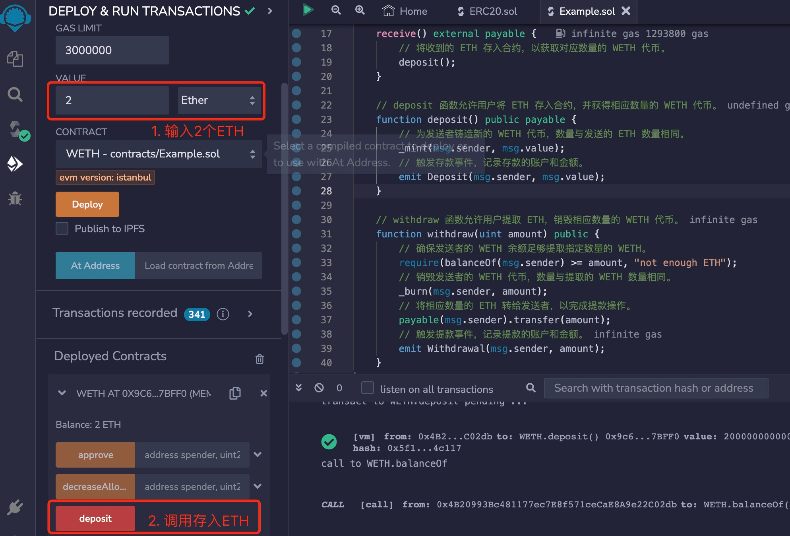

# Solidity常用合约:&nbsp;&nbsp;&nbsp;&nbsp;404.包装型代币

本章讲解什么是包装型代币，以及包装型代币合约的实现。

**视频**：[Bilibili](https://space.bilibili.com/2112923943)  |  [Youtube](https://www.youtube.com/@BinSchoolApp)

**官网**：[https://BinSchool.Org](https://binschool.org)

**代码**：[https://github.com/hitadao/solidity](https://github.com/hitadao/solidity)

**推特**：[@Hita_DAO](https://x.com/hita_dao)    **Discord**：[Hita_DAO](https://discord.gg/dzWY3QYGrx)

-----
包装型代币，英文为 Wrapped Tokens，是一种将原生币包装成符合 **`ERC-20`** 标准的代币。比如，**`WETH`**、**`WBNB`**、**`WBTC`** 等，都是包装型代币的实例。

我们以 **`WETH`** 为例，分析一下包装型代币的作用：

**`WETH`**，全名为 Wrapped Ether，旨在将以太坊的原生币 **`ETH`** 包装成符合 **`ERC-20`** 标准的代币。它使用非常广泛，长期占据以太坊区块链上 **`gas`** 消耗量前三名。

与此类似，**`WBNB`** 是将币安币 **`BNB`** 包装为 **`ERC-20`** 代币，**`WBTC`** 则是将比特币 **`BTC`** 包装为 **`ERC-20`** 代币。

那么，为什么需要将原生币 **`ETH`** 包装成 **`WETH`**` 呢？

在去中心化金融应用中，例如 **`Uniswap`**、**`Curve`** 等，这些应用背后实际上是由一组智能合约构成的。这些智能合约可以方便地实现不同代币之间的交易和兑换。然而，这些智能合约要求交易的代币必须符合 **`ERC-20`** 标准，因为 **`ERC-20`** 标准定义了一组函数和事件，代币的处理逻辑可以做到统一，而不需要为每一种代币单独编写。

然而，原生币 **`ETH`** 并非以智能合约的方式创建的，它不符合 **`ERC-20`** 标准，因此无法直接与这些智能合约进行交互。为了让 **`ETH`** 能够与其他 **`ERC-20`** 代币一样进行交易和使用，就产生了 **`WETH`** 这个概念。**`WETH`** 是将 **`ETH`** 包装成一个符合 **`ERC-20`** 标准的代币，使得 **`ETH`** 也能够在智能合约中和其他代币一样使用。

总而言之，包装型代币的产生是为了使原生币能够符合 **`ERC-20`** 标准，从而在智能合约和去中心化金融应用中与其他代币互操作。这样一来，以太坊生态系统中的各种代币都能够按照相同的标准进行处理，从而提高了互操作性和效率。

## 1. 包装型代币合约

包装型代币和原生币有各自适应的使用场景，我们希望包装型代币和原生币之间，能够随时按照 1:1 的比例自由兑换。

我们按照上述需求，将其编写为一个智能合约，名称为 **`WETH`**。

用户可以将 **`ETH`** 存入 **`WETH`** 合约，或者从 **`WETH`** 合约中提取 **`ETH`**，来进行 **`ETH`** 和 **`WETH`** 之间的转换。这个转换过程是双向的，而且兑换比例是 1:1。

```solidity
// SPDX-License-Identifier: MIT
pragma solidity ^0.8.0;

import "@openzeppelin/contracts/token/ERC20/ERC20.sol";

// 该合约使用 ERC-20 标准实现了 Wrapped Ether（WETH）代币
contract WETH is ERC20 {
    // 存款时触发的事件
    event Deposit(address indexed account, uint amount);
    // 提款时触发的事件
    event Withdrawal(address indexed account, uint amount);

    // 构造函数，初始化代币的名称和代号
    constructor() ERC20("Wrapped Ether", "WETH") {}

    // receive 函数在 ETH 直接发送到合约时被调用。
    receive() external payable {
        // 将收到的 ETH 存入合约，以获取对应数量的 WETH 代币。
        deposit();
    }

    // deposit 函数允许用户将 ETH 存入合约，并获得相应数量的 WETH 代币。
    function deposit() public payable {
        // 为发送者铸造新的 WETH 代币，数量与发送的 ETH 数量相同。
        _mint(msg.sender, msg.value);
        // 触发存款事件，记录存款的账户和金额。
        emit Deposit(msg.sender, msg.value);
    }

    // withdraw 函数允许用户提取 ETH，销毁相应数量的 WETH 代币。
    function withdraw(uint amount) public {
        // 确保发送者的 WETH 余额足够提取指定数量的 WETH。
        require(balanceOf(msg.sender) >= amount, "not enough ETH");
        // 销毁发送者的 WETH 代币，数量与提取的 WETH 数量相同。
        _burn(msg.sender, amount);
        // 将相应数量的 ETH 转给发送者，以完成提款操作。
        payable(msg.sender).transfer(amount);
        // 触发提款事件，记录提款的账户和金额。
        emit Withdrawal(msg.sender, amount);
    }
}
``` 

## 2. 部署和测试

我们可以把上面编写的 **`WETH`** 合约，复制到 **`Remix`** 里进行编译，然后部署到区块链上。

第一步：**`ETH`** 换成 **`WETH`**。我们先在 **`Value`** 区域输入 2 **`Ether`**，然后点击调用 **`deposit`** 方法，就可以将 2 **`ETH`** 存入合约，同时获得 2 **`WETH`** 代币。

我们可以在 **`balanceOf`** 方法中，输入当前账户的地址，就能看到该地址拥有的 2 **`WETH`** 的余额。

<p align="center"></p>

另外，我们还可以通过钱包软件，直接将 **`ETH`** 转账到这个合约地址，也可以实现 **`ETH`** 转换成 **`WETH`**。

第二步： **`WETH`** 换成 **`ETH`**。 在 **`withdraw`** 方法中，输入 2000000000000000000，也就是2后面18个0，因为合约中是以 Wei 为单位来计量代币。

然后点击调用 **`withdraw`** 方法，就可以将 2 **`WETH`** 换成 2 **`ETH`**，存入当前账户。

<p align="center"></p>