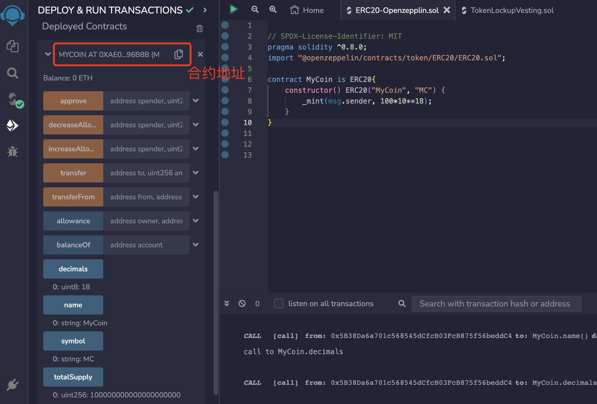
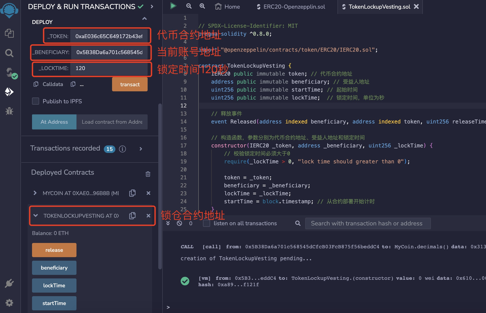
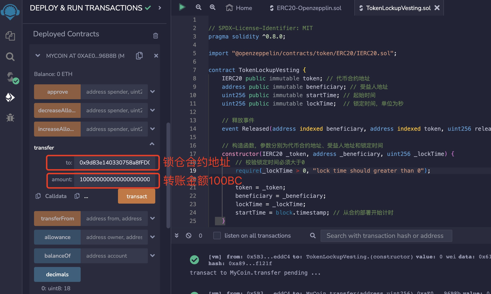
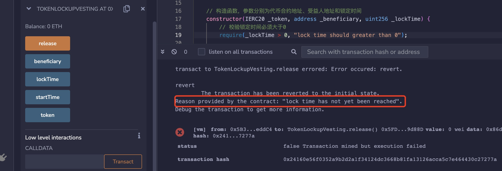
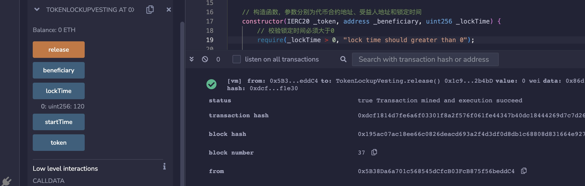

# Solidity常用合约:&nbsp;&nbsp;&nbsp;&nbsp;501.锁仓释放

本章讲解什么是锁仓释放，以及锁仓释放合约的原理和实现。

**视频**：[Bilibili](https://space.bilibili.com/2112923943)  |  [Youtube](https://www.youtube.com/@BinSchoolApp)

**官网**：[BinSchoolOrg](https://binschool.org)

**代码**：[github.com/hitadao](https://github.com/hitadao)

**推特**：[@Hita_DAO](https://x.com/hita_dao)    **Discord**：[Hita_DAO](https://discord.gg/dzWY3QYGrx)

-----

锁仓释放，英文名称为 “Vesting with Lock-up”，是指代币在一段时间内被冻结，无法被转移或销售，而只能在指定的时间段后才会被释放。

这种锁仓机制常常用于首次代币发售 **`ICO`** 或者团队成员分配的代币，以确保他们在一定时间内不会抛售，从而保持代币价格的稳定性。

锁仓释放机制，既可以直接写入在 **`ERC20`** 代币合约中，也可以编写一个独立的智能合约。

在 **`OpenZeppelin`** 库中的 **`VestingWallet`** 合约，可以在其构造函数中设置合适的参数，使之成为锁仓释放合约。

我们将其做了简化，单独编写成一个简单的锁仓释放合约。

## 实现步骤和算法

我们首先编写一个 **`ERC20`** 代币合约，作为锁仓使用的代币，您可以参考本教程的前面章节，直接复制一份代码。

然后，我们再编写一个锁仓合约 **`TokenLockupVesting`**，用于在指定的时间内锁定代币。

我们将一定数量的需要锁定的代币，转入锁仓合约 **`TokenLockupVesting`** 中，并设定锁定期和受益人。

在锁定期内，任何人都不能转走这些代币。当到达锁定期后，合约中的代币就会被释放，受益人就可以提走代币了。

### 1. ERC20 代币合约

代币名称为 **`BinSchool Coin`**，符号为 **`BC`**，为合约部署者发行 100 个代币：

```solidity
// SPDX-License-Identifier: MIT
pragma solidity ^0.8.0;

// 引入代币合约需要继承的 openzeppelin 的 ERC-20 合约
import "@openzeppelin/contracts/token/ERC20/ERC20.sol";

contract MyCoin is ERC20{
    // 构造函数，调用了openzeppelin的ERC-20合约的构造函数，传入代币名称和符号
    constructor() ERC20("BinSchool Coin", "BC") {
        // 铸造 100 个 BC 给合约部署者
        _mint(msg.sender, 100*10**18);
    }
}
```

2. TokenLockupVesting 锁仓合约 

锁仓合约 **`TokenLockupVesting`** 共有两个函数：构造函数 和 释放函数。

构造函数用于指定锁定时间和受益人。

释放函数是提供给受益人提取代币使用的函数。

```solidity
// SPDX-License-Identifier: MIT
pragma solidity ^0.8.0;

import "@openzeppelin/contracts/token/ERC20/IERC20.sol";

contract TokenLockupVesting {
    IERC20 public immutable token; // 代币合约地址
    address public immutable beneficiary; // 受益人地址
    uint256 public immutable startTime; // 起始时间
    uint256 public immutable lockTime;  // 锁定时间，单位为秒

    // 释放事件
    event Released(address indexed beneficiary, 
         address indexed token, 
         uint256 releaseTime, 
         uint256 amount);
    
    // 构造函数，参数分别为代币合约地址、受益人地址和锁定时间
    constructor(IERC20 _token, address _beneficiary, uint256 _lockTime) {
        // 校验锁定时间必须大于0
        require(_lockTime > 0, "lock time should greater than 0");
        
        token = _token; 
        beneficiary = _beneficiary; 
        lockTime = _lockTime; 
        startTime = block.timestamp; // 从合约部署开始计时
    }

    // 到达锁定期后，将代币释放给受益人
    function release() external  {
        // 判断当前时间是否到达锁定期，如果没有达到，终止执行
        require(block.timestamp >= startTime + lockTime, 
           "lock time has not yet been reached");

        // 获取当前合约的代币余额，用于释放给受益人
        uint256 amount = token.balanceOf(address(this));
        // 如果余额为0，就终止转账
        require(amount > 0, "no tokens to release");

        // 将合约中的代币转账给受益人
        token.transfer(beneficiary, amount);
        // 触发释放代币事件
        emit Released(msg.sender, address(token), block.timestamp, amount);
    }
}
```

## 测试和验证

第一步：我们首先将 **`ERC20`** 代币合约部署在 **`Remix`** 上。在后续的锁仓合约中，需要用到它部署后的合约地址。

<p align="center"></p>

第二步：将 **`**`Remix`**`**x 锁仓合约部署在 **`Remix`** 上。

部署时需要提供 3 个参数：

**`_token`** 需要填入上面部署的代币合约的地址。

**`_beneficiary`** 是受益人的地址，可以填入当前用来部署合约的账户地址。

**`_lockTime`**  是锁定时间，填入 120，它的单位是秒，表示锁定 2 分钟。

<p align="center"></p>

第三步：向当前的 **`TokenLockupVesting`** 锁仓合约转入 100BC 代币，注意默认的单位是 **`wei`**，也就是 100 后面需要跟着 18 个零。

在代币合约中，调用方法  **`transfer`**，分别填入  **`TokenLockupVesting`** 锁仓合约的地址、转账金额 100BC。

转账完成后，您可以通过代币合约的方法 **`balanceOf`**，填入 **`TokenLockupVesting`** 锁仓合约的地址，查看它的余额。

<p align="center"></p>

第四步：未到期时，调用 **`TokenLockupVesting`** 锁仓合约的方法 **`release`**，会报错，错误信息为：lock time has not yet been reached。表示还在锁定期，不能提取代币。

<p align="center"></p>

第五步：等待 2 分钟到期后，再次调用接口 **`release`**，执行成功，代币被提取。您可以通过代币合约的方法 **`balanceOf`**，查看锁仓合约的余额，已经变为 0。

<p align="center"></p>
