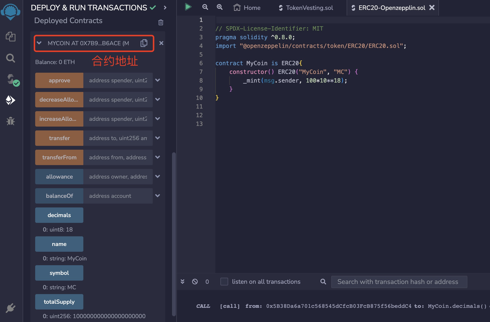
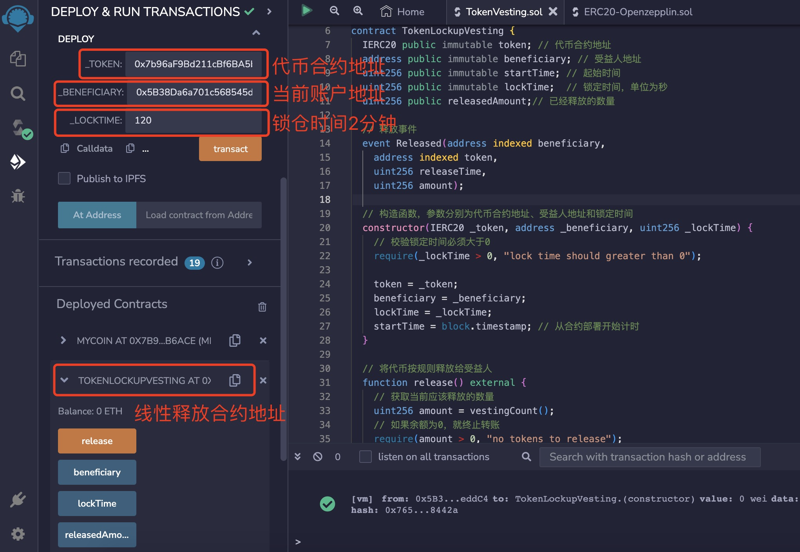
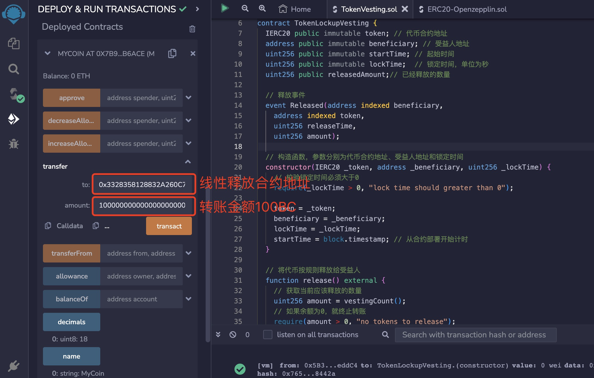
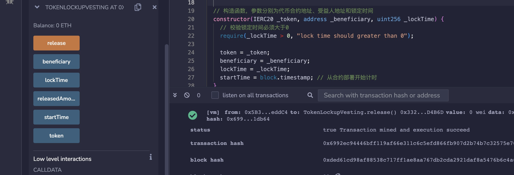

# Solidity常用合约:&nbsp;&nbsp;&nbsp;&nbsp;502.线性释放

本章讲解什么是线性释放，以及线性释放合约的原理和实现。  

**视频**：[Bilibili](https://space.bilibili.com/2112923943)  |  [Youtube](https://www.youtube.com/@BinSchoolApp)

**官网**：[BinSchoolOrg](https://binschool.org)

**代码**：[github.com/hitadao](https://github.com/hitadao)

**推特**：[@Hita_DAO](https://x.com/hita_dao)    **Discord**：[Hita_DAO](https://discord.gg/dzWY3QYGrx)

-----

线性释放，英文名称为 “Vesting”，是指代币按照一定速度在一段时间内匀速释放的过程，这种机制通常用于激励机制。

线性释放，既可以限制被激励人员在短时间内大量抛售代币，造成代币价格的不稳定，又可以保证他们具有长期的动力。

我们举个线性释放的使用场景，来帮助您理解线性释放的机制。比如：

某项目方为了激励团队成员，为每个人发放了 10000 个代币，并限制为 4 年内线性释放这些代币。

那么，团队成员在第一年，就可以提取 2500 个代币；第二年，依然可以再提取 2500 个代币，依次类推，4 年后就已经提取了全部代币。

当然，你也可以每两年提取一次，每次提取 5000 个代币。

这个具体提取时间，由团队成员自己掌握。团队成员能够提取代币的比例，就是按照“已过去的时间”占“锁定期”的比例。

线性释放过程，既可以直接写入在 **`ERC20`** 代币合约中，也可以编写一个独立的智能合约。

在 **`OpenZeppelin`** 库中的 **`VestingWallet`** 合约，就是一个通用的线性释放合约。

我们将其做了简化，单独编写成一个简单的线性释放合约。

## 实现步骤和算法

我们首先编写一个 **`ERC20`** 代币合约，作为锁仓使用的代币，您可以参考本教程的前面章节，直接复制一份代码。

然后，我们再编写一个锁仓合约 **`TokenVesting`**，用于存放锁定的代币。

我们将一定数量的需要锁定的代币，转入线性释放合约 **`TokenVesting`** 中，并设定锁定期和受益人。

在锁定期内，受益人可以调用 **`release`** 函数，按照“已过去的时间”占“锁定期”的比例，提走已经释放的代币。

### 1. ERC20 代币合约

代币名称为 **`BinSchool Coin`**，符号为 **`BC`**，为合约部署者发行 100 个代币：

```solidity
// SPDX-License-Identifier: MIT
pragma solidity ^0.8.0;

// 引入代币合约需要继承的 openzeppelin 的 ERC-20 合约
import "@openzeppelin/contracts/token/ERC20/ERC20.sol";

contract MyCoin is ERC20{
    // 构造函数，调用了openzeppelin的ERC-20合约的构造函数，传入代币名称和符号
    constructor() ERC20("BinSchool Coin", "BC") {
        // 铸造 100 个 BC 给合约部署者
        _mint(msg.sender, 100*10**18);
    }
}
```

2. TokenVesting 锁仓合约 

线性释放合约 **`TokenVesting`** 共有3个函数：构造函数、释放函数和计算释放量函数。

构造函数用于指定锁定时间和受益人。

释放函数是提供给受益人提取代币使用的函数。

计算释放量函数用于计算当前可以释放的代币数量。

```solidity
// SPDX-License-Identifier: MIT
pragma solidity ^0.8.0;

import "@openzeppelin/contracts/token/ERC20/IERC20.sol";

contract TokenVesting {
  IERC20 public immutable token; // 代币合约地址
  address public immutable beneficiary; // 受益人地址
  uint256 public immutable startTime; // 起始时间
  uint256 public immutable lockTime;  // 锁定时间，单位为秒
  uint256 public releasedAmount;// 已经释放的数量

  // 释放事件
  event Released(address indexed beneficiary, 
    address indexed token, 
    uint256 releaseTime, 
    uint256 amount);
    
  // 构造函数，参数分别为代币合约地址、受益人地址和锁定时间
  constructor(IERC20 _token, address _beneficiary, uint256 _lockTime) {
    // 校验锁定时间必须大于0
    require(_lockTime > 0, "lock time should greater than 0");
        
    token = _token; 
    beneficiary = _beneficiary; 
    lockTime = _lockTime; 
    startTime = block.timestamp; // 从合约部署开始计时
  }

  // 将代币按规则释放给受益人
  function release() external {
    // 获取当前应该释放的数量
    uint256 amount = vestingCount();
    // 如果余额为0，就终止转账
    require(amount > 0, "no tokens to release");

    // 将合约中的代币转账给受益人
    token.transfer(beneficiary, amount);
    // 触发释放代币事件
    emit Released(msg.sender, address(token), block.timestamp, amount);
  } 

  // 计算当前应该释放的数量
  function vestingCount() internal view returns(uint256) {
    // 总量为当前合约余额，再加上已经释放的数量
    uint256 totalAmount = IERC20(token).balanceOf(address(this)) + releasedAmount;
    // 获取当前时间
    uint256 currentTime = block.timestamp;
    // 如果当前时间已经超过锁定期，那么当前可释放全部代币
    if(currentTime - startTime >= lockTime ) {
        return totalAmount;
    }
    // 如果在锁定期内，可释放量为总量 * 已过去时间的占比
    return totalAmount * (currentTime - startTime) / lockTime;
  }
}
```

## 测试和验证

第一步：我们首先将 **`ERC20`** 代币合约部署在 **`Remix`** 上。在后续的锁仓合约中，需要用到它部署后的合约地址。

<p align="center"></p>

第二步：将 **`**`Remix`**`**x 锁仓合约部署在 **`Remix`** 上。

部署时需要提供 3 个参数：

**`_token`** 需要填入上面部署的代币合约的地址。

**`_beneficiary`** 是受益人的地址，可以填入当前用来部署合约的账户地址。

**`_lockTime`**  是锁定时间，填入 120，它的单位是秒，表示锁定 2 分钟。

<p align="center"></p>

第三步：向当前的 **`TokenVesting`** 锁仓合约转入 100BC 代币，注意默认的单位是 **`wei`**，也就是 100 后面需要跟着 18 个零。

在代币合约中，调用方法  **`transfer`**，分别填入  **`TokenVesting`** 锁仓合约的地址、转账金额 100BC。

转账完成后，您可以通过代币合约的方法 **`balanceOf`**，填入 **`TokenVesting`** 锁仓合约的地址，查看它的余额。

<p align="center"></p>

第四步：等待一段时间后，调用接口 **`release`**，执行成功，代币被部分提取。您可以通过代币合约的方法 **`balanceOf`**，查看锁仓合约的余额减少了一部分，而受益人的地址里多了相应的数量。

<p align="center"></p>
